## 府中日鋼団地 建替え事業全体説明会③資料

日時：2026年6月13日(土)10時～

2026年6月13日(±)13時～

※どちらに参加しても説明内容は同じです

場所：ホテルコンチネンタル府中

く本説明会の内容>

・資金計画の見直しについて

・住戸選定に向けた準備について

府中日鋼団地マンション建替組合

株式会社都市設計連合

株式会社長谷エコーポレーション

## はじめに

今回は、資金計画の見直しに伴い、当初より一部ご負担が変わる点がございます。

昨今の世界的な外部環境の影響による物価上昇などにより、

当初の前提が想定以上に変わってきている状況です。

できる限り、組合員の皆さまのご負担が大きくならないよう

改善に向けた検討を行ってまいりました。

そのうえで、組合員の再取得時のご負担部分については、

これまで一定の価格配慮を行っていた設定から、本来の事業原価の水準へ整理する形のお願いとなります。

今回の見直しは、組合員の皆さまのご負担を増やすこと自体が目的ではなく

今後の不確実性に引き続き備え、事業を安定的に進めていくための対応となります。

今回の説明会では、その考え方と住戸価格について順を追ってご説明いたします。

なお、本日は住戸の決定を行うものではございません。

組合員の皆さまのご理解とご協力をお願い申し上げます。

## 目次

本説明会の位置づけ p.4  
資金計画の見直しについて  
資金計画見直しの背景と必要性 p.6  
見直し内容とご負担の考え方 p.11  
住戸価格への影響と価格の考え方 p.13  
住戸選定説明会に向けて  
建物計画 p.15  
住戸価格について p.20  
代表的な間取り p.25  
住戸選定の進め方(案) p.28  
建替えサロンからのお知らせ p.31

## 本説明会の位置づけ

今回の説明会は「組合員の皆さまの住戸再取得時の負担額」に関わる重要な内容となります。  
ご説明した内容は、7月の総会と最終的には権利変換計画承認の総会で皆さまの承認を得ながら事業を進めてまいります。

## 本説明会の位置づけ

## ■本説明会の位置づけと今後の流れ

く本説明会の内容>

・資金計画の見直し

・住戸再取得時の負担額の考え方

・住戸価格や主な間取りと、今後の住戸選定の流れ　など

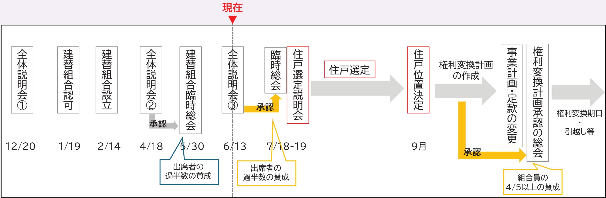

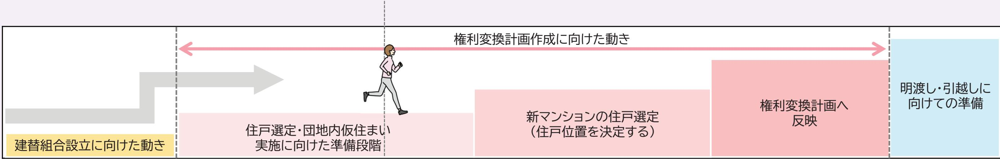

## 資金計画の見直しについて

## なぜ今資金計画を見直す必要があるのか

・ 実施計画案説明会(2024年8月)から約2年が経過

・ 長期間の建替え事業(工事着手まで約3年間を想定)

・想定以上に物価上昇が進み、今後も資材や労務費等の物価上昇が見込まれる状況

## このような状況を踏まえ、今の段階で資金計画を見直し、住戸選定・権利変換へ進む必要があります

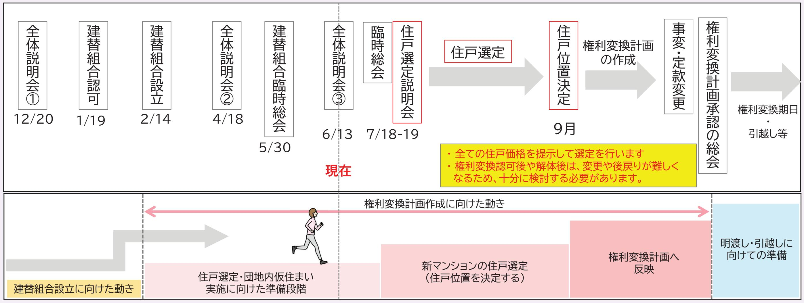

## 資金計画見直しの背景と必要性

実施計画案説明会でご説明した資金計画について、

改めて精査を行った結果、いくつかの課題が明らかになりました。

〈現状の資金計画の見直し結果と見込み〉

・世界的な情勢の影響により物価が上昇し総事業費が現時点で1.2倍増加

・これに伴い事業の予備費が減少

・工事着手までの約3年をふまえると、現状の予備費では今後の物価変動に十分対応できない可能性がある（実際、再開発・建替事業において資金不足により、着工が遅れている事例もあります。)

このような状況を踏まえ、

事業を安定的に進めていくためには予備費を確保しておくことが必要と考えます

そのための方向性として

「収入を増やす」か「支出を減らす」対応の両面から検討を行いました

## 資金計画見直しの背景と必要性

## 〈今回の予備費回復対応策〉

まず最優先に、組合員の皆さまの負担が極力増えないよう、検討を行ってまいりました。

## ①収入を増やす対応

・ 補助金(マンションストック長寿命化等モデル事業)採択により補助金収入を見込む…・約20億円回復

・ 保留地の事業性を見直し(坪80万円→90万円)により収入増を見込む…・約12億円回復

## 支出を減らす対応

・建築費は、昨今の情勢から現時点の削減見込みはむずかしい・継続検討

・従前資産評価額は、再取得・転出いずれにも影響が大きい…据置

## 〈今回の説明会の主旨〉

様々な予備費回復策を検討しましたが、今後も事業を安定的に進めていくため

## 「増床部分」のご負担する価格について、

これまで一定の価格配慮を行っていた水準を本来の事業原価相当とするご提案となります。  
なお、「従前資産評価額」は据置としております。

## 資金計画

建替組合設立時の資金計画(2024/8実施計画案説明会べース)と現在の資金計画を比較します。

物価上昇、追加調査を主な要因として、総事業費が約1.2倍となり、当初見込んでいた予備費が5億円となりました。

<table><tr><td rowspan=1 colspan=4>約1.2倍1</td><td rowspan=1 colspan=1>合計79億円</td><td rowspan=1 colspan=1>(税込)</td></tr><tr><td rowspan=1 colspan=3>支出合計(2024/8実施計画案説明会)</td><td rowspan=1 colspan=1>今回</td><td rowspan=1 colspan=1>差</td><td rowspan=1 colspan=1>内訳</td></tr><tr><td rowspan=1 colspan=1>調査設計計画費</td><td rowspan=1 colspan=1>事業計画作成費、地盤調査費、建築設計費権利変換計画作成費(登記費用・審査委員報酬)、その他各種調査費(アスベスト調査、設備調査等)</td><td rowspan=1 colspan=1>約12億円</td><td rowspan=1 colspan=1>約14億円</td><td rowspan=1 colspan=1>+2億円</td><td rowspan=1 colspan=1>事業計画作成費･約1億円地盤調查·各種調査費約0.6億円建築設計費・約10億円権利変換計画作成費…·約2.5億円</td></tr><tr><td rowspan=1 colspan=1>土地整備費</td><td rowspan=1 colspan=1>既存建築物除却費、道路整備費、埋蔵文化財調査費、引込関係費(排水ル一ト整備費)</td><td rowspan=1 colspan=1>約25億円</td><td rowspan=1 colspan=1>約28億円</td><td rowspan=1 colspan=1>+3億円</td><td rowspan=1 colspan=1>解体費…約15.5億円道路整備費…約6.6億円埋蔵文化財調査費…約5.4億円引込関係費…約0.6億円</td></tr><tr><td rowspan=1 colspan=1>工事費</td><td rowspan=1 colspan=1>建築工事費、その他工事費(近隣対策費、土壌汚染対策工事費、開発負担金、アフターサービス対応費、開発申請費)</td><td rowspan=1 colspan=1>約238億円</td><td rowspan=1 colspan=1>約308億円</td><td rowspan=1 colspan=1>+70億円</td><td rowspan=1 colspan=1>本体工事費…約303億円その他工事費…約5億円</td></tr><tr><td rowspan=1 colspan=1>事務費</td><td rowspan=1 colspan=1>各種専門家への委託費用、サロン運営費、印刷費等</td><td rowspan=1 colspan=1>約2億円</td><td rowspan=1 colspan=1>約3億円</td><td rowspan=1 colspan=1>+1億円</td><td rowspan=1 colspan=1>各専門家への委託費･約1億円サロン運営費・印刷費・約2億円</td></tr><tr><td rowspan=1 colspan=1>借入金利子</td><td rowspan=1 colspan=1></td><td rowspan=1 colspan=1>約5億円</td><td rowspan=1 colspan=1>約8億円</td><td rowspan=1 colspan=1>+3億円</td><td rowspan=1 colspan=1>金利UP(0.6%⇒1.0%)</td></tr><tr><td rowspan=1 colspan=1>その他(予備費)</td><td rowspan=1 colspan=1>今後の物価上昇分の見込み分も含む</td><td rowspan=1 colspan=1>約84億円</td><td rowspan=1 colspan=1>約5億円</td><td rowspan=1 colspan=1>-79億円</td><td rowspan=1 colspan=1></td></tr><tr><td rowspan=1 colspan=1>合計</td><td rowspan=1 colspan=2>約366億円</td><td rowspan=1 colspan=1></td><td rowspan=1 colspan=1></td><td rowspan=1 colspan=1></td></tr></table>

## 予備費回復策

まずは、組合員の皆さまのご負担ができるだけ大きくならないよう、補助金の活用、保留地価格の見直しなど、収入面の対応を中心に検討しました。しかしながら、それでも予備費の確保には至らずこれまで一定の配慮を行っていた増床部分のご負担についても、本来の事業原価相当の水準へ見直しさせていただきたく、ご提案させていただくものです。

<table><tr><td rowspan=1 colspan=3>収入合計(2024/8実施計画案説明会)</td><td rowspan=1 colspan=1>今回</td></tr><tr><td rowspan=1 colspan=1>保留床売却費</td><td rowspan=1 colspan=1>建替え後のマンションのうち、事業協力者(デベロッパー)へ売却する土地・建物分のこと。</td><td rowspan=1 colspan=1>約176億円</td><td rowspan=1 colspan=1>約161億円</td></tr><tr><td rowspan=1 colspan=1>保留地売却費</td><td rowspan=1 colspan=1>建替え後売却する敷地のこと。日鋼団地では、14号棟～32号棟部分を想定(企業及び不動産鑑定評価へのヒアリングを参考に処分時の価格を想定)</td><td rowspan=1 colspan=1>約95億円</td><td rowspan=1 colspan=1>約95億円+12億円=約107億円</td></tr><tr><td rowspan=1 colspan=1>増床負担金</td><td rowspan=1 colspan=1>区分所有者が従前資産評価額を超えて権利変換を受ける床(増床)に対する負担金</td><td rowspan=1 colspan=1>約95億円</td><td rowspan=1 colspan=1>約110億円+6億円=116億円</td></tr><tr><td rowspan=1 colspan=1>補助金</td><td rowspan=1 colspan=1>マンションストック長寿命化等モデル事業(国交省)</td><td rowspan=1 colspan=1></td><td rowspan=1 colspan=1>約20億円</td></tr><tr><td rowspan=1 colspan=1>(権利床)</td><td rowspan=1 colspan=1>建替え事業における従前資産評価額の合計</td><td rowspan=1 colspan=1>(約133億円)うち再取得分約80億円転出分約53億円</td><td rowspan=1 colspan=1>(約133億円)うち再取得分約93億円転出分約40億円</td></tr><tr><td rowspan=1 colspan=1>合計</td><td rowspan=1 colspan=2>約366億円</td><td rowspan=1 colspan=1>366億円+38億円=404億円</td></tr></table>

前回の実施計画案では、再取得率60％想定として計画していましたが、意向調査を踏まえ、再取得70％想定に見直しました。  
これにより再取得意向が高まり、増床面積が増え、保留床が減少したため、保留床売却費が約161億円に減少、増床負担金が約110億円に増加となっています。

## 見直し内容とご負担の考え方

## 建替え事業の床価格の構成

## ①一般的な建替え事業

建替え事業では本来「権利床　＝増床　＝保留床(転出床）」は、同じ『原価水準』で価格設定するのが原則です。（組合員の皆さまと参加組合員は同じ基準で再建マンションの住戸を取得する仕組み)

原価水準(単価)

<table><tr><td rowspan=1 colspan=1>権利床</td><td rowspan=1 colspan=1>増床</td><td rowspan=1 colspan=1>保留床</td><td rowspan=1 colspan=1>転出床</td></tr><tr><td rowspan=1 colspan=2>組合員</td><td rowspan=1 colspan=2>参加組合員</td></tr></table>

(参考)用語の説明

<table><tr><td rowspan=1 colspan=1>用語</td><td rowspan=1 colspan=1>内容</td></tr><tr><td rowspan=1 colspan=1>権利床</td><td rowspan=1 colspan=1>建替え後、権利者の皆さまが無償で取得できる土地・建物分のこと。</td></tr><tr><td rowspan=1 colspan=1>増增床</td><td rowspan=1 colspan=1>従前の区分所有者が権利床(無償で取得できる床)を超えて権利変換を受ける床のこと。</td></tr><tr><td rowspan=1 colspan=1>保留床</td><td rowspan=1 colspan=1>建替え後のマンションのうち、事業協力者(デベロッパー)へ売却する土地・建物分のこと。</td></tr><tr><td rowspan=1 colspan=1>転出床</td><td rowspan=1 colspan=1>建替え後のマンションを取得しない選択(転出)をした方の床のこと。</td></tr></table>

## 見直し内容とご負担の考え方

## それぞれの床価格の水準

## ②前回の考え方(再取得60%想定)

増床を原価より割安に設定し、保留床に上乗せして割高に設定して組合員の負担を抑える計画としました。

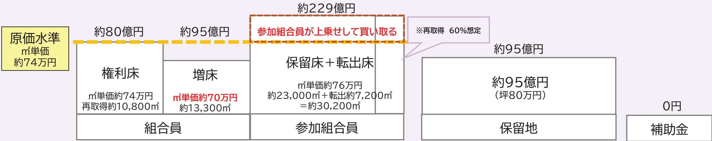

## ③今回の考え方(再取得70%想定)

前回、原価より割高に設定した保留床を、さらに値上げすることは現状の市況からすると困難です。

今回は、原価より割安に設定していた増床について、原価水準への見直しをお願いします。

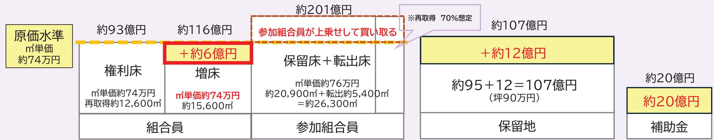

上記はあくまで平均単価の比較です。実際の金額は後述の価格表ページをご参照ください。

## 住戸価格への影響と価格の考え方

組合員への影響

実施計画案説明会の内容から増床をする際の負担額が増(全体で約6億円)

① 再取得時の増床負担金

割安設定 ⇒ 原価水準

具体的な住戸価格はp.19〜p.24をご確認ください。

## ② 従前資産評価額

実施計画案説明会の内容から変更なし

## 【実施計画案説明会資料P50抜粋】

<table><tr><td rowspan=1 colspan=1>住戸タイプ</td><td rowspan=1 colspan=1>号棟</td><td rowspan=1 colspan=1>現在の専有面積</td><td rowspan=1 colspan=1>従前資產評価額</td></tr><tr><td rowspan=1 colspan=1>3 DK</td><td rowspan=1 colspan=1>1,2,3,4,5,6,7,8,10,11,13,14,20,21,22,24,25,26,27,29,30</td><td rowspan=1 colspan=1>約47</td><td rowspan=1 colspan=1>1,809万円</td></tr><tr><td rowspan=1 colspan=1>3 LDK</td><td rowspan=1 colspan=1>9,12,15,16,17,18,19,23,28,31,32</td><td rowspan=1 colspan=1>約70</td><td rowspan=1 colspan=1>2,032万円</td></tr></table>

## 住戸選定説明会に向けて

<table><tr><td>向き</td><td>広さ</td><td>意向調査票の希望数</td><td>本計画案の住戸数</td></tr><tr><td rowspan="6">西</td><td>約35</td><td>18</td><td>20</td></tr><tr><td>約40</td><td>3</td><td>12</td></tr><tr><td>約50</td><td>17</td><td>27</td></tr><tr><td>約60</td><td>6</td><td>76</td></tr><tr><td>約70</td><td>7</td><td>43</td></tr><tr><td>約80</td><td>3</td><td>14</td></tr><tr><td rowspan="6">南</td><td>約35</td><td>0</td><td>0</td></tr><tr><td>約40</td><td>13</td><td>14</td></tr><tr><td>約50</td><td>73</td><td>111</td></tr><tr><td>約60</td><td>68</td><td>83</td></tr><tr><td>約70</td><td>61</td><td>220</td></tr><tr><td>約80</td><td>19</td><td>24</td></tr><tr><td rowspan="6">東</td><td>約35</td><td>17</td><td>23</td></tr><tr><td>約40</td><td>19</td><td></td></tr><tr><td>約50</td><td>56</td><td>19</td></tr><tr><td>約60</td><td>31</td><td>56</td></tr><tr><td>約70</td><td>21</td><td>52</td></tr><tr><td>約80</td><td>4</td><td>46 32</td></tr><tr><td colspan="6"></td></tr><tr><td colspan="6">②共用部の位置 ③エントランス位置</td></tr><tr><td colspan="6"></td></tr><tr><td colspan="6">④車寄せの形状</td></tr><tr><td colspan="6">⑤駐輪場への動線 敷地内への入口の位置が変わり、駐輪スペースまでの動線が短くなりました。</td></tr><tr><td colspan="6">⑥エレベーターの一部を住棟内に入れました</td></tr></table>

## 建物計画

## 建替え決議からの変更点

## ①意向調査による住戸数の調整

・40台住戸の検討

再取得住戸の選択肢をさらに広げるためご要望の多い40m台の住戸を取り入れました。

## ・住戸数の調整

2025年7月に実施した意向調査票の結果により住戸数を調整し、

不足がないように計画しました。

実施計画案説明会  
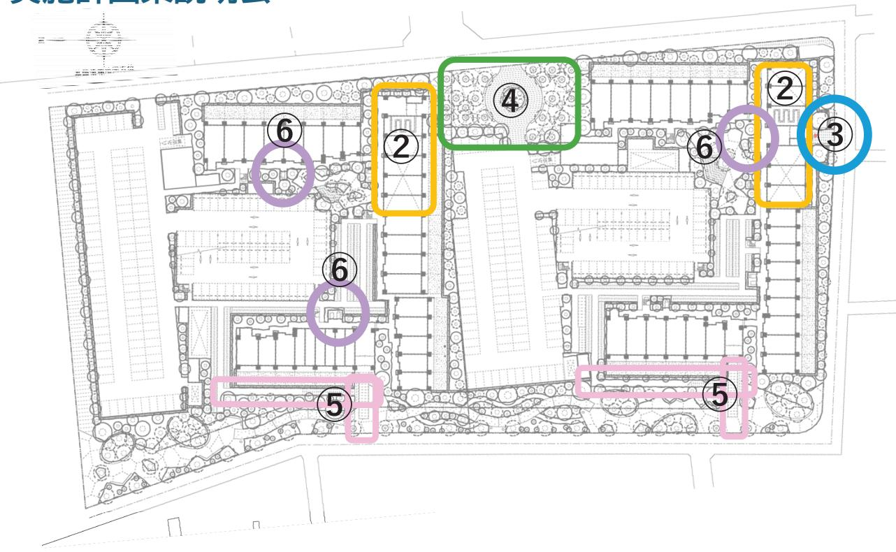

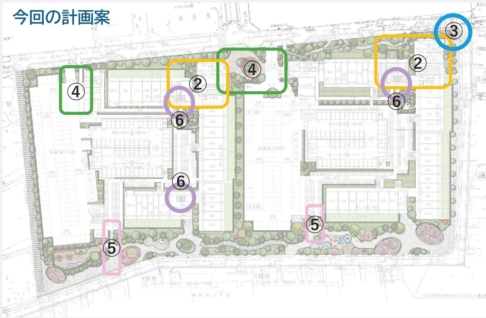

## 1階平面図　2階以上の住戸配置は次ページ以降でご確認ください

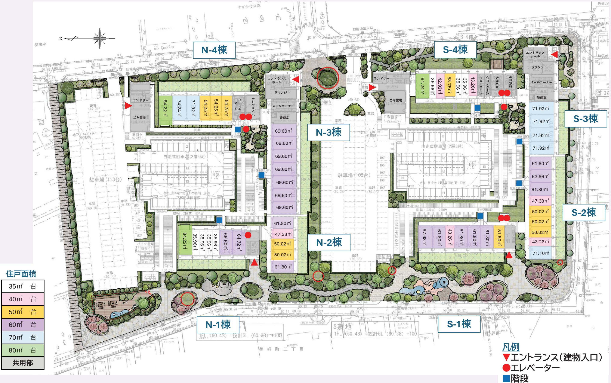

<table><tr><td>35</td><td>台</td></tr><tr><td>40</td><td>台</td></tr><tr><td>50</td><td>台</td></tr><tr><td>60</td><td>台</td></tr><tr><td>70</td><td>台</td></tr><tr><td>80</td><td>台</td></tr><tr><td>共用部</td><td></td></tr></table>

S-2棟 (南向き）

## 住戸構成

<table><tr><td></td><td></td><td></td><td></td><td rowspan=1 colspan=1>67.10</td><td rowspan=1 colspan=1>61.80</td><td rowspan=1 colspan=1>51.50</td><td rowspan=1 colspan=1>51.50</td></tr><tr><td></td><td></td><td></td><td rowspan=1 colspan=1>67.31</td><td rowspan=1 colspan=1>61.80</td><td rowspan=1 colspan=1>61.80</td><td rowspan=1 colspan=1>51.50</td><td rowspan=1 colspan=1>51.50</td></tr><tr><td></td><td rowspan=1 colspan=1>67.46</td><td rowspan=1 colspan=1>43.26</td><td rowspan=1 colspan=1>61.80</td><td rowspan=1 colspan=1>61.80</td><td rowspan=1 colspan=1>61.80</td><td rowspan=1 colspan=1>51.50</td><td rowspan=1 colspan=1>51.50</td></tr><tr><td></td><td rowspan=1 colspan=1>67.46</td><td rowspan=1 colspan=1>43.26</td><td rowspan=1 colspan=1>61.80</td><td rowspan=1 colspan=1>61.80</td><td rowspan=1 colspan=1>61.80</td><td rowspan=1 colspan=1>51.50</td><td rowspan=1 colspan=1>51.50</td></tr><tr><td rowspan=1 colspan=1>67.98</td><td rowspan=1 colspan=1>61.80</td><td rowspan=1 colspan=1>43.26</td><td rowspan=1 colspan=1>61.80</td><td rowspan=1 colspan=1>61.80</td><td rowspan=1 colspan=1>61.80</td><td rowspan=1 colspan=1>51.50</td><td rowspan=1 colspan=1>51.50</td></tr><tr><td rowspan=1 colspan=1>67.98</td><td rowspan=1 colspan=1>61.80</td><td rowspan=1 colspan=1>43.26</td><td rowspan=1 colspan=1>61.80</td><td rowspan=1 colspan=1>61.80</td><td rowspan=1 colspan=1>61.80</td><td rowspan=1 colspan=1>51.50</td><td rowspan=1 colspan=1>51.50</td></tr><tr><td rowspan=1 colspan=1>67.98</td><td rowspan=1 colspan=1>61.80</td><td rowspan=1 colspan=1>43.26</td><td rowspan=1 colspan=1>61.80</td><td rowspan=1 colspan=1>61.80</td><td rowspan=1 colspan=1>61.80</td><td rowspan=1 colspan=1>51.50</td><td rowspan=1 colspan=1>51.50</td></tr><tr><td rowspan=1 colspan=1>67.98</td><td rowspan=1 colspan=1>61.80</td><td rowspan=1 colspan=1>43.26</td><td rowspan=1 colspan=1>61.80</td><td rowspan=1 colspan=1>61.80</td><td rowspan=1 colspan=1>61.80</td><td rowspan=1 colspan=1>51.50</td><td rowspan=1 colspan=1>51.50</td></tr><tr><td rowspan=1 colspan=1>67.98</td><td rowspan=1 colspan=1>61.80</td><td rowspan=1 colspan=1>43.26</td><td rowspan=1 colspan=1>61.80</td><td rowspan=1 colspan=1>61.80</td><td rowspan=1 colspan=1>61.80</td><td rowspan=1 colspan=1>51.50</td><td rowspan=1 colspan=1>51.50</td></tr><tr><td rowspan=1 colspan=1>67.98</td><td rowspan=1 colspan=1>61.80</td><td rowspan=1 colspan=1>43.26</td><td rowspan=1 colspan=1>61.80</td><td rowspan=1 colspan=1>61.80</td><td rowspan=1 colspan=1>61.80</td><td rowspan=1 colspan=1>51.50</td><td rowspan=1 colspan=1>51.50</td></tr><tr><td rowspan=1 colspan=1>67.98</td><td rowspan=1 colspan=1>61.80</td><td rowspan=1 colspan=1>43.26</td><td rowspan=1 colspan=1>61.80</td><td rowspan=1 colspan=1>61.80</td><td rowspan=1 colspan=1>61.80</td><td rowspan=1 colspan=1>51.50</td><td rowspan=1 colspan=1>51.50</td></tr><tr><td rowspan=1 colspan=1>67.98</td><td rowspan=1 colspan=1>61.80</td><td rowspan=1 colspan=1>43.26</td><td rowspan=1 colspan=1>61.80</td><td rowspan=1 colspan=1>61.80</td><td rowspan=1 colspan=1>61.80</td><td rowspan=1 colspan=1>51.50</td><td rowspan=1 colspan=1>51.50</td></tr><tr><td rowspan=1 colspan=1>67.98</td><td rowspan=1 colspan=1>61.80</td><td rowspan=1 colspan=1>43.26</td><td rowspan=1 colspan=1>61.80</td><td rowspan=1 colspan=1>61.80</td><td rowspan=1 colspan=1>61.80</td><td rowspan=1 colspan=1>51.50</td><td rowspan=1 colspan=1>51.50</td></tr><tr><td rowspan=1 colspan=1>67.98</td><td rowspan=1 colspan=1>61.80</td><td rowspan=1 colspan=1>43.26</td><td rowspan=1 colspan=1>61.80</td><td rowspan=1 colspan=1>61.80</td><td rowspan=1 colspan=1>61.80</td><td rowspan=1 colspan=1>51.50</td><td rowspan=1 colspan=1>サブENT</td></tr></table>

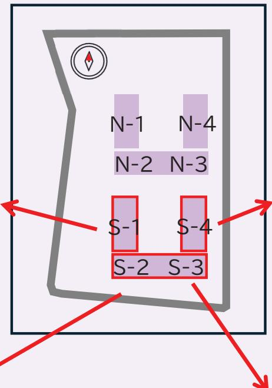

## S-4棟 (東向き)

<table><tr><td rowspan=16 colspan=1>自奴1413121110987654321</td><td></td><td></td><td></td><td></td><td></td><td></td><td></td><td></td><td></td><td></td><td></td></tr><tr><td rowspan=2 colspan=1>61.24</td><td rowspan=2 colspan=1>61.24</td><td rowspan=2 colspan=2>71.92</td><td rowspan=2 colspan=1>43.26</td><td rowspan=2 colspan=2>71.92</td><td rowspan=2 colspan=1>59.50</td><td></td><td></td><td></td></tr><tr><td rowspan=1 colspan=3></td></tr><tr><td rowspan=1 colspan=1>61.24</td><td rowspan=1 colspan=1>61.24</td><td rowspan=1 colspan=2>71.92</td><td rowspan=1 colspan=1>43.26</td><td rowspan=1 colspan=2>71.92</td><td rowspan=1 colspan=1>53.75</td><td rowspan=1 colspan=2>85.26</td><td rowspan=1 colspan=1></td></tr><tr><td rowspan=1 colspan=1>61.24</td><td rowspan=1 colspan=1>61.24</td><td rowspan=1 colspan=2>71.92</td><td rowspan=1 colspan=1>43.26</td><td rowspan=1 colspan=2>71.92</td><td rowspan=1 colspan=1>53.75</td><td rowspan=1 colspan=2>78.88</td><td rowspan=1 colspan=1>81.24</td></tr><tr><td rowspan=1 colspan=1>61.24</td><td rowspan=1 colspan=1>61.24</td><td rowspan=1 colspan=2>71.92</td><td rowspan=1 colspan=1>43.26</td><td rowspan=1 colspan=2>71.92</td><td rowspan=1 colspan=1>53.75</td><td rowspan=1 colspan=2>78.88</td><td rowspan=1 colspan=1>81.24</td></tr><tr><td rowspan=1 colspan=1>61.24</td><td rowspan=1 colspan=1>61.24</td><td rowspan=1 colspan=2>71.92</td><td rowspan=1 colspan=1>43.26</td><td rowspan=1 colspan=2>71.92</td><td rowspan=1 colspan=1>53.75</td><td rowspan=1 colspan=2>78.88</td><td rowspan=1 colspan=1>81.24</td></tr><tr><td rowspan=1 colspan=1>61.24</td><td rowspan=1 colspan=1>61.24</td><td rowspan=1 colspan=2>71.92</td><td rowspan=1 colspan=1>43.26</td><td rowspan=1 colspan=2>71.92</td><td rowspan=1 colspan=1>53.75</td><td rowspan=1 colspan=2>78.88</td><td rowspan=1 colspan=1>81.24</td></tr><tr><td rowspan=1 colspan=1>61.24</td><td rowspan=1 colspan=1>61.24</td><td rowspan=1 colspan=2>71.92</td><td rowspan=1 colspan=1>43.26</td><td rowspan=1 colspan=2>71.92</td><td rowspan=1 colspan=1>53.75</td><td rowspan=1 colspan=2>78.88</td><td rowspan=1 colspan=1>81.24</td></tr><tr><td rowspan=1 colspan=1>61.24</td><td rowspan=1 colspan=1>61.24</td><td rowspan=1 colspan=2>71.92</td><td rowspan=1 colspan=1>43.26</td><td rowspan=1 colspan=2>71.92</td><td rowspan=1 colspan=1>53.75</td><td rowspan=1 colspan=2>78.88</td><td rowspan=1 colspan=1>81.24</td></tr><tr><td rowspan=1 colspan=1>61.24</td><td rowspan=1 colspan=1>61.24</td><td rowspan=1 colspan=2>71.92</td><td rowspan=1 colspan=1>43.26</td><td rowspan=1 colspan=2>71.92</td><td rowspan=1 colspan=1>53.75</td><td rowspan=1 colspan=2>78.88</td><td rowspan=1 colspan=1>81.24</td></tr><tr><td rowspan=1 colspan=1>61.24</td><td rowspan=1 colspan=1>61.24</td><td rowspan=1 colspan=1>35.96</td><td rowspan=1 colspan=1>35.96</td><td rowspan=1 colspan=1>43.26</td><td rowspan=1 colspan=1>35.96</td><td rowspan=1 colspan=1>35.96</td><td rowspan=1 colspan=1>53.75</td><td rowspan=1 colspan=1>42.92</td><td rowspan=1 colspan=1>35.96</td><td rowspan=1 colspan=1>81.24</td></tr><tr><td rowspan=1 colspan=1>61.24</td><td rowspan=1 colspan=1>61.24</td><td rowspan=1 colspan=1>35.96</td><td rowspan=1 colspan=1>35.96</td><td rowspan=1 colspan=1>43.26</td><td rowspan=1 colspan=1>35.96</td><td rowspan=1 colspan=1>35.96</td><td rowspan=1 colspan=1>53.75</td><td rowspan=1 colspan=1>42.92</td><td rowspan=1 colspan=1>35.96</td><td rowspan=1 colspan=1>81.24</td></tr><tr><td rowspan=1 colspan=1>61.24</td><td rowspan=1 colspan=1>61.24</td><td rowspan=1 colspan=1>35.96</td><td rowspan=1 colspan=1>35.96</td><td rowspan=1 colspan=1>43.26</td><td rowspan=1 colspan=1>35.96</td><td rowspan=1 colspan=1>35.96</td><td rowspan=1 colspan=1>53.75</td><td rowspan=1 colspan=1>42.92</td><td rowspan=1 colspan=1>35.96</td><td rowspan=1 colspan=1>81.24</td></tr><tr><td rowspan=1 colspan=1>61.24</td><td rowspan=1 colspan=1>61.24</td><td rowspan=1 colspan=1>35.96</td><td rowspan=1 colspan=1>35.96</td><td rowspan=1 colspan=1>43.26</td><td rowspan=1 colspan=1>35.96</td><td rowspan=1 colspan=1>35.96</td><td rowspan=1 colspan=1>53.75</td><td rowspan=1 colspan=1>42.92</td><td rowspan=1 colspan=1>35.96</td><td rowspan=1 colspan=1>81.24</td></tr><tr><td rowspan=1 colspan=1>共用</td><td rowspan=1 colspan=1>共用</td><td rowspan=1 colspan=2>共用</td><td rowspan=1 colspan=1>43.26</td><td rowspan=1 colspan=1>35.96</td><td rowspan=1 colspan=1>35.96</td><td rowspan=1 colspan=1>53.75</td><td rowspan=1 colspan=1>42.92</td><td rowspan=1 colspan=1>35.96</td><td rowspan=1 colspan=1>71.98</td></tr></table>

<table><tr><td rowspan=15 colspan=1>1413121110987654321</td><td></td><td></td><td></td><td></td><td></td><td></td><td></td><td></td><td></td></tr><tr><td rowspan=1 colspan=1>71.10</td><td rowspan=1 colspan=1>43.26</td><td rowspan=1 colspan=1>50.02</td><td rowspan=1 colspan=1>50.02</td><td rowspan=1 colspan=1>50.02</td><td rowspan=1 colspan=1>47.38</td><td rowspan=1 colspan=1>61.80</td><td rowspan=1 colspan=1>63.86</td><td rowspan=1 colspan=1>61.80</td></tr><tr><td rowspan=1 colspan=1>71.10</td><td rowspan=1 colspan=1>43.26</td><td rowspan=1 colspan=1>50.02</td><td rowspan=1 colspan=1>50.02</td><td rowspan=1 colspan=1>50.02</td><td rowspan=1 colspan=1>47.38</td><td rowspan=1 colspan=1>61.80</td><td rowspan=1 colspan=1>63.86</td><td rowspan=1 colspan=1>61.80</td></tr><tr><td rowspan=1 colspan=1>71.10</td><td rowspan=1 colspan=1>43.26</td><td rowspan=1 colspan=1>50.02</td><td rowspan=1 colspan=1>50.02</td><td rowspan=1 colspan=1>50.02</td><td rowspan=1 colspan=1>47.38</td><td rowspan=1 colspan=1>61.80</td><td rowspan=1 colspan=1>63.86</td><td rowspan=1 colspan=1>61.80</td></tr><tr><td rowspan=1 colspan=1>71.10</td><td rowspan=1 colspan=1>43.26</td><td rowspan=1 colspan=1>50.02</td><td rowspan=1 colspan=1>50.02</td><td rowspan=1 colspan=1>50.02</td><td rowspan=1 colspan=1>47.38</td><td rowspan=1 colspan=1>61.80</td><td rowspan=1 colspan=1>63.86</td><td rowspan=1 colspan=1>61.80</td></tr><tr><td rowspan=1 colspan=1>71.10</td><td rowspan=1 colspan=1>43.26</td><td rowspan=1 colspan=1>50.02</td><td rowspan=1 colspan=1>50.02</td><td rowspan=1 colspan=1>50.02</td><td rowspan=1 colspan=1>47.38</td><td rowspan=1 colspan=1>61.80</td><td rowspan=1 colspan=1>63.86</td><td rowspan=1 colspan=1>61.80</td></tr><tr><td rowspan=1 colspan=1>71.10</td><td rowspan=1 colspan=1>43.26</td><td rowspan=1 colspan=1>50.02</td><td rowspan=1 colspan=1>50.02</td><td rowspan=1 colspan=1>50.02</td><td rowspan=1 colspan=1>47.38</td><td rowspan=1 colspan=1>61.80</td><td rowspan=1 colspan=1>63.86</td><td rowspan=1 colspan=1>61.80</td></tr><tr><td rowspan=1 colspan=1>71.10</td><td rowspan=1 colspan=1>43.26</td><td rowspan=1 colspan=1>50.02</td><td rowspan=1 colspan=1>50.02</td><td rowspan=1 colspan=1>50.02</td><td rowspan=1 colspan=1>47.38</td><td rowspan=1 colspan=1>61.80</td><td rowspan=1 colspan=1>63.86</td><td rowspan=1 colspan=1>61.80</td></tr><tr><td rowspan=1 colspan=1>71.10</td><td rowspan=1 colspan=1>43.26</td><td rowspan=1 colspan=1>50.02</td><td rowspan=1 colspan=1>50.02</td><td rowspan=1 colspan=1>50.02</td><td rowspan=1 colspan=1>47.38</td><td rowspan=1 colspan=1>61.80</td><td rowspan=1 colspan=1>63.86</td><td rowspan=1 colspan=1>61.80</td></tr><tr><td rowspan=1 colspan=1>71.10</td><td rowspan=1 colspan=1>43.26</td><td rowspan=1 colspan=1>50.02</td><td rowspan=1 colspan=1>50.02</td><td rowspan=1 colspan=1>50.02</td><td rowspan=1 colspan=1>47.38</td><td rowspan=1 colspan=1>61.80</td><td rowspan=1 colspan=1>63.86</td><td rowspan=1 colspan=1>61.80</td></tr><tr><td rowspan=1 colspan=1>71.10</td><td rowspan=1 colspan=1>43.26</td><td rowspan=1 colspan=1>50.02</td><td rowspan=1 colspan=1>50.02</td><td rowspan=1 colspan=1>50.02</td><td rowspan=1 colspan=1>47.38</td><td rowspan=1 colspan=1>61.80</td><td rowspan=1 colspan=1>63.86</td><td rowspan=1 colspan=1>61.80</td></tr><tr><td rowspan=1 colspan=1>71.10</td><td rowspan=1 colspan=1>43.26</td><td rowspan=1 colspan=1>50.02</td><td rowspan=1 colspan=1>50.02</td><td rowspan=1 colspan=1>50.02</td><td rowspan=1 colspan=1>47.38</td><td rowspan=1 colspan=1>61.80</td><td rowspan=1 colspan=1>63.86</td><td rowspan=1 colspan=1>61.80</td></tr><tr><td rowspan=1 colspan=1>71.10</td><td rowspan=1 colspan=1>43.26</td><td rowspan=1 colspan=1>50.02</td><td rowspan=1 colspan=1>50.02</td><td rowspan=1 colspan=1>50.02</td><td rowspan=1 colspan=1>47.38</td><td rowspan=1 colspan=1>61.80</td><td rowspan=1 colspan=1>63.86</td><td rowspan=1 colspan=1>61.80</td></tr><tr><td rowspan=1 colspan=1>71.10</td><td rowspan=1 colspan=1>43.26</td><td rowspan=1 colspan=1>50.02</td><td rowspan=1 colspan=1>50.02</td><td rowspan=1 colspan=1>50.02</td><td rowspan=1 colspan=1>47.38</td><td rowspan=1 colspan=1>61.80</td><td rowspan=1 colspan=1>63.86</td><td rowspan=1 colspan=1>61.80</td></tr><tr><td rowspan=1 colspan=1>71.10</td><td rowspan=1 colspan=1>43.26</td><td rowspan=1 colspan=1>50.02</td><td rowspan=1 colspan=1>50.02</td><td rowspan=1 colspan=1>50.02</td><td rowspan=1 colspan=1>47.38</td><td rowspan=1 colspan=1>61.80</td><td rowspan=1 colspan=1>63.86</td><td rowspan=1 colspan=1>61.80</td></tr></table>

<table><tr><td rowspan=1 colspan=1>71.92</td><td rowspan=1 colspan=1>71.92</td><td rowspan=1 colspan=1>71.92</td><td rowspan=1 colspan=1>71.92</td><td rowspan=1 colspan=1>71.08</td><td rowspan=1 colspan=1>71.08</td><td rowspan=1 colspan=1>71.92</td><td rowspan=1 colspan=1>80.05</td></tr><tr><td rowspan=1 colspan=1>71.92</td><td rowspan=1 colspan=1>71.92</td><td rowspan=1 colspan=1>71.92</td><td rowspan=1 colspan=1>71.92</td><td rowspan=1 colspan=1>71.08</td><td rowspan=1 colspan=1>71.08</td><td rowspan=1 colspan=1>71.92</td><td rowspan=1 colspan=1>80.05</td></tr><tr><td rowspan=1 colspan=1>71.92</td><td rowspan=1 colspan=1>71.92</td><td rowspan=1 colspan=1>71.92</td><td rowspan=1 colspan=1>71.92</td><td rowspan=1 colspan=1>71.08</td><td rowspan=1 colspan=1>71.08</td><td rowspan=1 colspan=1>71.92</td><td rowspan=1 colspan=1>80.05</td></tr><tr><td rowspan=1 colspan=1>71.92</td><td rowspan=1 colspan=1>71.92</td><td rowspan=1 colspan=1>71.92</td><td rowspan=1 colspan=1>71.92</td><td rowspan=1 colspan=1>71.08</td><td rowspan=1 colspan=1>71.08</td><td rowspan=1 colspan=1>71.92</td><td rowspan=1 colspan=1>80.05</td></tr><tr><td rowspan=1 colspan=1>71.92</td><td rowspan=1 colspan=1>71.92</td><td rowspan=1 colspan=1>71.92</td><td rowspan=1 colspan=1>71.92</td><td rowspan=1 colspan=1>71.08</td><td rowspan=1 colspan=1>71.08</td><td rowspan=1 colspan=1>71.92</td><td rowspan=1 colspan=1>80.05</td></tr><tr><td rowspan=1 colspan=1>71.92</td><td rowspan=1 colspan=1>71.92</td><td rowspan=1 colspan=1>71.92</td><td rowspan=1 colspan=1>71.92</td><td rowspan=1 colspan=1>71.08</td><td rowspan=1 colspan=1>71.08</td><td rowspan=1 colspan=1>71.92</td><td rowspan=1 colspan=1>80.05</td></tr><tr><td rowspan=1 colspan=1>71.92</td><td rowspan=1 colspan=1>71.92</td><td rowspan=1 colspan=1>71.92</td><td rowspan=1 colspan=1>71.92</td><td rowspan=1 colspan=1>71.08</td><td rowspan=1 colspan=1>71.08</td><td rowspan=1 colspan=1>71.92</td><td rowspan=1 colspan=1>80.05</td></tr><tr><td rowspan=1 colspan=1>71.92</td><td rowspan=1 colspan=1>71.92</td><td rowspan=1 colspan=1>71.92</td><td rowspan=1 colspan=1>71.92</td><td rowspan=1 colspan=1>71.08</td><td rowspan=1 colspan=1>71.08</td><td rowspan=1 colspan=1>71.92</td><td rowspan=1 colspan=1>80.05</td></tr><tr><td rowspan=1 colspan=1>71.92</td><td rowspan=1 colspan=1>71.92</td><td rowspan=1 colspan=1>71.92</td><td rowspan=1 colspan=1>71.92</td><td rowspan=1 colspan=1>71.08</td><td rowspan=1 colspan=1>71.08</td><td rowspan=1 colspan=1>71.92</td><td rowspan=1 colspan=1>80.05</td></tr><tr><td rowspan=1 colspan=1>71.92</td><td rowspan=1 colspan=1>71.92</td><td rowspan=1 colspan=1>71.92</td><td rowspan=1 colspan=1>71.92</td><td rowspan=1 colspan=1>71.08</td><td rowspan=1 colspan=1>71.08</td><td rowspan=1 colspan=1>71.92</td><td rowspan=1 colspan=1>80.05</td></tr><tr><td rowspan=1 colspan=1>71.92</td><td rowspan=1 colspan=1>71.92</td><td rowspan=1 colspan=1>71.92</td><td rowspan=1 colspan=1>71.92</td><td rowspan=1 colspan=1>71.08</td><td rowspan=1 colspan=1>71.08</td><td rowspan=1 colspan=1>71.92</td><td rowspan=1 colspan=1>80.05</td></tr><tr><td rowspan=1 colspan=1>71.92</td><td rowspan=1 colspan=1>71.92</td><td rowspan=1 colspan=1>71.92</td><td rowspan=1 colspan=1>71.92</td><td rowspan=1 colspan=1>71.08</td><td rowspan=1 colspan=1>71.08</td><td rowspan=1 colspan=1>71.92</td><td rowspan=1 colspan=1>80.05</td></tr><tr><td rowspan=1 colspan=1>71.92</td><td rowspan=1 colspan=1>71.92</td><td rowspan=1 colspan=1>71.92</td><td rowspan=1 colspan=1>71.92</td><td rowspan=1 colspan=1>71.08</td><td rowspan=1 colspan=1>71.08</td><td rowspan=1 colspan=1>71.92</td><td rowspan=1 colspan=1>吹抜</td></tr><tr><td rowspan=1 colspan=1>71.92</td><td rowspan=1 colspan=1>71.92</td><td rowspan=1 colspan=1>71.92</td><td rowspan=1 colspan=1>71.92</td><td rowspan=1 colspan=1>共用</td><td rowspan=1 colspan=1>共用</td><td rowspan=1 colspan=1>メール</td><td rowspan=1 colspan=1>ENT</td></tr></table>

## 住戸構成

## N-1棟 (西向き）

<table><tr><td></td><td></td><td></td><td rowspan=1 colspan=2>78.30</td><td rowspan=1 colspan=1>69.60</td><td rowspan=1 colspan=1>64.72</td><td rowspan=1 colspan=1>64.72</td></tr><tr><td></td><td rowspan=1 colspan=2>78.30</td><td rowspan=1 colspan=2>71.92</td><td rowspan=1 colspan=1>69.60</td><td rowspan=1 colspan=1>64.72</td><td rowspan=1 colspan=1>64.72</td></tr><tr><td rowspan=1 colspan=1>84.22</td><td rowspan=1 colspan=2>71.92</td><td rowspan=1 colspan=2>71.92</td><td rowspan=1 colspan=1>69.60</td><td rowspan=1 colspan=1>64.72</td><td rowspan=1 colspan=1>64.72</td></tr><tr><td rowspan=1 colspan=1>84.22</td><td rowspan=1 colspan=2>71.92</td><td rowspan=1 colspan=2>71.92</td><td rowspan=1 colspan=1>69.60</td><td rowspan=1 colspan=1>64.72</td><td rowspan=1 colspan=1>64.72</td></tr><tr><td rowspan=1 colspan=1>84.22</td><td rowspan=1 colspan=2>71.92</td><td rowspan=1 colspan=2>71.92</td><td rowspan=1 colspan=1>69.60</td><td rowspan=1 colspan=1>64.72</td><td rowspan=1 colspan=1>64.72</td></tr><tr><td rowspan=1 colspan=1>84.22</td><td rowspan=1 colspan=2>71.92</td><td rowspan=1 colspan=2>71.92</td><td rowspan=1 colspan=1>69.60</td><td rowspan=1 colspan=1>64.72</td><td rowspan=1 colspan=1>64.72</td></tr><tr><td rowspan=1 colspan=1>84.22</td><td rowspan=1 colspan=2>71.92</td><td rowspan=1 colspan=2>71.92</td><td rowspan=1 colspan=1>69.60</td><td rowspan=1 colspan=1>64.72</td><td rowspan=1 colspan=1>64.72</td></tr><tr><td rowspan=1 colspan=1>84.22</td><td rowspan=1 colspan=2>71.92</td><td rowspan=1 colspan=2>71.92</td><td rowspan=1 colspan=1>69.60</td><td rowspan=1 colspan=1>64.72</td><td rowspan=1 colspan=1>64.72</td></tr><tr><td rowspan=1 colspan=1>84.22</td><td rowspan=1 colspan=2>71.92</td><td rowspan=1 colspan=2>71.92</td><td rowspan=1 colspan=1>69.60</td><td rowspan=1 colspan=1>64.72</td><td rowspan=1 colspan=1>64.72</td></tr><tr><td rowspan=1 colspan=1>84.22</td><td rowspan=1 colspan=1>35.96</td><td rowspan=1 colspan=1>35.96</td><td rowspan=1 colspan=1>35.96</td><td rowspan=1 colspan=1>35.96</td><td rowspan=1 colspan=1>69.60</td><td rowspan=1 colspan=1>64.72</td><td rowspan=1 colspan=1>64.72</td></tr><tr><td rowspan=1 colspan=1>84.22</td><td rowspan=1 colspan=1>35.96</td><td rowspan=1 colspan=1>35.96</td><td rowspan=1 colspan=1>35.96</td><td rowspan=1 colspan=1>35.96</td><td rowspan=1 colspan=1>69.60</td><td rowspan=1 colspan=1>64.72</td><td rowspan=1 colspan=1>64.72</td></tr><tr><td rowspan=1 colspan=1>84.22</td><td rowspan=1 colspan=1>35.96</td><td rowspan=1 colspan=1>35.96</td><td rowspan=1 colspan=1>35.96</td><td rowspan=1 colspan=1>35.96</td><td rowspan=1 colspan=1>69.60</td><td rowspan=1 colspan=1>64.72</td><td rowspan=1 colspan=1>64.72</td></tr><tr><td rowspan=1 colspan=1>84.22</td><td rowspan=1 colspan=1>35.96</td><td rowspan=1 colspan=1>35.96</td><td rowspan=1 colspan=1>35.96</td><td rowspan=1 colspan=1>35.96</td><td rowspan=1 colspan=1>69.60</td><td rowspan=1 colspan=1>64.72</td><td rowspan=1 colspan=1>64.72</td></tr><tr><td rowspan=1 colspan=1>84.22</td><td rowspan=1 colspan=1>35.96</td><td rowspan=1 colspan=1>35.96</td><td rowspan=1 colspan=1>35.96</td><td rowspan=1 colspan=1>35.96</td><td rowspan=1 colspan=1>69.60</td><td rowspan=1 colspan=1>64.72</td><td rowspan=1 colspan=1>サブENT</td></tr></table>

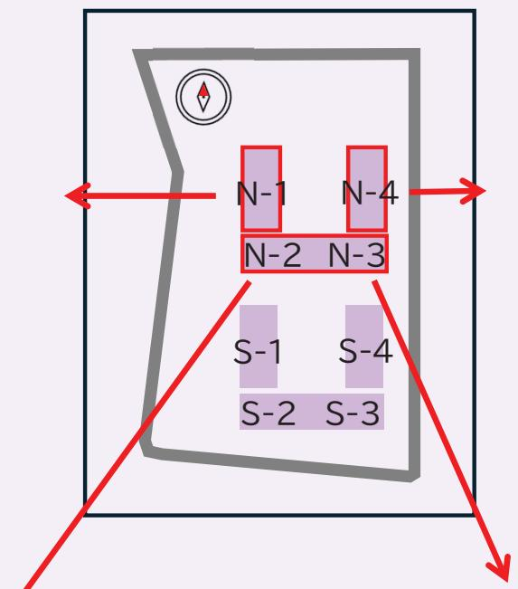

<table><tr><td rowspan=1 colspan=1>64.72</td><td rowspan=1 colspan=1>64.72</td><td rowspan=1 colspan=1>54.25</td><td rowspan=1 colspan=1>54.25</td><td rowspan=1 colspan=1>54.25</td><td rowspan=1 colspan=1>71.92</td><td rowspan=1 colspan=1>80.62</td><td rowspan=1 colspan=1></td><td rowspan=2 colspan=1></td></tr><tr><td rowspan=1 colspan=1>64.72</td><td rowspan=1 colspan=1>64.72</td><td rowspan=1 colspan=1>54.25</td><td rowspan=1 colspan=1>54.25</td><td rowspan=1 colspan=1>54.25</td><td rowspan=1 colspan=1>71.92</td><td rowspan=1 colspan=1>80.62</td><td></td></tr><tr><td rowspan=1 colspan=1>64.72</td><td rowspan=1 colspan=1>64.72</td><td rowspan=1 colspan=1>54.25</td><td rowspan=1 colspan=1>54.25</td><td rowspan=1 colspan=1>54.25</td><td rowspan=1 colspan=1>71.92</td><td rowspan=1 colspan=1>74.24</td><td rowspan=1 colspan=2>84.22</td></tr><tr><td rowspan=1 colspan=1>64.72</td><td rowspan=1 colspan=1>64.72</td><td rowspan=1 colspan=1>54.25</td><td rowspan=1 colspan=1>54.25</td><td rowspan=1 colspan=1>54.25</td><td rowspan=1 colspan=1>71.92</td><td rowspan=1 colspan=1>74.24</td><td rowspan=1 colspan=2>84.22</td></tr><tr><td rowspan=1 colspan=1>64.72</td><td rowspan=1 colspan=1>64.72</td><td rowspan=1 colspan=1>54.25</td><td rowspan=1 colspan=1>54.25</td><td rowspan=1 colspan=1>54.25</td><td rowspan=1 colspan=1>71.92</td><td rowspan=1 colspan=1>74.24</td><td rowspan=1 colspan=2>84.22</td></tr><tr><td rowspan=1 colspan=1>64.72</td><td rowspan=1 colspan=1>64.72</td><td rowspan=1 colspan=1>54.25</td><td rowspan=1 colspan=1>54.25</td><td rowspan=1 colspan=1>54.25</td><td rowspan=1 colspan=1>71.92</td><td rowspan=1 colspan=1>74.24</td><td rowspan=1 colspan=2>84.22</td></tr><tr><td rowspan=1 colspan=1>64.72</td><td rowspan=1 colspan=1>64.72</td><td rowspan=1 colspan=1>54.25</td><td rowspan=1 colspan=1>54.25</td><td rowspan=1 colspan=1>54.25</td><td rowspan=1 colspan=1>71.92</td><td rowspan=1 colspan=1>74.24</td><td rowspan=1 colspan=2>84.22</td></tr><tr><td rowspan=1 colspan=1>64.72</td><td rowspan=1 colspan=1>64.72</td><td rowspan=1 colspan=1>54.25</td><td rowspan=1 colspan=1>54.25</td><td rowspan=1 colspan=1>54.25</td><td rowspan=1 colspan=1>71.92</td><td rowspan=1 colspan=1>74.24</td><td rowspan=1 colspan=2>84.22</td></tr><tr><td rowspan=1 colspan=1>64.72</td><td rowspan=1 colspan=1>64.72</td><td rowspan=1 colspan=1>54.25</td><td rowspan=1 colspan=1>54.25</td><td rowspan=1 colspan=1>54.25</td><td rowspan=1 colspan=1>71.92</td><td rowspan=1 colspan=1>74.24</td><td rowspan=1 colspan=2>84.22</td></tr><tr><td rowspan=1 colspan=1>64.72</td><td rowspan=1 colspan=1>64.72</td><td rowspan=1 colspan=1>54.25</td><td rowspan=1 colspan=1>54.25</td><td rowspan=1 colspan=1>54.25</td><td rowspan=1 colspan=1>71.92</td><td rowspan=1 colspan=1>74.24</td><td rowspan=1 colspan=2>84.22</td></tr><tr><td rowspan=1 colspan=1>64.72</td><td rowspan=1 colspan=1>64.72</td><td rowspan=1 colspan=1>54.25</td><td rowspan=1 colspan=1>54.25</td><td rowspan=1 colspan=1>54.25</td><td rowspan=1 colspan=1>71.92</td><td rowspan=1 colspan=1>74.24</td><td rowspan=1 colspan=2>84.22</td></tr><tr><td rowspan=1 colspan=1>64.72</td><td rowspan=1 colspan=1>64.72</td><td rowspan=1 colspan=1>54.25</td><td rowspan=1 colspan=1>54.25</td><td rowspan=1 colspan=1>54.25</td><td rowspan=1 colspan=1>71.92</td><td rowspan=1 colspan=1>74.24</td><td rowspan=1 colspan=2>84.22</td></tr><tr><td rowspan=1 colspan=1>64.72</td><td rowspan=1 colspan=1>64.72</td><td rowspan=1 colspan=1>54.25</td><td rowspan=1 colspan=1>54.25</td><td rowspan=1 colspan=1>54.25</td><td rowspan=1 colspan=1>71.92</td><td rowspan=1 colspan=1>74.24</td><td rowspan=1 colspan=2>84.22</td></tr><tr><td rowspan=1 colspan=1>共用</td><td rowspan=1 colspan=1>共用</td><td rowspan=1 colspan=1>54.25</td><td rowspan=1 colspan=1>54.25</td><td rowspan=1 colspan=1>54.25</td><td rowspan=1 colspan=1>71.92</td><td rowspan=1 colspan=1>74.24</td><td rowspan=1 colspan=2>71.98</td></tr></table>

<table><tr><td rowspan=1 colspan=1>61.80</td><td rowspan=1 colspan=1>50.02</td><td rowspan=1 colspan=1>50.02</td><td rowspan=1 colspan=1>47.38</td><td rowspan=1 colspan=1>61.80</td></tr><tr><td rowspan=1 colspan=1>61.80</td><td rowspan=1 colspan=1>50.02</td><td rowspan=1 colspan=1>50.02</td><td rowspan=1 colspan=1>47.38</td><td rowspan=1 colspan=1>61.80</td></tr><tr><td rowspan=1 colspan=1>61.80</td><td rowspan=1 colspan=1>50.02</td><td rowspan=1 colspan=1>50.02</td><td rowspan=1 colspan=1>47.38</td><td rowspan=1 colspan=1>61.80</td></tr><tr><td rowspan=1 colspan=1>61.80</td><td rowspan=1 colspan=1>50.02</td><td rowspan=1 colspan=1>50.02</td><td rowspan=1 colspan=1>47.38</td><td rowspan=1 colspan=1>61.80</td></tr><tr><td rowspan=1 colspan=1>61.80</td><td rowspan=1 colspan=1>50.02</td><td rowspan=1 colspan=1>50.02</td><td rowspan=1 colspan=1>47.38</td><td rowspan=1 colspan=1>61.80</td></tr><tr><td rowspan=1 colspan=1>61.80</td><td rowspan=1 colspan=1>50.02</td><td rowspan=1 colspan=1>50.02</td><td rowspan=1 colspan=1>47.38</td><td rowspan=1 colspan=1>61.80</td></tr><tr><td rowspan=1 colspan=1>61.80</td><td rowspan=1 colspan=1>50.02</td><td rowspan=1 colspan=1>50.02</td><td rowspan=1 colspan=1>47.38</td><td rowspan=1 colspan=1>61.80</td></tr><tr><td rowspan=1 colspan=1>61.80</td><td rowspan=1 colspan=1>50.02</td><td rowspan=1 colspan=1>50.02</td><td rowspan=1 colspan=1>47.38</td><td rowspan=1 colspan=1>61.80</td></tr><tr><td rowspan=1 colspan=1>61.80</td><td rowspan=1 colspan=1>50.02</td><td rowspan=1 colspan=1>50.02</td><td rowspan=1 colspan=1>47.38</td><td rowspan=1 colspan=1>61.80</td></tr><tr><td rowspan=1 colspan=1>61.80</td><td rowspan=1 colspan=1>50.02</td><td rowspan=1 colspan=1>50.02</td><td rowspan=1 colspan=1>47.38</td><td rowspan=1 colspan=1>61.80</td></tr><tr><td rowspan=1 colspan=1>61.80</td><td rowspan=1 colspan=1>50.02</td><td rowspan=1 colspan=1>50.02</td><td rowspan=1 colspan=1>47.38</td><td rowspan=1 colspan=1>61.80</td></tr><tr><td rowspan=1 colspan=1>61.80</td><td rowspan=1 colspan=1>50.02</td><td rowspan=1 colspan=1>50.02</td><td rowspan=1 colspan=1>47.38</td><td rowspan=1 colspan=1>61.80</td></tr><tr><td rowspan=1 colspan=1>61.80</td><td rowspan=1 colspan=1>50.02</td><td rowspan=1 colspan=1>50.02</td><td rowspan=1 colspan=1>47.38</td><td rowspan=1 colspan=1>61.80</td></tr><tr><td rowspan=1 colspan=1>61.80</td><td rowspan=1 colspan=1>50.02</td><td rowspan=1 colspan=1>50.02</td><td rowspan=1 colspan=1>47.38</td><td rowspan=1 colspan=1>61.80</td></tr></table>

<table><tr><td rowspan=1 colspan=1>69.60</td><td rowspan=1 colspan=1>69.60</td><td rowspan=1 colspan=1>69.60</td><td rowspan=1 colspan=1>69.60</td><td rowspan=1 colspan=1>69.60</td><td rowspan=1 colspan=1>69.60</td><td rowspan=1 colspan=1>69.60</td><td rowspan=1 colspan=1>68.85</td><td rowspan=1 colspan=1>54.25</td><td rowspan=1 colspan=1>64.22</td><td rowspan=1 colspan=1>81.42</td></tr><tr><td rowspan=1 colspan=1>69.60</td><td rowspan=1 colspan=1>69.60</td><td rowspan=1 colspan=1>69.60</td><td rowspan=1 colspan=1>69.60</td><td rowspan=1 colspan=1>69.60</td><td rowspan=1 colspan=1>69.60</td><td rowspan=1 colspan=1>69.60</td><td rowspan=1 colspan=1>68.85</td><td rowspan=1 colspan=1>54.25</td><td rowspan=1 colspan=1>64.22</td><td rowspan=1 colspan=1>81.42</td></tr><tr><td rowspan=1 colspan=1>69.60</td><td rowspan=1 colspan=1>69.60</td><td rowspan=1 colspan=1>69.60</td><td rowspan=1 colspan=1>69.60</td><td rowspan=1 colspan=1>69.60</td><td rowspan=1 colspan=1>69.60</td><td rowspan=1 colspan=1>69.60</td><td rowspan=1 colspan=1>68.85</td><td rowspan=1 colspan=1>54.25</td><td rowspan=1 colspan=1>64.22</td><td rowspan=1 colspan=1>81.42</td></tr><tr><td rowspan=1 colspan=1>69.60</td><td rowspan=1 colspan=1>69.60</td><td rowspan=1 colspan=1>69.60</td><td rowspan=1 colspan=1>69.60</td><td rowspan=1 colspan=1>69.60</td><td rowspan=1 colspan=1>69.60</td><td rowspan=1 colspan=1>69.60</td><td rowspan=1 colspan=1>68.85</td><td rowspan=1 colspan=1>54.25</td><td rowspan=1 colspan=1>64.22</td><td rowspan=1 colspan=1>81.42</td></tr><tr><td rowspan=1 colspan=1>69.60</td><td rowspan=1 colspan=1>69.60</td><td rowspan=1 colspan=1>69.60</td><td rowspan=1 colspan=1>69.60</td><td rowspan=1 colspan=1>69.60</td><td rowspan=1 colspan=1>69.60</td><td rowspan=1 colspan=1>69.60</td><td rowspan=1 colspan=1>68.85</td><td rowspan=1 colspan=1>54.25</td><td rowspan=1 colspan=1>64.22</td><td rowspan=1 colspan=1>81.42</td></tr><tr><td rowspan=1 colspan=1>69.60</td><td rowspan=1 colspan=1>69.60</td><td rowspan=1 colspan=1>69.60</td><td rowspan=1 colspan=1>69.60</td><td rowspan=1 colspan=1>69.60</td><td rowspan=1 colspan=1>69.60</td><td rowspan=1 colspan=1>69.60</td><td rowspan=1 colspan=1>68.85</td><td rowspan=1 colspan=1>54.25</td><td rowspan=1 colspan=1>64.22</td><td rowspan=1 colspan=1>81.42</td></tr><tr><td rowspan=1 colspan=1>69.60</td><td rowspan=1 colspan=1>69.60</td><td rowspan=1 colspan=1>69.60</td><td rowspan=1 colspan=1>69.60</td><td rowspan=1 colspan=1>69.60</td><td rowspan=1 colspan=1>69.60</td><td rowspan=1 colspan=1>69.60</td><td rowspan=1 colspan=1>68.85</td><td rowspan=1 colspan=1>54.25</td><td rowspan=1 colspan=1>64.22</td><td rowspan=1 colspan=1>81.42</td></tr><tr><td rowspan=1 colspan=1>69.60</td><td rowspan=1 colspan=1>69.60</td><td rowspan=1 colspan=1>69.60</td><td rowspan=1 colspan=1>69.60</td><td rowspan=1 colspan=1>69.60</td><td rowspan=1 colspan=1>69.60</td><td rowspan=1 colspan=1>69.60</td><td rowspan=1 colspan=1>68.85</td><td rowspan=1 colspan=1>54.25</td><td rowspan=1 colspan=1>64.22</td><td rowspan=1 colspan=1>81.42</td></tr><tr><td rowspan=1 colspan=1>69.60</td><td rowspan=1 colspan=1>69.60</td><td rowspan=1 colspan=1>69.60</td><td rowspan=1 colspan=1>69.60</td><td rowspan=1 colspan=1>69.60</td><td rowspan=1 colspan=1>69.60</td><td rowspan=1 colspan=1>69.60</td><td rowspan=1 colspan=1>68.85</td><td rowspan=1 colspan=1>54.25</td><td rowspan=1 colspan=1>64.22</td><td rowspan=1 colspan=1>81.42</td></tr><tr><td rowspan=1 colspan=1>69.60</td><td rowspan=1 colspan=1>69.60</td><td rowspan=1 colspan=1>69.60</td><td rowspan=1 colspan=1>69.60</td><td rowspan=1 colspan=1>69.60</td><td rowspan=1 colspan=1>69.60</td><td rowspan=1 colspan=1>69.60</td><td rowspan=1 colspan=1>68.85</td><td rowspan=1 colspan=1>54.25</td><td rowspan=1 colspan=1>64.22</td><td rowspan=1 colspan=1>81.42</td></tr><tr><td rowspan=1 colspan=1>69.60</td><td rowspan=1 colspan=1>69.60</td><td rowspan=1 colspan=1>69.60</td><td rowspan=1 colspan=1>69.60</td><td rowspan=1 colspan=1>69.60</td><td rowspan=1 colspan=1>69.60</td><td rowspan=1 colspan=1>69.60</td><td rowspan=1 colspan=1>68.85</td><td rowspan=1 colspan=1>54.25</td><td rowspan=1 colspan=1>64.22</td><td rowspan=1 colspan=1>81.42</td></tr><tr><td rowspan=1 colspan=1>69.60</td><td rowspan=1 colspan=1>69.60</td><td rowspan=1 colspan=1>69.60</td><td rowspan=1 colspan=1>69.60</td><td rowspan=1 colspan=1>69.60</td><td rowspan=1 colspan=1>69.60</td><td rowspan=1 colspan=1>69.60</td><td rowspan=1 colspan=1>68.85</td><td rowspan=1 colspan=1>54.25</td><td rowspan=1 colspan=1>64.22</td><td rowspan=1 colspan=1>81.42</td></tr><tr><td rowspan=1 colspan=1>69.60</td><td rowspan=1 colspan=1>69.60</td><td rowspan=1 colspan=1>69.60</td><td rowspan=1 colspan=1>69.60</td><td rowspan=1 colspan=1>69.60</td><td rowspan=1 colspan=1>69.60</td><td rowspan=1 colspan=1>69.60</td><td rowspan=1 colspan=1>68.85</td><td rowspan=1 colspan=1>54.25</td><td rowspan=1 colspan=1>64.22</td><td rowspan=1 colspan=1>吹抜</td></tr><tr><td rowspan=1 colspan=1>69.60</td><td rowspan=1 colspan=1>69.60</td><td rowspan=1 colspan=1>69.60</td><td rowspan=1 colspan=1>69.60</td><td rowspan=1 colspan=1>69.60</td><td rowspan=1 colspan=1>69.60</td><td rowspan=1 colspan=1>69.60</td><td rowspan=1 colspan=1>共用</td><td rowspan=1 colspan=1>共用</td><td rowspan=1 colspan=1>メール</td><td rowspan=1 colspan=1>ENT</td></tr></table>

## 住戸構成と価格の考え方について

今回の資金計画の見直し(p.13参照)により住戸の床価格と住戸の構成を変更しました。

## 住戸構成について

住戸のバリエーションを増やす

元々希望していた住戸面積から小さくしたい場合に対応できるように40台の住戸や50台、60台の住戸タイプを増やしました。

間取や部屋数を大きく変えない範囲で住戸面積を小さく調整

住戸価格の増減は住戸面積による影響が大きいため、住戸の使い勝手が大きく変わらない範囲で面積が小さい住戸を増やしました。(例)70で計画していた住戸を68や69の住戸に変更(間取りは3LDKのまま)

## 住戸価格について

・建替え決議後、詳細な設計作業により住戸面積や間取を精査

・販売会社や分譲会社にて実際に分譲する市場価値を精査

価格や効用比の考え方について事業実施段階の価格表として再作成しました。  
2024年8月の実施計画案説明会時から効用比の考え方を見直した住棟、住戸があります。

◎今回の資金計画の見直しや価格表の作成にあたり、第三者機関の意見として鑑定会社に相談し意見を参考にしています。

## 効用比とは

一般的な分譲マンションの住戸価格は、方位や階数、位置等により同じ専有面積でも価格差が生じる仕組みです。

この価格差を「効用比」と言い、各住戸の価格は、区分所有者が提供した従前資産と事業に要した費用を合算した「床価額総額」を専有面積と効用比に応じて按分して算出されます。

効用比については、建替え後の各住戸の価格を決定する重要な要因となるため、従前資産と同様、近傍類似のマンションの価格を参考に決定することとされています。

<table><tr><td rowspan=1 colspan=1>主な要因</td><td rowspan=1 colspan=1>概要</td></tr><tr><td rowspan=1 colspan=1>階層</td><td rowspan=1 colspan=1>日照時間、眺望等が異なることによる効用差</td></tr><tr><td rowspan=1 colspan=1>開口方位</td><td rowspan=1 colspan=1>日照時間等が異なることによる効用差</td></tr><tr><td rowspan=1 colspan=1>開口面積</td><td rowspan=1 colspan=1>開口部分の大小や角住戸等、日照・通風が異なることによる効用差</td></tr><tr><td rowspan=1 colspan=1>専用使用権</td><td rowspan=1 colspan=1>ルーフバルコニーや専用庭等、専用使用権による効用増</td></tr><tr><td rowspan=1 colspan=1>隣棟間隔</td><td rowspan=1 colspan=1>隣棟間隔の差に伴う圧迫感等が異なることによる効用差</td></tr><tr><td rowspan=1 colspan=1>眺望</td><td rowspan=1 colspan=1>特に優れた眺望の有無による効用差</td></tr><tr><td rowspan=1 colspan=1>共用施設への近接性</td><td rowspan=1 colspan=1>ゴミ置場、その他共用施設等、居住者の往来の過多による効用差</td></tr></table>

## 住戸価格について

く価格表を確認するうえでの注意点>

・現時点での価格表です。最終の価格表は設計と詳細部分の整合があるため7/18-7/19の説明会資料でご提示します。

・各住戸の間取りや間数、住戸毎の管理費の想定についても住戸選定説明会資料でご提示します。

・本計画は行政協議・施工・計画等で変更となる場合があります。

## ■負担額算出のモデルケース

## ケース① 約35を取得する場合

N-1棟(西向き)の3階

1,860万円

1,809万円(3DK所有)  
2,032万円(3LDK所有)

51万円(3DK所有)-172万円(3LDK所有)

ケース② 約43を取得する場合

S-4棟(東向き)の3階

2,970万円

1,809万円(3DK所有)  
2,032万円(3LDK所有)  
1,161万円(3DK所有)  
938万円(3LDK所有)

## ケース③ 約50を取得する場合

S-1棟(西向き)の7階

3,530万円

1,809万円(3DK所有)  
2,032万円(3LDK所有)  
1,721万円(3DK所有)  
1,498万円(3LDK所有)

N-2棟(南向き)の7階

3,690万円

1,809万円(3DK所有)  
2,032万円(3LDK所有)  
1,881万円(3DK所有)  
1,658万円(3LDK所有)

## ケース④ 約64を取得する場合

N-4棟(東向き)の5階

4,420万円

1,809万円(3DK所有)  
2,032万円(3LDK所有)  
2,611万円(3DK所有)  
2,388万円(3LDK所有)

## ケース⑤約69を取得する場合

N-3棟(南向き)の5階

5,130万円

1,809万円(3DK所有)  
2,032万円(3LDK所有)  
3,321万円(3DK所有)  
3,098万円(3LDK所有)

## (参考)負担額の計算方法

希望する住戸の  
価格  
(価格表)

p.21\~24参照

従前資産評価額

ご負担いただく金額(増床負担金)

## (参考)従前評価額

<table><tr><td rowspan=1 colspan=1>住戸タイプ</td><td rowspan=1 colspan=1>号棟</td><td rowspan=1 colspan=1>現在の専有面積</td><td rowspan=1 colspan=1>従前資産評価額</td></tr><tr><td rowspan=1 colspan=1>3 DK</td><td rowspan=1 colspan=1>1,2,3,4,5,6,7,8,10,11,13,14,20,21,22,24,25,26,27,29,30</td><td rowspan=1 colspan=1>約47</td><td rowspan=1 colspan=1>1,809万円</td></tr><tr><td rowspan=1 colspan=1>3 LDK</td><td rowspan=1 colspan=1>9,12,15,16,17,18,19,23,28,31,32</td><td rowspan=1 colspan=1>約70</td><td rowspan=1 colspan=1>2,032万円</td></tr></table>

## 住戸価格について

価格表

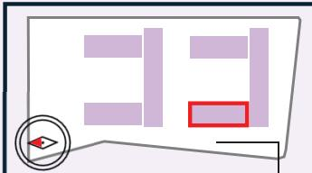

現時点での価格表です。最終の価格表は設計と詳細部分の整合があるため7/18-7/19の説明会資料でご提示します。  
各住戸の間取りや間数、住戸毎の管理費の想定についても住戸選定説明会資料でご提示します。  
※本計画は行政協議・施工・計画等で変更となる場合があります。

S-1棟 （西向き）

S-4棟 (東向き）  
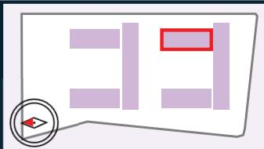

<table><tr><td rowspan=63 colspan=4>14階11階9階凡例住戸面積35台4階3階702階共用部</td><td></td><td></td><td></td><td rowspan=4 colspan=2>S</td><td></td><td></td><td></td><td></td><td></td><td></td><td rowspan=1 colspan=1>S4-1-1426</td><td rowspan=1 colspan=1>S4-2-1427</td><td rowspan=1 colspan=2>S4-3-1428</td><td rowspan=1 colspan=1>S4-4-1430</td><td rowspan=1 colspan=2>S4-5-1431</td><td></td><td rowspan=1 colspan=2></td><td rowspan=7 colspan=23></td></tr><tr><td></td><td></td><td></td><td></td><td></td><td></td><td></td><td></td><td></td><td rowspan=1 colspan=1>S4-1</td><td rowspan=1 colspan=1>S4-2</td><td rowspan=1 colspan=2>S4-3</td><td rowspan=1 colspan=1>S4-4</td><td rowspan=1 colspan=2>S4-5</td><td rowspan=1 colspan=1>S4-6r</td><td rowspan=3 colspan=2></td></tr><tr><td></td><td></td><td></td><td></td><td></td><td></td><td></td><td></td><td></td><td rowspan=1 colspan=1>61.24 m²</td><td rowspan=1 colspan=1>61.24 m²</td><td rowspan=1 colspan=2>71.92 m²</td><td rowspan=1 colspan=1>43.26 m²</td><td rowspan=1 colspan=2>71.92 m²</td><td rowspan=1 colspan=1>59.50 m²</td><td rowspan=1 colspan=1>61.80 m²</td><td rowspan=1 colspan=1>51.50 m²</td><td rowspan=1 colspan=1>51.50 m²</td><td rowspan=1 colspan=1></td></tr><tr><td></td><td></td><td></td><td></td><td></td><td></td><td></td><td></td><td></td><td rowspan=1 colspan=1>4,590</td><td rowspan=1 colspan=1>4,530</td><td rowspan=1 colspan=2>5,440</td><td rowspan=1 colspan=1>3,270</td><td rowspan=1 colspan=2>5,440</td><td rowspan=1 colspan=1>4,770</td><td rowspan=1 colspan=1>5,440</td><td rowspan=1 colspan=1>4,730</td><td rowspan=1 colspan=1>3,810</td><td rowspan=1 colspan=1>3,940</td><td rowspan=1 colspan=1>14階</td></tr><tr><td rowspan=4 colspan=1>13階</td><td></td><td></td><td></td><td></td><td></td><td></td><td></td><td></td><td></td><td></td><td></td><td rowspan=1 colspan=1>S4-1-1326</td><td rowspan=1 colspan=1>S4-2-1327</td><td rowspan=1 colspan=2>S4-3-1328</td><td rowspan=1 colspan=1>S4-4-1330</td><td rowspan=1 colspan=2>S4-5-1331</td><td rowspan=1 colspan=1>S4-6-1333</td><td rowspan=1 colspan=2>S4-7r-1334</td><td rowspan=4 colspan=3></td><td rowspan=1 colspan=1>S1-4r-1304</td><td rowspan=1 colspan=1>S1-5-1305</td><td rowspan=1 colspan=1>S1-6-1306</td><td rowspan=1 colspan=1>S1-7-1307</td><td rowspan=1 colspan=1>S1-8-1308</td><td rowspan=1 colspan=1></td></tr><tr><td></td><td></td><td></td><td></td><td></td><td></td><td></td><td></td><td></td><td></td><td></td><td rowspan=1 colspan=1>S4-1</td><td rowspan=1 colspan=1>S4-2</td><td rowspan=1 colspan=2>S4-3</td><td rowspan=1 colspan=1>S4-4</td><td rowspan=1 colspan=2>S4-5</td><td rowspan=1 colspan=1>S4-6</td><td rowspan=1 colspan=2>S4-7r</td><td rowspan=1 colspan=1>S1-4r</td><td rowspan=1 colspan=1>S1-5</td><td rowspan=1 colspan=1>S1-6</td><td rowspan=1 colspan=1>S1-7</td><td rowspan=1 colspan=1>S1-8</td><td rowspan=1 colspan=1></td></tr><tr><td></td><td></td><td></td><td></td><td></td><td></td><td></td><td></td><td></td><td></td><td></td><td rowspan=1 colspan=1>61.24 m²</td><td rowspan=1 colspan=1>61.24 m²</td><td rowspan=1 colspan=2>71.92 m²</td><td rowspan=1 colspan=1>43.26 m²</td><td rowspan=1 colspan=2>71.92 m²</td><td rowspan=1 colspan=1>53.75 m²</td><td rowspan=1 colspan=2>85.26 m²</td><td rowspan=1 colspan=1>67.31 m²</td><td rowspan=1 colspan=1>61.80 m²</td><td rowspan=1 colspan=1>61.80 m²</td><td rowspan=1 colspan=1>51.50 m²</td><td rowspan=1 colspan=1>51.50 m²</td><td rowspan=1 colspan=1></td></tr><tr><td></td><td></td><td></td><td></td><td></td><td></td><td></td><td></td><td></td><td></td><td></td><td rowspan=1 colspan=1>4,440</td><td rowspan=1 colspan=1>4,490</td><td rowspan=1 colspan=2>5,390</td><td rowspan=1 colspan=1>3,240</td><td rowspan=1 colspan=2>5,390</td><td rowspan=1 colspan=1>4,030</td><td rowspan=1 colspan=2>6,740</td><td rowspan=1 colspan=23></td></tr><tr><td rowspan=4 colspan=1>12階</td><td></td><td></td><td></td><td></td><td></td><td></td><td></td><td></td><td></td><td></td><td></td><td rowspan=2 colspan=1>S4-1-1226</td><td rowspan=1 colspan=1>S4-2-1227</td><td rowspan=1 colspan=2>S4-3-1228</td><td rowspan=1 colspan=1>S4-4-1230</td><td rowspan=1 colspan=2>S4-5-1231</td><td rowspan=1 colspan=1>S4-6-1233</td><td rowspan=1 colspan=2>S4-7-1234</td><td rowspan=1 colspan=23>S4-8-1236</td></tr><tr><td></td><td></td><td></td><td></td><td></td><td></td><td></td><td></td><td></td><td></td><td></td><td rowspan=1 colspan=1>S4-2</td><td rowspan=1 colspan=2></td><td rowspan=1 colspan=1>S4-4</td><td rowspan=1 colspan=2></td><td rowspan=1 colspan=1>S4-6</td><td rowspan=1 colspan=2></td><td rowspan=1 colspan=23>S4-8</td></tr><tr><td></td><td></td><td></td><td></td><td></td><td></td><td></td><td></td><td></td><td></td><td></td><td rowspan=1 colspan=1>61.24 m²</td><td rowspan=1 colspan=1>61.24 m²</td><td rowspan=1 colspan=2>71.92m²</td><td rowspan=1 colspan=1>43.26 m²</td><td rowspan=1 colspan=2>71.92m²</td><td></td><td rowspan=1 colspan=2>78.88m²</td><td rowspan=1 colspan=23>81.24 m²</td></tr><tr><td></td><td></td><td></td><td></td><td></td><td></td><td></td><td></td><td></td><td></td><td></td><td rowspan=1 colspan=1>4,410</td><td rowspan=1 colspan=1>4,310</td><td rowspan=1 colspan=2>5,350</td><td rowspan=1 colspan=1>3,220</td><td rowspan=1 colspan=2>5,350</td><td rowspan=1 colspan=1>4,000</td><td rowspan=1 colspan=2>5,870</td><td rowspan=1 colspan=23>6,290</td></tr><tr><td rowspan=6 colspan=1>11</td><td></td><td></td><td></td><td></td><td></td><td></td><td></td><td></td><td></td><td></td><td></td><td rowspan=1 colspan=1>S4-1-1126</td><td rowspan=1 colspan=1>S4-2-1127</td><td rowspan=1 colspan=2>S4-3-1128</td><td rowspan=1 colspan=1>S4-4-1130</td><td rowspan=1 colspan=2>S4-5-1131</td><td rowspan=1 colspan=1>S4-6-1133</td><td rowspan=1 colspan=2>S4-7-1134</td><td rowspan=1 colspan=23>S4-8-1136</td></tr><tr><td></td><td></td><td></td><td></td><td></td><td></td><td></td><td></td><td></td><td></td><td rowspan=1 colspan=1></td><td rowspan=1 colspan=1>S4-1</td><td rowspan=1 colspan=1>S4-2</td><td rowspan=1 colspan=2>S4-3</td><td rowspan=1 colspan=1>S4-4</td><td rowspan=1 colspan=2>S4-5</td><td rowspan=1 colspan=1>S4-6</td><td rowspan=1 colspan=2></td><td rowspan=1 colspan=23>S4-8</td></tr><tr><td></td><td></td><td></td><td></td><td></td><td></td><td></td><td></td><td></td><td></td><td></td><td></td><td></td><td></td><td></td><td></td><td></td><td></td><td></td><td></td><td></td><td></td><td></td><td></td><td rowspan=3 colspan=1>67.46 m²</td><td></td><td></td><td></td><td></td><td></td><td></td><td></td><td></td><td></td><td></td><td></td><td></td><td></td><td></td><td></td><td></td><td></td><td></td></tr><tr><td></td><td></td><td></td><td></td><td></td><td></td><td></td><td></td><td></td><td></td><td></td><td></td><td></td><td></td><td></td><td></td><td></td><td></td><td></td><td></td><td></td><td></td><td></td><td></td><td rowspan=2 colspan=1>43.26 m²</td><td rowspan=2 colspan=1>61.80 m²</td><td rowspan=2 colspan=1>61.80 m²</td><td></td><td></td><td></td><td></td><td></td><td></td><td></td><td></td><td></td><td></td><td></td><td></td><td></td><td></td><td></td></tr><tr><td></td><td></td><td></td><td></td><td></td><td></td><td></td><td></td><td></td><td></td><td></td><td rowspan=1 colspan=1>61.24 m²</td><td rowspan=1 colspan=1>61.24 m²</td><td rowspan=1 colspan=2>71.92 m²</td><td rowspan=1 colspan=1>43.26 m²</td><td rowspan=1 colspan=2>71.92 m²</td><td rowspan=1 colspan=1>53.75 m²</td><td rowspan=1 colspan=2>78.88 m²</td><td rowspan=1 colspan=23>81.24 m²</td></tr><tr><td></td><td></td><td></td><td></td><td></td><td></td><td></td><td></td><td></td><td></td><td></td><td rowspan=1 colspan=1>4,390</td><td rowspan=1 colspan=1>4,280</td><td rowspan=1 colspan=2>5,220</td><td rowspan=1 colspan=1>3,200</td><td rowspan=1 colspan=2>5,320</td><td rowspan=1 colspan=1>3,980</td><td rowspan=1 colspan=2>5,840</td><td rowspan=1 colspan=23>6,260</td></tr><tr><td rowspan=4 colspan=1>10階</td><td></td><td></td><td></td><td></td><td></td><td></td><td></td><td></td><td></td><td></td><td></td><td rowspan=1 colspan=1>S4-1-1026</td><td rowspan=1 colspan=1>S4-2-1027</td><td rowspan=1 colspan=2>S4-3-1028</td><td rowspan=1 colspan=1>S4-4-1030</td><td rowspan=1 colspan=2>S4-5-1031</td><td rowspan=1 colspan=1>S4-6-1033</td><td rowspan=1 colspan=2>S4-7-1034</td><td rowspan=1 colspan=23>S4-8-1036</td></tr><tr><td></td><td></td><td></td><td></td><td></td><td></td><td></td><td></td><td></td><td></td><td></td><td rowspan=1 colspan=1>S4-1</td><td rowspan=1 colspan=1>4S4-2</td><td rowspan=1 colspan=2>S4-3</td><td rowspan=1 colspan=1>S4-4</td><td rowspan=1 colspan=2>S4-5</td><td rowspan=1 colspan=1>S4-6</td><td rowspan=1 colspan=2></td><td rowspan=1 colspan=23>S4-8</td></tr><tr><td></td><td></td><td></td><td></td><td></td><td></td><td></td><td></td><td></td><td></td><td></td><td rowspan=1 colspan=1>61.24 m²</td><td rowspan=1 colspan=1>61.24 m²</td><td rowspan=1 colspan=2>71.92 m²</td><td rowspan=1 colspan=1>43.26 m²</td><td rowspan=1 colspan=2>71.92 m²</td><td rowspan=1 colspan=1>53.75 m²</td><td rowspan=1 colspan=2>78.88 m²</td><td rowspan=1 colspan=23>81.24 m²</td></tr><tr><td></td><td></td><td></td><td></td><td></td><td></td><td></td><td></td><td></td><td></td><td></td><td rowspan=1 colspan=1>4,360</td><td rowspan=1 colspan=1>4,250</td><td rowspan=1 colspan=2>5,190</td><td rowspan=1 colspan=1>3,130</td><td rowspan=1 colspan=2>5,290</td><td rowspan=1 colspan=1>3,950</td><td rowspan=1 colspan=2>5,800</td><td rowspan=1 colspan=23>6,220</td></tr><tr><td rowspan=3 colspan=1></td><td></td><td></td><td></td><td></td><td></td><td></td><td></td><td></td><td></td><td></td><td></td><td rowspan=1 colspan=1>S4-1-926</td><td rowspan=1 colspan=1>S4-2-927</td><td rowspan=1 colspan=2>S4-3-928</td><td rowspan=1 colspan=1>S4-4-930</td><td rowspan=1 colspan=2>S4-5-931</td><td rowspan=1 colspan=1>S4-6-933</td><td rowspan=1 colspan=2>S4-7-934</td><td rowspan=1 colspan=23>S4-8-936</td></tr><tr><td></td><td></td><td></td><td></td><td></td><td></td><td></td><td></td><td></td><td></td><td></td><td rowspan=1 colspan=1>S4-1</td><td rowspan=1 colspan=1>S4-2</td><td rowspan=1 colspan=2>S4-3</td><td rowspan=1 colspan=1>S4-4</td><td rowspan=1 colspan=2>S4-5</td><td rowspan=1 colspan=1>S4-6</td><td rowspan=1 colspan=2>S4-&#x27;</td><td rowspan=1 colspan=23>S4-8</td></tr><tr><td></td><td></td><td></td><td></td><td></td><td></td><td></td><td></td><td></td><td></td><td></td><td rowspan=1 colspan=1>61.24 m²</td><td rowspan=1 colspan=1>61.24 m²</td><td rowspan=1 colspan=2>71.92 m²</td><td rowspan=1 colspan=1>43.26 m²</td><td rowspan=1 colspan=2>71.92 m2</td><td rowspan=1 colspan=1>53.75 m²</td><td rowspan=1 colspan=2>78.88 m²</td><td rowspan=1 colspan=23>81.24 m²</td></tr><tr><td rowspan=3 colspan=1>9階</td><td></td><td></td><td></td><td></td><td></td><td></td><td></td><td></td><td></td><td></td><td></td><td rowspan=3 colspan=1>4,330</td><td rowspan=3 colspan=1>4,230</td><td rowspan=3 colspan=2>5,160</td><td rowspan=3 colspan=1>3,110</td><td rowspan=3 colspan=2>5,210</td><td></td><td></td><td></td><td></td><td></td><td></td><td rowspan=3 colspan=1>5,240</td><td rowspan=3 colspan=1>4,570</td><td rowspan=3 colspan=1>3,200</td><td rowspan=3 colspan=1>4,570</td><td rowspan=3 colspan=1>4,520</td><td rowspan=3 colspan=1>4,520</td><td rowspan=3 colspan=1>3,580</td><td rowspan=3 colspan=1>3,660</td><td rowspan=3 colspan=1>9階</td><td></td><td></td><td></td><td></td><td></td><td></td><td></td><td></td><td></td><td></td><td></td></tr><tr><td></td><td></td><td></td><td></td><td></td><td></td><td></td><td></td><td></td><td></td><td></td><td rowspan=2 colspan=1>3,930</td><td></td><td></td><td></td><td></td><td></td><td></td><td></td><td></td><td></td><td></td><td></td><td></td><td></td><td></td><td></td><td></td></tr><tr><td></td><td></td><td></td><td></td><td></td><td></td><td></td><td></td><td></td><td></td><td></td><td rowspan=1 colspan=2>5,760</td><td rowspan=1 colspan=23>6,180</td></tr><tr><td rowspan=1 colspan=1></td><td></td><td></td><td></td><td></td><td></td><td></td><td></td><td></td><td></td><td></td><td></td><td rowspan=1 colspan=1>S4-1-826</td><td rowspan=1 colspan=1>S4-2-827</td><td rowspan=1 colspan=2>S4-3-828</td><td rowspan=1 colspan=1>S4-4-830</td><td rowspan=1 colspan=2>S4-5-831</td><td rowspan=1 colspan=1>S4-6-833</td><td rowspan=1 colspan=2>S4-7-834</td><td rowspan=1 colspan=23>S4-8-836</td></tr><tr><td rowspan=1 colspan=1></td><td></td><td></td><td></td><td></td><td></td><td></td><td></td><td></td><td></td><td></td><td></td><td rowspan=1 colspan=1>61.24 m²S4-1</td><td rowspan=1 colspan=1>S4-261.24 m²</td><td rowspan=1 colspan=2>S4-371.92 m²</td><td rowspan=1 colspan=1>S4-443.26 m²</td><td rowspan=1 colspan=2>S4-571.92 m²</td><td rowspan=1 colspan=1>5375m²</td><td rowspan=1 colspan=2>S4-78.88 m²</td><td rowspan=1 colspan=23>81.24 m²S4-8</td></tr><tr><td rowspan=1 colspan=1>8階</td><td></td><td></td><td></td><td></td><td></td><td></td><td></td><td></td><td></td><td></td><td></td><td rowspan=1 colspan=1>4,300</td><td rowspan=1 colspan=1>4,200</td><td rowspan=1 colspan=2>5,120</td><td rowspan=1 colspan=1>3,090</td><td rowspan=1 colspan=2>5,170</td><td rowspan=1 colspan=1>3,900</td><td rowspan=1 colspan=2>5,730</td><td rowspan=1 colspan=23>6,150</td></tr><tr><td></td><td></td><td></td><td></td><td></td><td></td><td></td><td></td><td></td><td></td><td></td><td rowspan=2 colspan=1>S4-1-726</td><td rowspan=2 colspan=1>S4-2-727</td><td rowspan=2 colspan=2>S4-3-728</td><td rowspan=2 colspan=1>S4-4-730</td><td rowspan=2 colspan=2>S4-5-731</td><td rowspan=2 colspan=1>S4-6-733</td><td rowspan=2 colspan=2>S4-7-734</td><td rowspan=2 colspan=23>S4-8-736</td></tr><tr><td rowspan=3 colspan=2>住戸番号</td><td rowspan=3 colspan=1></td><td></td><td></td><td></td><td></td><td></td><td></td><td></td><td></td><td></td><td></td><td></td></tr><tr><td></td><td></td><td></td><td></td><td></td><td></td><td></td><td></td><td></td><td></td><td></td><td rowspan=1 colspan=1>S4-</td><td rowspan=1 colspan=1>S4-2</td><td rowspan=1 colspan=2></td><td rowspan=1 colspan=1>S4-4</td><td rowspan=1 colspan=2>S4-5</td><td rowspan=1 colspan=1>S4-6</td><td rowspan=1 colspan=2></td><td rowspan=1 colspan=23>S4-8</td></tr><tr><td></td><td></td><td></td><td></td><td></td><td></td><td></td><td></td><td></td><td></td><td></td><td rowspan=1 colspan=1>61.24 m²</td><td rowspan=1 colspan=1>61.24 m²</td><td rowspan=1 colspan=2>71.92m²</td><td rowspan=1 colspan=1>43.26 m²</td><td rowspan=1 colspan=2>71.92 m²</td><td rowspan=1 colspan=1>53.75 m²</td><td rowspan=1 colspan=2>78.88 m²</td><td rowspan=1 colspan=23>81.24 m²</td></tr><tr><td rowspan=1 colspan=2>住戸タイプ</td><td></td><td></td><td></td><td></td><td></td><td></td><td></td><td></td><td></td><td></td><td></td><td rowspan=1 colspan=1>4,280</td><td rowspan=1 colspan=1>4,170</td><td rowspan=1 colspan=2>5,090</td><td rowspan=1 colspan=1>3,070</td><td rowspan=1 colspan=2>5,140</td><td rowspan=1 colspan=1>3,830</td><td rowspan=1 colspan=2>5,690</td><td rowspan=1 colspan=23>6,110</td></tr><tr><td rowspan=2 colspan=2>面積</td><td></td><td></td><td></td><td></td><td></td><td></td><td></td><td></td><td></td><td></td><td></td><td rowspan=1 colspan=1>S4-1-626</td><td rowspan=1 colspan=1>S4-2-627</td><td rowspan=1 colspan=2>S4-3-628</td><td rowspan=1 colspan=1>S4-4-630</td><td rowspan=1 colspan=2>S4-5-631</td><td></td><td rowspan=1 colspan=2>S4-7-634</td><td rowspan=1 colspan=23>S4-8-636</td></tr><tr><td></td><td></td><td></td><td></td><td></td><td></td><td></td><td></td><td></td><td></td><td></td><td rowspan=1 colspan=1>S4-1</td><td rowspan=1 colspan=1>4-4</td><td rowspan=1 colspan=2>S4-3</td><td rowspan=1 colspan=1>S4-4</td><td rowspan=1 colspan=2>-5</td><td rowspan=1 colspan=1>S4-6</td><td rowspan=1 colspan=2>S4-7</td><td rowspan=1 colspan=23>S4-8</td></tr><tr><td rowspan=1 colspan=2>価格(万円)</td><td></td><td></td><td></td><td></td><td></td><td></td><td></td><td></td><td></td><td></td><td></td><td rowspan=1 colspan=1>61.24 m²4,250</td><td rowspan=1 colspan=1>4,140</td><td rowspan=1 colspan=2>71.92 m²5,060</td><td rowspan=1 colspan=1>43.26 m²3,050</td><td rowspan=1 colspan=2>5,110</td><td rowspan=1 colspan=1>3,810</td><td rowspan=1 colspan=2>78.88 m²5,660</td><td rowspan=1 colspan=23>6,020</td></tr><tr><td></td><td></td><td></td><td></td><td></td><td></td><td></td><td></td><td></td><td></td><td></td><td rowspan=2 colspan=1>S4-1-526</td><td rowspan=1 colspan=1>S4-2-527</td><td rowspan=1 colspan=1>S4-3A-528</td><td rowspan=1 colspan=1>S4-3B-529</td><td rowspan=1 colspan=1>S4-4-530</td><td rowspan=1 colspan=2>S4-5A-531S4-5B-532</td><td rowspan=1 colspan=1>S4-6-533</td><td rowspan=1 colspan=1>-7A-534</td><td rowspan=1 colspan=1>S4-7B-535</td><td rowspan=2 colspan=23>S4-8-536S4-8</td></tr><tr><td></td><td></td><td></td><td></td><td></td><td></td><td></td><td></td><td></td><td></td><td></td><td rowspan=1 colspan=1>S4-2</td><td rowspan=1 colspan=1>S4-3A</td><td rowspan=1 colspan=1>S4-3B</td><td rowspan=1 colspan=1>S4-4</td><td rowspan=1 colspan=2>S4-5A    S4-5B</td><td rowspan=1 colspan=1>S4-6</td><td rowspan=1 colspan=1>S4-7A</td><td rowspan=1 colspan=1>S4-7B</td></tr><tr><td></td><td></td><td></td><td></td><td></td><td></td><td></td><td></td><td></td><td></td><td></td><td rowspan=1 colspan=1>61.24 m²</td><td rowspan=1 colspan=1>61.24 m²</td><td rowspan=1 colspan=1>35.96 m²</td><td rowspan=1 colspan=1>35.96 m²</td><td rowspan=1 colspan=1>43.26 m²</td><td rowspan=1 colspan=1>35.96 m²</td><td rowspan=1 colspan=1>35.96 m²</td><td rowspan=1 colspan=1>53.75 m²</td><td rowspan=1 colspan=1>42.92 m²</td><td rowspan=1 colspan=1>35.96 m²</td><td rowspan=1 colspan=23>81.24 m²</td></tr><tr><td></td><td></td><td></td><td></td><td></td><td></td><td></td><td></td><td></td><td></td><td></td><td rowspan=1 colspan=1>4,220</td><td rowspan=1 colspan=1>4,110</td><td rowspan=1 colspan=1>1,810</td><td rowspan=1 colspan=1>1,860</td><td rowspan=1 colspan=1>3,030</td><td rowspan=1 colspan=1>1,860</td><td rowspan=1 colspan=1>1,860</td><td rowspan=1 colspan=1>3,780</td><td rowspan=1 colspan=1>3,010</td><td rowspan=1 colspan=1>1,860</td><td rowspan=1 colspan=23>5,990</td></tr><tr><td></td><td></td><td></td><td></td><td></td><td></td><td></td><td></td><td></td><td></td><td></td><td rowspan=1 colspan=1>S4-1-426</td><td rowspan=1 colspan=1>S4-2-427</td><td rowspan=1 colspan=1>S4-3A-428</td><td rowspan=1 colspan=1>S4-3B-429</td><td rowspan=1 colspan=1>S4-4-430</td><td rowspan=1 colspan=1>S4-5A-431</td><td rowspan=1 colspan=1></td><td rowspan=1 colspan=1></td><td rowspan=1 colspan=1></td><td rowspan=1 colspan=1></td><td rowspan=1 colspan=23></td></tr><tr><td></td><td></td><td></td><td></td><td></td><td></td><td></td><td></td><td></td><td></td><td></td><td rowspan=3 colspan=1>S4-61.24 m²</td><td rowspan=2 colspan=1>S4-2</td><td rowspan=2 colspan=1>S4-3A</td><td rowspan=2 colspan=1>S4-3B</td><td rowspan=2 colspan=1>64-4</td><td rowspan=2 colspan=1>S4-5A</td><td rowspan=2 colspan=1>S4-5B</td><td></td><td rowspan=2 colspan=1>4-7A</td><td rowspan=2 colspan=1>4-7B</td><td rowspan=2 colspan=23>64-8</td></tr><tr><td></td><td></td><td></td><td></td><td></td><td></td><td></td><td></td><td></td><td></td><td></td><td></td><td rowspan=2 colspan=1>35m台</td><td rowspan=2 colspan=1></td></tr><tr><td></td><td></td><td></td><td></td><td></td><td></td><td></td><td></td><td></td><td></td><td></td><td rowspan=1 colspan=1>61.24 m²</td><td rowspan=1 colspan=1>35.96 m²</td><td rowspan=1 colspan=1>35.96 m²</td><td rowspan=1 colspan=1>43.26 m²</td><td rowspan=1 colspan=1>35.96 m2</td><td rowspan=1 colspan=1>35.96 m²</td><td></td><td rowspan=1 colspan=1>42.92 m²</td><td rowspan=1 colspan=1>35.96 m²</td><td rowspan=1 colspan=23>81.24 m²</td></tr><tr><td></td><td></td><td></td><td></td><td></td><td></td><td></td><td></td><td></td><td></td><td></td><td rowspan=1 colspan=1>4,190</td><td rowspan=1 colspan=1>4,090</td><td rowspan=1 colspan=1>1,800</td><td rowspan=1 colspan=1>1,850</td><td rowspan=1 colspan=1>3,010</td><td rowspan=1 colspan=1>1,850</td><td rowspan=1 colspan=1>1,850</td><td rowspan=1 colspan=1>3,760</td><td rowspan=1 colspan=1>2,990</td><td rowspan=1 colspan=1>1,850</td><td rowspan=1 colspan=23>5,950</td></tr><tr><td></td><td></td><td></td><td></td><td></td><td></td><td></td><td></td><td></td><td></td><td></td><td rowspan=3 colspan=1>S4-1-326</td><td rowspan=1 colspan=1>S4-2-327</td><td rowspan=1 colspan=1>S4-3A-328</td><td rowspan=1 colspan=1>S4-3B-329</td><td rowspan=1 colspan=1>S4-4-330</td><td rowspan=1 colspan=1>S4-5A-331</td><td rowspan=1 colspan=1>S4-5B-332</td><td rowspan=1 colspan=1>S4-6-333</td><td rowspan=1 colspan=1>54-7A-334</td><td rowspan=1 colspan=1>S4-7B-335</td><td rowspan=1 colspan=23>S4-8-336</td></tr><tr><td></td><td></td><td></td><td></td><td></td><td></td><td></td><td></td><td></td><td></td><td></td><td></td><td></td><td></td><td></td><td></td><td></td><td></td><td></td><td></td><td></td><td></td><td></td><td rowspan=2 colspan=1></td><td rowspan=2 colspan=1></td><td rowspan=2 colspan=1></td><td rowspan=2 colspan=1>31-4-304</td><td rowspan=2 colspan=1>31-5-305</td><td rowspan=2 colspan=1>S1-6-306</td><td rowspan=2 colspan=1>ST-7-307</td><td></td><td></td><td></td><td></td><td></td><td></td><td></td><td></td><td></td><td></td><td></td></tr><tr><td></td><td></td><td></td><td></td><td></td><td></td><td></td><td></td><td></td><td></td><td></td><td rowspan=1 colspan=1>3+2327</td><td rowspan=1 colspan=1></td><td rowspan=1 colspan=1></td><td rowspan=1 colspan=1>S4-4</td><td rowspan=1 colspan=1>345351</td><td rowspan=1 colspan=1>3435352</td><td rowspan=1 colspan=1></td><td rowspan=1 colspan=1></td><td rowspan=1 colspan=1>S4-7B</td><td rowspan=1 colspan=23>348 350</td></tr><tr><td></td><td></td><td></td><td></td><td></td><td></td><td></td><td></td><td></td><td></td><td></td><td rowspan=1 colspan=1>61.24 m²</td><td rowspan=1 colspan=1>S4-261.24 m²</td><td rowspan=1 colspan=1>35.96m²</td><td rowspan=1 colspan=1>35.06.m²</td><td rowspan=1 colspan=1>43.26 m²</td><td rowspan=1 colspan=1>35.96 m²</td><td rowspan=1 colspan=1>35.96 m²</td><td rowspan=1 colspan=1>5275 m²</td><td rowspan=1 colspan=1>42.92 m²</td><td rowspan=1 colspan=1>35.96 m²</td><td rowspan=1 colspan=23>81.24 m²</td></tr><tr><td rowspan=2 colspan=1></td><td></td><td></td><td></td><td></td><td></td><td></td><td></td><td></td><td></td><td></td><td></td><td></td><td></td><td></td><td></td><td></td><td></td><td></td><td></td><td></td><td></td><td></td><td rowspan=3 colspan=1>60台</td><td></td><td></td><td></td><td></td><td></td><td></td><td></td><td></td><td></td><td></td><td></td><td></td><td></td><td></td><td></td><td></td><td></td><td></td><td></td><td></td><td></td></tr><tr><td></td><td></td><td></td><td></td><td></td><td></td><td></td><td></td><td></td><td></td><td></td><td rowspan=1 colspan=1>4,160</td><td rowspan=1 colspan=1>4,060</td><td rowspan=1 colspan=1>1,780</td><td rowspan=1 colspan=1>1,830</td><td rowspan=1 colspan=1>2,990</td><td rowspan=1 colspan=1>1,830</td><td rowspan=1 colspan=1>1,830</td><td rowspan=1 colspan=1>3,730</td><td rowspan=1 colspan=1>2,970</td><td rowspan=1 colspan=1>1,830</td><td rowspan=1 colspan=23>5,910</td></tr><tr><td></td><td></td><td></td><td></td><td></td><td></td><td></td><td></td><td></td><td></td><td></td><td rowspan=1 colspan=1>S4-1-226</td><td rowspan=1 colspan=1>S4-2-227</td><td rowspan=1 colspan=1>S4-3A-228</td><td rowspan=1 colspan=1>S4-3B-229</td><td rowspan=1 colspan=1>S4-4-230</td><td rowspan=1 colspan=1>S4-5A-231</td><td rowspan=1 colspan=1>S4-5B-232</td><td rowspan=1 colspan=1>S4-6-233</td><td rowspan=1 colspan=1>64-7A-234</td><td rowspan=1 colspan=1>S4-7B-235</td><td rowspan=1 colspan=23>S4-8-236</td></tr><tr><td></td><td></td><td></td><td></td><td></td><td></td><td></td><td></td><td></td><td></td><td></td><td rowspan=1 colspan=1>34-1-226</td><td rowspan=1 colspan=1>34-2-227</td><td rowspan=1 colspan=1>34-3A-228</td><td rowspan=1 colspan=1>34-3B-229</td><td rowspan=1 colspan=1>34-4-230</td><td rowspan=1 colspan=1>34-5A-231</td><td rowspan=1 colspan=1>34-5B-232</td><td rowspan=1 colspan=1>34-6-233</td><td rowspan=1 colspan=1>34-7A-234</td><td rowspan=1 colspan=1>34-7B-235</td><td rowspan=1 colspan=23>34-8-236</td><td rowspan=1 colspan=2>70台</td><td rowspan=1 colspan=1></td><td rowspan=1 colspan=1>67.98 m2</td><td rowspan=1 colspan=1>S1-261.80 m²</td><td rowspan=1 colspan=1>43.2m2m</td><td rowspan=1 colspan=1>S1-461.80 m²</td><td rowspan=1 colspan=1>61.80 m²</td><td rowspan=1 colspan=1>S1-661.80 m²</td><td rowspan=1 colspan=1>51.50 m²</td><td rowspan=1 colspan=1>51.50m²1-8</td><td rowspan=1 colspan=1></td><td rowspan=1 colspan=1>S4-161.24 m²</td><td rowspan=1 colspan=1>S4-261.24 m²</td><td rowspan=1 colspan=1>S4-3A35.96 m²</td></tr><tr><td></td><td></td><td></td><td></td><td></td><td></td><td></td><td></td><td></td><td></td><td></td><td rowspan=1 colspan=1>4,140</td><td rowspan=1 colspan=1>4,030</td><td rowspan=1 colspan=1>1,760</td><td rowspan=1 colspan=1>1,810</td><td rowspan=1 colspan=1>2,970</td><td rowspan=1 colspan=1>1,810</td><td rowspan=1 colspan=1>1,810</td><td></td><td rowspan=1 colspan=1>2,950</td><td rowspan=1 colspan=1>1,810</td><td rowspan=1 colspan=23>5,880</td></tr><tr><td></td><td></td><td></td><td></td><td></td><td></td><td></td><td></td><td></td><td></td><td></td><td rowspan=1 colspan=1></td><td rowspan=1 colspan=1></td><td rowspan=1 colspan=1></td><td rowspan=1 colspan=1></td><td rowspan=1 colspan=1>S4-4-130</td><td rowspan=1 colspan=1>S4-5A-131</td><td rowspan=1 colspan=1>S4-5B-132</td><td rowspan=1 colspan=1>S4-6-133</td><td rowspan=1 colspan=1>S4-7A-134</td><td rowspan=1 colspan=1>S4-7B-135</td><td rowspan=1 colspan=23>S4-8g-136</td></tr><tr><td></td><td></td><td></td><td></td><td></td><td></td><td></td><td></td><td></td><td></td><td></td><td></td><td></td><td></td><td></td><td></td><td></td><td></td><td></td><td></td><td></td><td></td><td rowspan=4 colspan=1>共用部</td><td rowspan=4 colspan=1></td><td rowspan=4 colspan=1>S1-1g67.98 m²</td><td rowspan=4 colspan=1>S1-2g61.80 m²</td><td rowspan=4 colspan=1>1S1-3g2</td><td rowspan=4 colspan=1>S1-4g61.80 m²</td><td rowspan=4 colspan=1>S1-5g61.80 m²</td><td rowspan=4 colspan=1>61.80m2</td><td></td><td></td><td></td><td></td><td></td><td></td><td></td><td></td><td></td><td></td><td></td><td></td><td></td><td></td></tr><tr><td></td><td></td><td></td><td></td><td></td><td></td><td></td><td></td><td></td><td></td><td></td><td></td><td></td><td></td><td></td><td></td><td></td><td></td><td></td><td></td><td></td><td></td><td rowspan=3 colspan=1>S1-7g51.50 m²</td><td rowspan=3 colspan=1>サブエントランス</td><td></td><td></td><td></td><td></td><td></td><td></td><td></td><td></td><td></td><td></td><td></td><td></td></tr><tr><td></td><td></td><td></td><td></td><td></td><td></td><td></td><td></td><td></td><td></td><td></td><td></td><td></td><td></td><td></td><td></td><td></td><td></td><td></td><td></td><td></td><td></td><td rowspan=2 colspan=1></td><td></td><td></td><td></td><td></td><td></td><td></td><td></td><td></td><td></td><td></td><td></td></tr><tr><td></td><td></td><td></td><td></td><td></td><td></td><td></td><td></td><td></td><td></td><td></td><td rowspan=1 colspan=1>共用</td><td rowspan=1 colspan=1>共用</td><td rowspan=1 colspan=1>共用</td><td rowspan=1 colspan=1>共用</td><td rowspan=1 colspan=1>S4-443.26 m²</td><td rowspan=1 colspan=1>S4-5A</td><td rowspan=1 colspan=1>S4-5B35.96 m²</td><td rowspan=1 colspan=1>S4-6</td><td rowspan=1 colspan=1>S4-7A</td><td rowspan=1 colspan=1>S4-7B</td><td rowspan=1 colspan=23>S4-8g71.98 m2</td></tr><tr><td></td><td></td><td></td><td></td><td></td><td></td><td></td><td></td><td></td><td></td><td></td><td rowspan=1 colspan=1></td><td rowspan=1 colspan=1></td><td rowspan=1 colspan=1></td><td rowspan=1 colspan=1></td><td rowspan=1 colspan=1>2,940</td><td rowspan=1 colspan=1>1,790</td><td rowspan=1 colspan=1>1,790</td><td rowspan=1 colspan=1>3,670</td><td rowspan=1 colspan=1>2,920</td><td rowspan=1 colspan=1>1,790</td><td rowspan=1 colspan=23>5,150</td></tr></table>

S-2棟 (南向き）

## 住戸価格について

価格表

住戸面積  
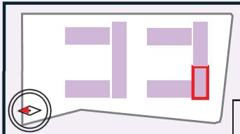

※現時点での価格表です。最終の価格表は設計と詳細部分の整合があるため7/18-7/19の説明会資料にてご確認ください。※各住戸の間取りや間数は住戸選定説明会資料でご提示します。※本計画は行政協議・施工・計画等で変更となる場合があります。 \_

S-3棟 (南向き）

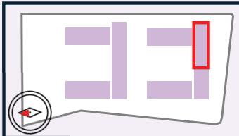

住戸番号住戸タイプ面積価格(万円)

凡例

<table><tr><td rowspan=2 colspan=1></td><td rowspan=2 colspan=1></td><td rowspan=1 colspan=1>S2-1-1409</td><td rowspan=1 colspan=1>S2-2-1410S</td><td rowspan=1 colspan=1>2-3-1411</td><td rowspan=1 colspan=1>S2-4-1412</td><td rowspan=1 colspan=1>S2-5-1413</td><td rowspan=1 colspan=1>S2-6-1414</td><td rowspan=1 colspan=1>S2-7-1415</td><td rowspan=1 colspan=1>S2-8-1416 S</td><td rowspan=1 colspan=1>2-9-1417</td><td rowspan=1 colspan=1></td><td rowspan=1 colspan=1>S3-1-1418</td><td rowspan=1 colspan=1>S3-2-1419S</td><td rowspan=1 colspan=1>3-3-1420</td><td rowspan=1 colspan=1>S3-4-1421</td><td rowspan=1 colspan=1>S3-5-1422</td><td rowspan=1 colspan=1>S3-6-1423</td><td rowspan=1 colspan=1>S3-7-1424</td><td rowspan=1 colspan=1>S3-8-1425</td></tr><tr><td rowspan=1 colspan=1>S2-1</td><td rowspan=1 colspan=1>S2-2</td><td rowspan=1 colspan=1>S2-3</td><td rowspan=1 colspan=1>S2-4</td><td rowspan=1 colspan=1>S2-5</td><td rowspan=1 colspan=1>S2-6</td><td rowspan=1 colspan=1>S2-7</td><td rowspan=1 colspan=1>S2-8</td><td rowspan=1 colspan=1>S2-9</td><td rowspan=1 colspan=1></td><td rowspan=1 colspan=1>S3-1</td><td rowspan=1 colspan=1>S3-2</td><td rowspan=1 colspan=1>S3-3</td><td rowspan=1 colspan=1>S3-4</td><td rowspan=1 colspan=1>S3-5</td><td rowspan=1 colspan=1>S3-6</td><td rowspan=1 colspan=1>S3-7</td><td rowspan=1 colspan=1>S3-8</td></tr><tr><td rowspan=2 colspan=1></td><td rowspan=2 colspan=1>14階</td><td rowspan=1 colspan=1>71.10 m²</td><td rowspan=1 colspan=1>43.26 m²</td><td rowspan=1 colspan=1>50.02 m²</td><td rowspan=1 colspan=1>50.02 m²</td><td rowspan=1 colspan=1>50.02 m²</td><td rowspan=1 colspan=1>47.38 m²</td><td rowspan=1 colspan=1>61.80 m²</td><td rowspan=1 colspan=1>63.86 m²</td><td rowspan=1 colspan=1>61.80 m²</td><td rowspan=1 colspan=1></td><td rowspan=1 colspan=1>71.92 m²</td><td rowspan=1 colspan=1>71.92 m²</td><td rowspan=1 colspan=1>71.92m²</td><td rowspan=1 colspan=1>71.92 m²</td><td rowspan=1 colspan=1>71.08 m²</td><td rowspan=1 colspan=1>71.08 m²</td><td rowspan=1 colspan=1>71.92 m²</td><td rowspan=1 colspan=1>80.05 m²</td></tr><tr><td rowspan=1 colspan=1>6,170</td><td rowspan=1 colspan=1>3,540</td><td rowspan=1 colspan=1>4,010</td><td rowspan=1 colspan=1>4,010</td><td rowspan=1 colspan=1>4,090</td><td rowspan=1 colspan=1>3,880</td><td rowspan=1 colspan=1>5,060</td><td rowspan=1 colspan=1>5,230</td><td rowspan=1 colspan=1>5,060</td><td rowspan=1 colspan=1>14階</td><td rowspan=1 colspan=1>5,880</td><td rowspan=1 colspan=1>5,880</td><td rowspan=1 colspan=1>5,880</td><td rowspan=1 colspan=1>5,880</td><td rowspan=1 colspan=1>5,740</td><td rowspan=1 colspan=1>5,740</td><td rowspan=1 colspan=1>5,800</td><td rowspan=1 colspan=1>7,340</td></tr><tr><td rowspan=4 colspan=1></td><td rowspan=2 colspan=1></td><td rowspan=2 colspan=1>S2-1-1309S2-1</td><td rowspan=1 colspan=1>S2-2-1310</td><td rowspan=1 colspan=1>S2-3-1311</td><td rowspan=1 colspan=1>S2-4-1312</td><td rowspan=1 colspan=1>S2-5-1313</td><td rowspan=1 colspan=1>S2-6-1314</td><td rowspan=1 colspan=1>S2-7-1315</td><td rowspan=1 colspan=1>S2-8-1316</td><td rowspan=1 colspan=1>S2-9-1317</td><td rowspan=2 colspan=1></td><td rowspan=1 colspan=1>S3-1-1318</td><td rowspan=1 colspan=1>S3-2-1319</td><td rowspan=1 colspan=1>S3-3-1320</td><td rowspan=1 colspan=1>S3-4-1321</td><td rowspan=1 colspan=1>S3-5-1322</td><td rowspan=1 colspan=1>S3-6-1323</td><td rowspan=1 colspan=1>S3-7-1324</td><td rowspan=2 colspan=1>S3-8-1325S3-8</td></tr><tr><td rowspan=1 colspan=1>S2-2</td><td rowspan=1 colspan=1>S2-3</td><td rowspan=1 colspan=1>S2-4</td><td rowspan=1 colspan=1>S2-5</td><td rowspan=1 colspan=1>S2-6</td><td rowspan=1 colspan=1>S2-7</td><td rowspan=1 colspan=1>S2-8</td><td rowspan=1 colspan=1>S2-9</td><td rowspan=1 colspan=1>S3-1</td><td rowspan=1 colspan=1>S3-2</td><td rowspan=1 colspan=1>S3-3</td><td rowspan=1 colspan=1>S3-4</td><td rowspan=1 colspan=1>S3-5</td><td rowspan=1 colspan=1>S3-6</td><td rowspan=1 colspan=1>S3-7</td></tr><tr><td rowspan=1 colspan=1></td><td rowspan=1 colspan=1>71.10 m²</td><td rowspan=1 colspan=1>43.26 m²</td><td rowspan=1 colspan=1>50.02 m²</td><td rowspan=1 colspan=1>50.02 m²</td><td rowspan=1 colspan=1>50.02 m²</td><td rowspan=1 colspan=1>47.38 m²</td><td rowspan=1 colspan=1>61.80 m²</td><td rowspan=1 colspan=1>63.86 m²</td><td rowspan=1 colspan=1>61.80 m²</td><td rowspan=1 colspan=1></td><td rowspan=1 colspan=1>71.92 m²</td><td rowspan=1 colspan=1>71.92 m²</td><td rowspan=1 colspan=1>71.92 m²</td><td rowspan=1 colspan=1>71.92 m²</td><td rowspan=1 colspan=1>71.08 m²</td><td rowspan=1 colspan=1>71.08 m²</td><td rowspan=1 colspan=1>71.92 m²</td><td rowspan=1 colspan=1>80.05 m²</td></tr><tr><td rowspan=1 colspan=1>13階</td><td rowspan=1 colspan=1>6,110</td><td rowspan=1 colspan=1>3,510</td><td rowspan=1 colspan=1>3,980</td><td rowspan=1 colspan=1>3,980</td><td rowspan=1 colspan=1>4,060</td><td rowspan=1 colspan=1>3,840</td><td rowspan=1 colspan=1>5,010</td><td rowspan=1 colspan=1>5,180</td><td rowspan=1 colspan=1>5,010</td><td rowspan=1 colspan=1>13階</td><td rowspan=1 colspan=1>5,830</td><td rowspan=1 colspan=1>5,830</td><td rowspan=1 colspan=1>5,830</td><td rowspan=1 colspan=1>5,830</td><td rowspan=1 colspan=1>5,680</td><td rowspan=1 colspan=1>5,680</td><td rowspan=1 colspan=1>5,750</td><td rowspan=1 colspan=1>7,280</td></tr><tr><td rowspan=4 colspan=1></td><td rowspan=3 colspan=1></td><td rowspan=1 colspan=1>S2-1-1209</td><td rowspan=1 colspan=1>S2-2-1210</td><td rowspan=1 colspan=1>S2-3-1211</td><td rowspan=1 colspan=1>S2-4-1212</td><td rowspan=1 colspan=1>S2-5-1213</td><td rowspan=1 colspan=1>S2-6-1214</td><td rowspan=1 colspan=1>S2-7-1215</td><td rowspan=1 colspan=1>S2-8-1216</td><td rowspan=1 colspan=1>S2-9-1217</td><td rowspan=1 colspan=1></td><td rowspan=1 colspan=1>S3-1-1218</td><td rowspan=1 colspan=1>S3-2-1219</td><td rowspan=1 colspan=1>S3-3-1220</td><td rowspan=1 colspan=1>S3-4-1221</td><td rowspan=1 colspan=1>S3-5-1222</td><td rowspan=1 colspan=1>S3-6-1223</td><td rowspan=1 colspan=1>S3-7-1224</td><td rowspan=1 colspan=1>S3-8-1225</td></tr><tr><td rowspan=1 colspan=1>S2-1</td><td rowspan=1 colspan=1>S2-2</td><td rowspan=1 colspan=1>S2-3</td><td rowspan=1 colspan=1>S2-4</td><td rowspan=1 colspan=1>S2-5</td><td rowspan=1 colspan=1>S2-6</td><td rowspan=1 colspan=1>S2-7</td><td rowspan=1 colspan=1>S2-8</td><td rowspan=1 colspan=1>S2-9</td><td rowspan=1 colspan=1></td><td rowspan=1 colspan=1>S3-1</td><td rowspan=1 colspan=1>S3-2</td><td rowspan=1 colspan=1>S3-3</td><td rowspan=1 colspan=1>S3-4</td><td rowspan=1 colspan=1>S3-5</td><td rowspan=1 colspan=1>S3-6</td><td rowspan=1 colspan=1>S3-7</td><td rowspan=1 colspan=1>S3-8</td></tr><tr><td rowspan=1 colspan=1>71.10 m²</td><td rowspan=1 colspan=1>43.26 m²</td><td rowspan=1 colspan=1>50.02 m²</td><td rowspan=1 colspan=1>50.02 m²</td><td rowspan=1 colspan=1>50.02 m²</td><td rowspan=1 colspan=1>47.38 m²</td><td rowspan=1 colspan=1>61.80 m²</td><td rowspan=1 colspan=1>63.86 m²</td><td rowspan=1 colspan=1>61.80 m²</td><td rowspan=1 colspan=1></td><td rowspan=1 colspan=1>71.92 m²</td><td rowspan=1 colspan=1>71.92 m²</td><td rowspan=1 colspan=1>71.92 m²</td><td rowspan=1 colspan=1>71.92 m²</td><td rowspan=1 colspan=1>71.08 m²</td><td rowspan=1 colspan=1>71.08 m²</td><td rowspan=1 colspan=1>71.92 m²</td><td rowspan=1 colspan=1>80.05 m²</td></tr><tr><td rowspan=1 colspan=1>12階</td><td rowspan=1 colspan=1>6,080</td><td rowspan=1 colspan=1>3,490</td><td rowspan=1 colspan=1>3,950</td><td rowspan=1 colspan=1>3,950</td><td rowspan=1 colspan=1>4,030</td><td rowspan=1 colspan=1>3,820</td><td rowspan=1 colspan=1>4,980</td><td rowspan=1 colspan=1>5,150</td><td rowspan=1 colspan=1>4,980</td><td rowspan=1 colspan=1>12階</td><td rowspan=1 colspan=1>5,800</td><td rowspan=1 colspan=1>5,800</td><td rowspan=1 colspan=1>5,800</td><td rowspan=1 colspan=1>5,800</td><td rowspan=1 colspan=1>5,650</td><td rowspan=1 colspan=1>5,650</td><td rowspan=1 colspan=1>5,720</td><td rowspan=1 colspan=1>7,240</td></tr><tr><td rowspan=4 colspan=1></td><td rowspan=3 colspan=1></td><td rowspan=1 colspan=1>S2-1-1109</td><td rowspan=1 colspan=1>S2-2-1110</td><td rowspan=1 colspan=1>S2-3-1111</td><td rowspan=1 colspan=1>S2-4-1112</td><td rowspan=1 colspan=1>S2-5-1113</td><td rowspan=1 colspan=1>S2-6-1114</td><td rowspan=1 colspan=1>S2-7-1115</td><td rowspan=1 colspan=1>S2-8-1116</td><td rowspan=1 colspan=1>S2-9-1117</td><td rowspan=1 colspan=1></td><td rowspan=1 colspan=1>S3-1-1118</td><td rowspan=1 colspan=1>S3-2-1119</td><td rowspan=1 colspan=1>S3-3-1120</td><td rowspan=1 colspan=1>S3-4-1121</td><td rowspan=1 colspan=1>S3-5-1122</td><td rowspan=1 colspan=1>S3-6-1123</td><td rowspan=1 colspan=1>S3-7-1124</td><td rowspan=1 colspan=1>S3-8-1125</td></tr><tr><td rowspan=1 colspan=1>S2-1</td><td rowspan=1 colspan=1>S2-2</td><td rowspan=1 colspan=1>S2-3</td><td rowspan=1 colspan=1>S2-4</td><td rowspan=1 colspan=1>S2-5</td><td rowspan=1 colspan=1>S2-6</td><td rowspan=1 colspan=1>S2-7</td><td rowspan=1 colspan=1>S2-8</td><td rowspan=1 colspan=1>S2-9</td><td rowspan=1 colspan=1></td><td rowspan=1 colspan=1>S3-</td><td rowspan=1 colspan=1>S3-2</td><td rowspan=1 colspan=1>S3-3</td><td rowspan=1 colspan=1>S3-4</td><td rowspan=1 colspan=1>S3-5</td><td rowspan=1 colspan=1>S3-6</td><td rowspan=1 colspan=1>S3-7</td><td rowspan=1 colspan=1>S3-8</td></tr><tr><td rowspan=1 colspan=1>71.10 m²</td><td rowspan=1 colspan=1>43.26 m²</td><td rowspan=1 colspan=1>50.02 m²</td><td rowspan=1 colspan=1>50.02 m²</td><td rowspan=1 colspan=1>50.02 m²</td><td rowspan=1 colspan=1>47.38 m²</td><td rowspan=1 colspan=1>61.80 m²</td><td rowspan=1 colspan=1>63.86 m²</td><td rowspan=1 colspan=1>61.80 m²</td><td rowspan=1 colspan=1></td><td rowspan=1 colspan=1>71.92 m²</td><td rowspan=1 colspan=1>71.92 m²</td><td rowspan=1 colspan=1>71.92 m²</td><td rowspan=1 colspan=1>71.92 m²</td><td rowspan=1 colspan=1>71.08 m²</td><td rowspan=1 colspan=1>71.08 m²</td><td rowspan=1 colspan=1>71.92 m²</td><td rowspan=1 colspan=1>80.05 m²</td></tr><tr><td rowspan=1 colspan=1>11階</td><td rowspan=1 colspan=1>6,050</td><td rowspan=1 colspan=1>3,470</td><td rowspan=1 colspan=1>3,930</td><td rowspan=1 colspan=1>3,930</td><td rowspan=1 colspan=1>4,010</td><td rowspan=1 colspan=1>3,800</td><td rowspan=1 colspan=1>4,950</td><td rowspan=1 colspan=1>5,120</td><td rowspan=1 colspan=1>4,950</td><td rowspan=1 colspan=1>11階</td><td rowspan=1 colspan=1>5,770</td><td rowspan=1 colspan=1>5,770</td><td rowspan=1 colspan=1>5,770</td><td rowspan=1 colspan=1>5,770</td><td rowspan=1 colspan=1>5,620</td><td rowspan=1 colspan=1>5,620</td><td rowspan=1 colspan=1>5,690</td><td rowspan=1 colspan=1>7,200</td></tr><tr><td rowspan=4 colspan=1></td><td rowspan=3 colspan=1></td><td rowspan=1 colspan=1>S2-1-1009</td><td rowspan=1 colspan=1>S2-2-1010</td><td rowspan=1 colspan=1>S2-3-1011</td><td rowspan=1 colspan=1>S2-4-1012</td><td rowspan=1 colspan=1>S2-5-1013</td><td rowspan=1 colspan=1>S2-6-1014</td><td rowspan=1 colspan=1>S2-7-1015</td><td rowspan=1 colspan=1>S2-8-1016</td><td rowspan=1 colspan=1>S2-9-1017</td><td rowspan=1 colspan=1></td><td rowspan=1 colspan=1>S3-1-1018</td><td rowspan=1 colspan=1>S3-2-1019</td><td rowspan=1 colspan=1>S3-3-1020</td><td rowspan=1 colspan=1>S3-4-1021</td><td rowspan=1 colspan=1>S3-5-1022</td><td rowspan=1 colspan=1>S3-6-1023</td><td rowspan=1 colspan=1>S3-7-1024</td><td rowspan=1 colspan=1>S3-8-1025</td></tr><tr><td rowspan=1 colspan=1>S2-1</td><td rowspan=1 colspan=1>S2-2</td><td rowspan=1 colspan=1>S2-3</td><td rowspan=1 colspan=1>S2-4</td><td rowspan=1 colspan=1>S2-5</td><td rowspan=1 colspan=1>S2-6</td><td rowspan=1 colspan=1>S2-7</td><td rowspan=1 colspan=1>S2-8</td><td rowspan=1 colspan=1>S2-9</td><td rowspan=1 colspan=1></td><td rowspan=1 colspan=1>S3-1</td><td rowspan=1 colspan=1>S3-2</td><td rowspan=1 colspan=1>S3-3</td><td rowspan=1 colspan=1>S3-4</td><td rowspan=1 colspan=1>S3-5</td><td rowspan=1 colspan=1>S3-6</td><td rowspan=1 colspan=1>S3-7</td><td rowspan=1 colspan=1>S3-8</td></tr><tr><td rowspan=1 colspan=1>71.10 m²</td><td rowspan=1 colspan=1>43.26 m²</td><td rowspan=1 colspan=1>50.02 m²</td><td rowspan=1 colspan=1>50.02 m²</td><td rowspan=1 colspan=1>50.02 m²</td><td rowspan=1 colspan=1>47.38 m²</td><td rowspan=1 colspan=1>61.80 m²</td><td rowspan=1 colspan=1>63.86 m²</td><td rowspan=1 colspan=1>61.80 m²</td><td rowspan=1 colspan=1></td><td rowspan=1 colspan=1>71.92 m²</td><td rowspan=1 colspan=1>71.92 m²</td><td rowspan=1 colspan=1>71.92 m²</td><td rowspan=1 colspan=1>71.92 m²</td><td rowspan=1 colspan=1>71.08 m²</td><td rowspan=1 colspan=1>71.08 m²</td><td rowspan=1 colspan=1>71.92 m²</td><td rowspan=1 colspan=1>80.05 m²</td></tr><tr><td rowspan=1 colspan=1>10階</td><td rowspan=1 colspan=1>6,020</td><td rowspan=1 colspan=1>3,450</td><td rowspan=1 colspan=1>3,910</td><td rowspan=1 colspan=1>3,910</td><td rowspan=1 colspan=1>3,990</td><td rowspan=1 colspan=1>3,780</td><td rowspan=1 colspan=1>4,930</td><td rowspan=1 colspan=1>5,090</td><td rowspan=1 colspan=1>4,930</td><td rowspan=1 colspan=1>10階</td><td rowspan=1 colspan=1>5,730</td><td rowspan=1 colspan=1>5,730</td><td rowspan=1 colspan=1>5,730</td><td rowspan=1 colspan=1>5,730</td><td rowspan=1 colspan=1>5,590</td><td rowspan=1 colspan=1>5,590</td><td rowspan=1 colspan=1>5,650</td><td rowspan=1 colspan=1>7,170</td></tr><tr><td rowspan=4 colspan=1></td><td rowspan=3 colspan=1></td><td rowspan=2 colspan=1>S2-1-909S2-1</td><td rowspan=1 colspan=1>S2-2-910</td><td rowspan=1 colspan=1>S2-3-911</td><td rowspan=1 colspan=1>S2-4-912</td><td rowspan=1 colspan=1>S2-5-913</td><td rowspan=1 colspan=1>S2-6-914</td><td rowspan=1 colspan=1>S2-7-915</td><td rowspan=1 colspan=1>S2-8-916</td><td rowspan=1 colspan=1>S2-9-917</td><td rowspan=1 colspan=1></td><td rowspan=1 colspan=1>S3-1-918</td><td rowspan=1 colspan=1>S3-2-919</td><td rowspan=1 colspan=1>S3-3-920</td><td rowspan=1 colspan=1>S3-4-921</td><td rowspan=1 colspan=1>S3-5-922</td><td rowspan=1 colspan=1>S3-6-923</td><td rowspan=1 colspan=1>S3-7-924</td><td rowspan=1 colspan=1>S3-8-925</td></tr><tr><td rowspan=1 colspan=1>S2-2</td><td rowspan=1 colspan=1>S2-3</td><td rowspan=1 colspan=1>S2-4</td><td rowspan=1 colspan=1>S2-5</td><td rowspan=1 colspan=1>S2-6</td><td rowspan=1 colspan=1>S2-7</td><td rowspan=1 colspan=1>S2-8</td><td rowspan=1 colspan=1>S2-9</td><td rowspan=1 colspan=1></td><td rowspan=1 colspan=1>S3-1</td><td rowspan=1 colspan=1>S3-2</td><td rowspan=1 colspan=1>S3-3</td><td rowspan=1 colspan=1>S3-4</td><td rowspan=1 colspan=1>S3-5</td><td rowspan=1 colspan=1>S3-6</td><td rowspan=1 colspan=1>S3-7</td><td rowspan=1 colspan=1>S3-8</td></tr><tr><td rowspan=1 colspan=1>71.10 m²</td><td rowspan=1 colspan=1>43.26 m²</td><td rowspan=1 colspan=1>50.02 m²</td><td rowspan=1 colspan=1>50.02 m²</td><td rowspan=1 colspan=1>50.02 m²</td><td rowspan=1 colspan=1>47.38 m²</td><td rowspan=1 colspan=1>61.80 m²</td><td rowspan=1 colspan=1>63.86 m²</td><td rowspan=1 colspan=1>61.80 m²</td><td rowspan=1 colspan=1></td><td rowspan=1 colspan=1>71.92 m²</td><td rowspan=1 colspan=1>71.92 m²</td><td rowspan=1 colspan=1>71.92 m²</td><td rowspan=1 colspan=1>71.92 m²</td><td rowspan=1 colspan=1>71.08 m²</td><td rowspan=1 colspan=1>71.08 m²</td><td rowspan=1 colspan=1>71.92 m²</td><td rowspan=1 colspan=1>80.05 m²</td></tr><tr><td rowspan=1 colspan=1>9階</td><td rowspan=1 colspan=1>5,990</td><td rowspan=1 colspan=1>3,430</td><td rowspan=1 colspan=1>3,880</td><td rowspan=1 colspan=1>3,880</td><td rowspan=1 colspan=1>3,960</td><td rowspan=1 colspan=1>3,760</td><td rowspan=1 colspan=1>4,900</td><td rowspan=1 colspan=1>5,060</td><td rowspan=1 colspan=1>4,900</td><td rowspan=1 colspan=1>9階</td><td rowspan=1 colspan=1>5,700</td><td rowspan=1 colspan=1>5,700</td><td rowspan=1 colspan=1>5,700</td><td rowspan=1 colspan=1>5,700</td><td rowspan=1 colspan=1>5,550</td><td rowspan=1 colspan=1>5,550</td><td rowspan=1 colspan=1>5,620</td><td rowspan=1 colspan=1>7,130</td></tr><tr><td></td><td rowspan=3 colspan=1></td><td rowspan=2 colspan=1>S2-1-809S2-1</td><td rowspan=1 colspan=1>S2-2-810</td><td rowspan=1 colspan=1>S2-3-811</td><td rowspan=1 colspan=1>S2-4-812</td><td rowspan=1 colspan=1>S2-5-813</td><td rowspan=1 colspan=1>S2-6-814</td><td rowspan=1 colspan=1>S2-7-815</td><td rowspan=1 colspan=1>S2-8-816</td><td rowspan=1 colspan=1>S2-9-817</td><td rowspan=1 colspan=1></td><td rowspan=1 colspan=1>S3-1-818</td><td rowspan=1 colspan=1>S3-2-819</td><td rowspan=1 colspan=1>S3-3-820</td><td rowspan=1 colspan=1>S3-4-821</td><td rowspan=1 colspan=1>S3-5-822</td><td rowspan=1 colspan=1>S3-6-823</td><td rowspan=1 colspan=1>S3-7-824</td><td rowspan=1 colspan=1>S3-8-825</td></tr><tr><td></td><td rowspan=1 colspan=1>S2-2</td><td rowspan=1 colspan=1>S2-3</td><td rowspan=1 colspan=1>S2-4</td><td rowspan=1 colspan=1>S2-5</td><td rowspan=1 colspan=1>S2-6</td><td rowspan=1 colspan=1>S2-7</td><td rowspan=1 colspan=1>S2-8</td><td rowspan=1 colspan=1>S2-9</td><td rowspan=1 colspan=1></td><td rowspan=1 colspan=1>S3-1</td><td rowspan=1 colspan=1>S3-2</td><td rowspan=1 colspan=1>S3-3</td><td rowspan=1 colspan=1>S3-4</td><td rowspan=1 colspan=1>S3-5</td><td rowspan=1 colspan=1>S3-6</td><td rowspan=1 colspan=1>S3-7</td><td rowspan=1 colspan=1>S3-8</td></tr><tr><td></td><td rowspan=1 colspan=1>71.10 m²</td><td rowspan=1 colspan=1>43.26 m²</td><td rowspan=1 colspan=1>50.02 m²</td><td rowspan=1 colspan=1>50.02 m²</td><td rowspan=1 colspan=1>50.02 m²</td><td rowspan=1 colspan=1>47.38 m²</td><td rowspan=1 colspan=1>61.80 m²</td><td rowspan=1 colspan=1>63.86 m²</td><td rowspan=1 colspan=1>61.80 m²</td><td rowspan=1 colspan=1></td><td rowspan=1 colspan=1>71.92 m²</td><td rowspan=1 colspan=1>71.92 m²</td><td rowspan=1 colspan=1>71.92 m²</td><td rowspan=1 colspan=1>71.92 m²</td><td rowspan=1 colspan=1>71.08 m²</td><td rowspan=1 colspan=1>71.08 m²</td><td rowspan=1 colspan=1>71.92 m²</td><td rowspan=1 colspan=1>80.05 m²</td></tr><tr><td></td><td rowspan=1 colspan=1>8階</td><td rowspan=1 colspan=1>5,950</td><td rowspan=1 colspan=1>3,410</td><td rowspan=1 colspan=1>3,860</td><td rowspan=1 colspan=1>3,860</td><td rowspan=1 colspan=1>3,940</td><td rowspan=1 colspan=1>3,730</td><td rowspan=1 colspan=1>4,870</td><td rowspan=1 colspan=1>5,030</td><td rowspan=1 colspan=1>4,870</td><td rowspan=1 colspan=1>8階</td><td rowspan=1 colspan=1>5,670</td><td rowspan=1 colspan=1>5,670</td><td rowspan=1 colspan=1>5,670</td><td rowspan=1 colspan=1>5,670</td><td rowspan=1 colspan=1>5,520</td><td rowspan=1 colspan=1>5,520</td><td rowspan=1 colspan=1>5,590</td><td rowspan=1 colspan=1>7,100</td></tr><tr><td></td><td rowspan=3 colspan=1></td><td rowspan=1 colspan=1>S2-1-709</td><td rowspan=1 colspan=1>S2-2-710</td><td rowspan=1 colspan=1>S2-3-711</td><td rowspan=1 colspan=1>S2-4-712</td><td rowspan=1 colspan=1>S2-5-713</td><td rowspan=1 colspan=1>S2-6-714</td><td rowspan=1 colspan=1>S2-7-715</td><td rowspan=1 colspan=1>S2-8-716</td><td rowspan=1 colspan=1>S2-9-717</td><td rowspan=1 colspan=1></td><td rowspan=1 colspan=1>S3-1-718</td><td rowspan=1 colspan=1>S3-2-719</td><td rowspan=1 colspan=1>S3-3-720</td><td rowspan=1 colspan=1>S3-4-721</td><td rowspan=1 colspan=1>S3-5-722</td><td rowspan=1 colspan=1>S3-6-723</td><td rowspan=1 colspan=1>S3-7-724</td><td rowspan=1 colspan=1>S3-8-725</td></tr><tr><td></td><td rowspan=1 colspan=1>S2-1</td><td rowspan=1 colspan=1>S2-2</td><td rowspan=1 colspan=1>S2-3</td><td rowspan=1 colspan=1>S2-4</td><td rowspan=1 colspan=1>S2-5</td><td rowspan=1 colspan=1>S2-6</td><td rowspan=1 colspan=1>S2-7</td><td rowspan=1 colspan=1>S2-8</td><td rowspan=1 colspan=1>S2-9</td><td rowspan=1 colspan=1></td><td rowspan=1 colspan=1>S3-1</td><td rowspan=1 colspan=1>S3-2</td><td rowspan=1 colspan=1>S3-3</td><td rowspan=1 colspan=1>S3-4</td><td rowspan=1 colspan=1>S3-5</td><td rowspan=1 colspan=1>S3-6</td><td rowspan=1 colspan=1>S3-7</td><td rowspan=1 colspan=1>S3-8</td></tr><tr><td></td><td rowspan=1 colspan=1>71.10 m²</td><td rowspan=1 colspan=1>43.26 m²</td><td rowspan=1 colspan=1>50.02 m²</td><td rowspan=1 colspan=1>50.02 m²</td><td rowspan=1 colspan=1>50.02 m²</td><td rowspan=1 colspan=1>47.38 m²</td><td rowspan=1 colspan=1>61.80 m²</td><td rowspan=1 colspan=1>63.86 m²</td><td rowspan=1 colspan=1>61.80 m²</td><td rowspan=1 colspan=1></td><td rowspan=1 colspan=1>71.92 m²</td><td rowspan=1 colspan=1>71.92 m²</td><td rowspan=1 colspan=1>71.92 m²</td><td rowspan=1 colspan=1>71.92 m²</td><td rowspan=1 colspan=1>71.08 m²</td><td rowspan=1 colspan=1>71.08 m²</td><td rowspan=1 colspan=1>71.92 m²</td><td rowspan=1 colspan=1>80.05 m²</td></tr><tr><td></td><td rowspan=1 colspan=1>7階</td><td rowspan=1 colspan=1>5,920</td><td rowspan=1 colspan=1>3,390</td><td rowspan=1 colspan=1>3,840</td><td rowspan=1 colspan=1>3,840</td><td rowspan=1 colspan=1>3,920</td><td rowspan=1 colspan=1>3,710</td><td rowspan=1 colspan=1>4,840</td><td rowspan=1 colspan=1>5,000</td><td rowspan=1 colspan=1>4,840</td><td rowspan=1 colspan=1>7階</td><td rowspan=1 colspan=1>5,630</td><td rowspan=1 colspan=1>5,630</td><td rowspan=1 colspan=1>5,630</td><td rowspan=1 colspan=1>5,630</td><td rowspan=1 colspan=1>5,490</td><td rowspan=1 colspan=1>5,490</td><td rowspan=1 colspan=1>5,550</td><td rowspan=1 colspan=1>7,060</td></tr><tr><td></td><td rowspan=3 colspan=1></td><td rowspan=1 colspan=1>S2-1-609</td><td rowspan=1 colspan=1>S2-2-610</td><td rowspan=1 colspan=1>S2-3-611</td><td rowspan=1 colspan=1>S2-4-612</td><td rowspan=1 colspan=1>S2-5-613</td><td rowspan=1 colspan=1>S2-6-614</td><td rowspan=1 colspan=1>S2-7-615</td><td rowspan=1 colspan=1>S2-8-616</td><td rowspan=1 colspan=1>S2-9-617</td><td rowspan=1 colspan=1></td><td rowspan=1 colspan=1>S3-1-618</td><td rowspan=1 colspan=1>S3-2-619</td><td rowspan=1 colspan=1>S3-3-620</td><td rowspan=1 colspan=1>S3-4-621</td><td rowspan=1 colspan=1>S3-5-622</td><td rowspan=1 colspan=1>S3-6-623</td><td rowspan=1 colspan=1>S3-7-624</td><td rowspan=1 colspan=1>S3-8-625</td></tr><tr><td></td><td rowspan=1 colspan=1>S2-1</td><td rowspan=1 colspan=1>S2-2</td><td rowspan=1 colspan=1>S2-3</td><td rowspan=1 colspan=1>S2-4</td><td rowspan=1 colspan=1>S2-5</td><td rowspan=1 colspan=1>S2-6</td><td rowspan=1 colspan=1>S2-7</td><td rowspan=1 colspan=1>S2-8</td><td rowspan=1 colspan=1>S2-9</td><td rowspan=1 colspan=1></td><td rowspan=1 colspan=1>S3-1</td><td rowspan=1 colspan=1>S3-2</td><td rowspan=1 colspan=1>S3-3</td><td rowspan=1 colspan=1>S3-4</td><td rowspan=1 colspan=1>S3-5</td><td rowspan=1 colspan=1>S3-6</td><td rowspan=1 colspan=1>S3-7</td><td rowspan=1 colspan=1>S3-8</td></tr><tr><td></td><td rowspan=1 colspan=1>71.10 m²</td><td rowspan=1 colspan=1>43.26 m²</td><td rowspan=1 colspan=1>50.02 m²</td><td rowspan=1 colspan=1>50.02 m²</td><td rowspan=1 colspan=1>50.02 m²</td><td rowspan=1 colspan=1>47.38 m²</td><td rowspan=1 colspan=1>61.80 m²</td><td rowspan=1 colspan=1>63.86 m²</td><td rowspan=1 colspan=1>61.80 m²</td><td rowspan=1 colspan=1></td><td rowspan=1 colspan=1>71.92 m²</td><td rowspan=1 colspan=1>71.92 m²</td><td rowspan=1 colspan=1>71.92 m²</td><td rowspan=1 colspan=1>71.92 m²</td><td rowspan=1 colspan=1>71.08 m²</td><td rowspan=1 colspan=1>71.08 m²</td><td rowspan=1 colspan=1>71.92 m²</td><td rowspan=1 colspan=1>80.05 m²</td></tr><tr><td></td><td rowspan=1 colspan=1>6階</td><td rowspan=1 colspan=1>5,890</td><td rowspan=1 colspan=1>3,370</td><td rowspan=1 colspan=1>3,820</td><td rowspan=1 colspan=1>3,820</td><td rowspan=1 colspan=1>3,900</td><td rowspan=1 colspan=1>3,690</td><td rowspan=1 colspan=1>4,810</td><td rowspan=1 colspan=1>4,970</td><td rowspan=1 colspan=1>4,810</td><td rowspan=1 colspan=1>6階</td><td rowspan=1 colspan=1>5,600</td><td rowspan=1 colspan=1>5,600</td><td rowspan=1 colspan=1>5,600</td><td rowspan=1 colspan=1>5,600</td><td rowspan=1 colspan=1>5,460</td><td rowspan=1 colspan=1>5,460</td><td rowspan=1 colspan=1>5,520</td><td rowspan=1 colspan=1>7,020</td></tr><tr><td></td><td rowspan=3 colspan=1></td><td rowspan=1 colspan=1>S2-1-509</td><td rowspan=1 colspan=1>S2-2-510</td><td rowspan=1 colspan=1>S2-3-511</td><td rowspan=1 colspan=1>S2-4-512</td><td rowspan=1 colspan=1>S2-5-513</td><td rowspan=1 colspan=1>S2-6-514</td><td rowspan=1 colspan=1>S2-7-515</td><td rowspan=1 colspan=1>S2-8-516</td><td rowspan=1 colspan=1>S2-9-517</td><td rowspan=1 colspan=1></td><td rowspan=1 colspan=1>S3-1-518</td><td rowspan=1 colspan=1>S3-2-519</td><td rowspan=1 colspan=1>S3-3-520</td><td rowspan=1 colspan=1>S3-4-521</td><td rowspan=1 colspan=1>S3-5-522</td><td rowspan=1 colspan=1>S3-6-523</td><td rowspan=1 colspan=1>S3-7-524</td><td rowspan=1 colspan=1>S3-8-525</td></tr><tr><td></td><td rowspan=1 colspan=1>S2-1</td><td rowspan=1 colspan=1>S2-2</td><td rowspan=1 colspan=1>S2-3</td><td rowspan=1 colspan=1>S2-4</td><td rowspan=1 colspan=1>S2-5</td><td rowspan=1 colspan=1>S2-6</td><td rowspan=1 colspan=1>S2-7</td><td rowspan=1 colspan=1>S2-8</td><td rowspan=1 colspan=1>S2-9</td><td rowspan=1 colspan=1></td><td rowspan=1 colspan=1>S3-1</td><td rowspan=1 colspan=1>S3-2</td><td rowspan=1 colspan=1>S3-3</td><td rowspan=1 colspan=1>S3-4</td><td rowspan=1 colspan=1>S3-5</td><td rowspan=1 colspan=1>S3-6</td><td rowspan=1 colspan=1>S3-7</td><td rowspan=1 colspan=1>S3-8</td></tr><tr><td></td><td rowspan=1 colspan=1>71.10 m²</td><td rowspan=1 colspan=1>43.26 m²</td><td rowspan=1 colspan=1>50.02 m²</td><td rowspan=1 colspan=1>50.02 m²</td><td rowspan=1 colspan=1>50.02 m²</td><td rowspan=1 colspan=1>47.38 m²</td><td rowspan=1 colspan=1>61.80 m²</td><td rowspan=1 colspan=1>63.86 m²</td><td rowspan=1 colspan=1>61.80 m²</td><td rowspan=1 colspan=1></td><td rowspan=1 colspan=1>71.92 m²</td><td rowspan=1 colspan=1>71.92 m²</td><td rowspan=1 colspan=1>71.92 m²</td><td rowspan=1 colspan=1>71.92 m²</td><td rowspan=1 colspan=1>71.08 m²</td><td rowspan=1 colspan=1>71.08 m²</td><td rowspan=1 colspan=1>71.92 m²</td><td rowspan=1 colspan=1>80.05 m²</td></tr><tr><td></td><td rowspan=1 colspan=1>5階</td><td rowspan=1 colspan=1>5,860</td><td rowspan=1 colspan=1>3,350</td><td rowspan=1 colspan=1>3,790</td><td rowspan=1 colspan=1>3,790</td><td rowspan=1 colspan=1>3,870</td><td rowspan=1 colspan=1>3,670</td><td rowspan=1 colspan=1>4,790</td><td rowspan=1 colspan=1>4,950</td><td rowspan=1 colspan=1>4,790</td><td rowspan=1 colspan=1>5階</td><td rowspan=1 colspan=1>5,570</td><td rowspan=1 colspan=1>5,570</td><td rowspan=1 colspan=1>5,570</td><td rowspan=1 colspan=1>5,570</td><td rowspan=1 colspan=1>5,420</td><td rowspan=1 colspan=1>5,420</td><td rowspan=1 colspan=1>5,490</td><td rowspan=1 colspan=1>6,990</td></tr><tr><td></td><td rowspan=3 colspan=1></td><td rowspan=1 colspan=1>S2-1-409</td><td rowspan=1 colspan=1>S2-2-410</td><td rowspan=1 colspan=1>S2-3-411</td><td rowspan=1 colspan=1>S2-4-412</td><td rowspan=1 colspan=1>S2-5-413</td><td rowspan=1 colspan=1>S2-6-414</td><td rowspan=1 colspan=1>S2-7-415</td><td rowspan=1 colspan=1>S2-8-416</td><td rowspan=1 colspan=1>S2-9-417</td><td rowspan=1 colspan=1></td><td rowspan=1 colspan=1>S3-1-418</td><td rowspan=1 colspan=1>S3-2-419</td><td rowspan=1 colspan=1>S3-3-420</td><td rowspan=1 colspan=1>S3-4-421</td><td rowspan=1 colspan=1>S3-5-422</td><td rowspan=1 colspan=1>S3-6-423</td><td rowspan=1 colspan=1>S3-7-424</td><td rowspan=1 colspan=1>S3-8-425</td></tr><tr><td></td><td rowspan=1 colspan=1>S2-1</td><td rowspan=1 colspan=1>S2-2</td><td rowspan=1 colspan=1>S2-3</td><td rowspan=1 colspan=1>S2-4</td><td rowspan=1 colspan=1>S2-5</td><td rowspan=1 colspan=1>S2-6</td><td rowspan=1 colspan=1>S2-7</td><td rowspan=1 colspan=1>S2-8</td><td rowspan=1 colspan=1>S2-9</td><td rowspan=1 colspan=1></td><td rowspan=1 colspan=1>S3-1</td><td rowspan=1 colspan=1>S3-2</td><td rowspan=1 colspan=1>S3-3</td><td rowspan=1 colspan=1>S3-4</td><td rowspan=1 colspan=1>S3-5</td><td rowspan=1 colspan=1>S3-6</td><td rowspan=1 colspan=1>S3-7</td><td rowspan=1 colspan=1>S3-8</td></tr><tr><td></td><td rowspan=1 colspan=1>71.10 m²</td><td rowspan=1 colspan=1>43.26 m²</td><td rowspan=1 colspan=1>50.02 m²</td><td rowspan=1 colspan=1>50.02 m²</td><td rowspan=1 colspan=1>50.02 m²</td><td rowspan=1 colspan=1>47.38 m²</td><td rowspan=1 colspan=1>61.80 m²</td><td rowspan=1 colspan=1>63.86 m²</td><td rowspan=1 colspan=1>61.80 m²</td><td rowspan=1 colspan=1></td><td rowspan=1 colspan=1>71.92 m²</td><td rowspan=1 colspan=1>71.92 m²</td><td rowspan=1 colspan=1>71.92 m²</td><td rowspan=1 colspan=1>71.92 m²</td><td rowspan=1 colspan=1>71.08 m²</td><td rowspan=1 colspan=1>71.08 m²</td><td rowspan=1 colspan=1>71.92 m²</td><td rowspan=1 colspan=1>80.05 m²</td></tr><tr><td></td><td rowspan=1 colspan=1>4階</td><td rowspan=1 colspan=1>5,820</td><td rowspan=1 colspan=1>3,330</td><td rowspan=1 colspan=1>3,770</td><td rowspan=1 colspan=1>3,770</td><td rowspan=1 colspan=1>3,850</td><td rowspan=1 colspan=1>3,650</td><td rowspan=1 colspan=1>4,760</td><td rowspan=1 colspan=1>4,920</td><td rowspan=1 colspan=1>4,760</td><td rowspan=1 colspan=1>4階</td><td rowspan=1 colspan=1>5,540</td><td rowspan=1 colspan=1>5,540</td><td rowspan=1 colspan=1>5,540</td><td rowspan=1 colspan=1>5,540</td><td rowspan=1 colspan=1>5,390</td><td rowspan=1 colspan=1>5,390</td><td rowspan=1 colspan=1>5,460</td><td rowspan=1 colspan=1>6,950</td></tr><tr><td></td><td rowspan=3 colspan=1></td><td rowspan=1 colspan=1>S2-1-309</td><td rowspan=1 colspan=1>S2-2-310</td><td rowspan=1 colspan=1>S2-3-311</td><td rowspan=1 colspan=1>S2-4-312</td><td rowspan=1 colspan=1>S2-5-313</td><td rowspan=1 colspan=1>S2-6-314</td><td rowspan=1 colspan=1>S2-7-315</td><td rowspan=1 colspan=1>S2-8-316</td><td rowspan=1 colspan=1>S2-9-317</td><td rowspan=1 colspan=1></td><td rowspan=1 colspan=1>S3-1-318</td><td rowspan=1 colspan=1>S3-2-319</td><td rowspan=1 colspan=1>S3-3-320</td><td rowspan=1 colspan=1>S3-4-321</td><td rowspan=1 colspan=1>S3-5-322</td><td rowspan=1 colspan=1>S3-6-323</td><td rowspan=1 colspan=1>S3-7-324</td><td rowspan=1 colspan=1>S3-8-325</td></tr><tr><td></td><td rowspan=1 colspan=1>s2-1</td><td rowspan=1 colspan=1>s2-2</td><td rowspan=1 colspan=1>S2-3</td><td rowspan=1 colspan=1>S2-4</td><td rowspan=1 colspan=1>S2-5</td><td rowspan=1 colspan=1>S2-6</td><td rowspan=1 colspan=1>S2-7</td><td rowspan=1 colspan=1>S2-8</td><td rowspan=1 colspan=1>S2-9</td><td rowspan=1 colspan=1></td><td rowspan=1 colspan=1>S3-1</td><td rowspan=1 colspan=1>s3-2</td><td rowspan=1 colspan=1>S3-3</td><td rowspan=1 colspan=1>S3-4</td><td rowspan=1 colspan=1>S3-5</td><td rowspan=1 colspan=1>S3-6</td><td rowspan=1 colspan=1>S3-7</td><td rowspan=1 colspan=1>S3-8</td></tr><tr><td></td><td rowspan=1 colspan=1>71.10 m²</td><td rowspan=1 colspan=1>43.26 m²</td><td rowspan=1 colspan=1>50.02 m²</td><td rowspan=1 colspan=1>50.02 m²</td><td rowspan=1 colspan=1>50.02 m²</td><td rowspan=1 colspan=1>47.38 m²</td><td rowspan=1 colspan=1>61.80 m²</td><td rowspan=1 colspan=1>63.86 m²</td><td rowspan=1 colspan=1>61.80 m²</td><td rowspan=1 colspan=1></td><td rowspan=1 colspan=1>71.92 m²</td><td rowspan=1 colspan=1>3⁻</td><td rowspan=1 colspan=1>71.92 m²</td><td rowspan=1 colspan=1>71.92 m²</td><td rowspan=1 colspan=1>71.08 m²</td><td rowspan=1 colspan=1>71.08 m²</td><td rowspan=1 colspan=1>71.92 m²</td><td rowspan=1 colspan=1>80.05 m²</td></tr><tr><td></td><td rowspan=1 colspan=1>3階</td><td rowspan=1 colspan=1>5,790</td><td rowspan=1 colspan=1>3,310</td><td rowspan=1 colspan=1>3,750</td><td rowspan=1 colspan=1>3,750</td><td rowspan=1 colspan=1>3,830</td><td rowspan=1 colspan=1>3,630</td><td rowspan=1 colspan=1>4,730</td><td rowspan=1 colspan=1>4,890</td><td rowspan=1 colspan=1>4,730</td><td rowspan=1 colspan=1>3階</td><td rowspan=1 colspan=1>5,500</td><td rowspan=1 colspan=1>5,500</td><td rowspan=1 colspan=1>5,500</td><td rowspan=1 colspan=1>5,500</td><td rowspan=1 colspan=1>5,360</td><td rowspan=1 colspan=1>5,360</td><td rowspan=1 colspan=1>5,420</td><td rowspan=1 colspan=1>6,910</td></tr><tr><td></td><td rowspan=2 colspan=1></td><td rowspan=1 colspan=1>S2-1-209</td><td rowspan=1 colspan=1>S2-2-210</td><td rowspan=1 colspan=1>S2-3-211</td><td rowspan=1 colspan=1>S2-4-212</td><td rowspan=1 colspan=1>S2-5-213</td><td rowspan=1 colspan=1>S2-6-214</td><td rowspan=1 colspan=1>S2-7-215</td><td rowspan=1 colspan=1>S2-8-216</td><td rowspan=1 colspan=1>S2-9-217</td><td rowspan=1 colspan=1></td><td rowspan=1 colspan=1>S3-1-218</td><td rowspan=1 colspan=1>S3-2-219</td><td rowspan=1 colspan=1>S3-3-220</td><td rowspan=1 colspan=1>S3-4-221</td><td rowspan=1 colspan=1>S3-5-222</td><td rowspan=1 colspan=1>S3-6-223</td><td rowspan=1 colspan=1>S3-7-224</td><td rowspan=1 colspan=1></td></tr><tr><td></td><td rowspan=1 colspan=1>S2-171.10 m²</td><td rowspan=1 colspan=1>S2-243.26 m²</td><td rowspan=1 colspan=1>S2-350.02 m²</td><td rowspan=1 colspan=1>S2-450.02 m²</td><td rowspan=1 colspan=1>S2-550.02 m²</td><td rowspan=1 colspan=1>S2-647.38 m²</td><td rowspan=1 colspan=1>S2-761.80 m²6</td><td rowspan=1 colspan=1>S2-83.86 m²</td><td rowspan=1 colspan=1>S2-961.80 m²</td><td rowspan=1 colspan=1></td><td rowspan=1 colspan=1>713-1m²</td><td rowspan=1 colspan=1>713-2m²</td><td rowspan=1 colspan=1>S3-371.92 m²</td><td rowspan=1 colspan=1>S3-471.92 m²</td><td rowspan=1 colspan=1>713-5m²</td><td rowspan=1 colspan=1>S3-671.08 m²</td><td rowspan=1 colspan=1>S3-771.92 m²</td><td rowspan=1 colspan=1>エントランス</td></tr><tr><td rowspan=1 colspan=2>2階</td><td rowspan=1 colspan=1>5,760</td><td rowspan=1 colspan=1>3,290</td><td rowspan=1 colspan=1>3,730</td><td rowspan=1 colspan=1>3,730</td><td rowspan=1 colspan=1>3,810</td><td rowspan=1 colspan=1>3,600</td><td rowspan=1 colspan=1>4,700</td><td rowspan=1 colspan=1>4,860</td><td rowspan=1 colspan=1>4,700</td><td rowspan=1 colspan=1>2階</td><td rowspan=1 colspan=1>5,470</td><td rowspan=1 colspan=1>5,470</td><td rowspan=1 colspan=1>5,470</td><td rowspan=1 colspan=1>5,470</td><td rowspan=1 colspan=1>5,330</td><td rowspan=1 colspan=1>5,330</td><td rowspan=1 colspan=1>5,390</td><td rowspan=1 colspan=1></td></tr><tr><td rowspan=3 colspan=2></td><td rowspan=1 colspan=1>S2-1g-109</td><td rowspan=1 colspan=1>S2-2g-110</td><td rowspan=1 colspan=1>S2-3g-111</td><td rowspan=1 colspan=1>S2-4g-112</td><td rowspan=1 colspan=1>S2-5g-113</td><td rowspan=1 colspan=1>S2-6g-114</td><td rowspan=1 colspan=1>S2-7g-115</td><td rowspan=1 colspan=1>S2-8g-116</td><td rowspan=1 colspan=1>S2-9g-117</td><td rowspan=1 colspan=1></td><td rowspan=1 colspan=1>S3-1g-118</td><td rowspan=1 colspan=1>S3-2g-119</td><td rowspan=1 colspan=1>S3-3g-120</td><td rowspan=1 colspan=1>S3-4g-121</td><td rowspan=1 colspan=1></td><td rowspan=1 colspan=1></td><td rowspan=1 colspan=1></td><td rowspan=1 colspan=1></td></tr><tr><td rowspan=1 colspan=1>S2-19</td><td rowspan=1 colspan=1>S2-2g</td><td rowspan=1 colspan=1>S2-3g</td><td rowspan=1 colspan=1>S2-4g</td><td rowspan=1 colspan=1>S2-5g</td><td rowspan=1 colspan=1>s26</td><td rowspan=1 colspan=1>S2-7g</td><td rowspan=1 colspan=1>S2-89</td><td rowspan=1 colspan=1>S2-9g</td><td rowspan=1 colspan=1></td><td rowspan=1 colspan=1>c21</td><td rowspan=1 colspan=1>S3-29</td><td rowspan=1 colspan=1>S3-39</td><td rowspan=1 colspan=1>S3-4g</td><td rowspan=1 colspan=1></td><td rowspan=1 colspan=1></td><td rowspan=1 colspan=1>共用</td><td rowspan=1 colspan=1>エントランス</td></tr><tr><td rowspan=1 colspan=1>71.10 m²</td><td rowspan=1 colspan=1>43.26 m²</td><td rowspan=1 colspan=1>50.02 m²</td><td rowspan=1 colspan=1>50.02 m²</td><td rowspan=1 colspan=1>50.02 m²</td><td rowspan=1 colspan=1>47.38 m²</td><td rowspan=1 colspan=1>61.80 m²</td><td rowspan=1 colspan=1>63.86 m²</td><td rowspan=1 colspan=1>61.80 m²</td><td rowspan=1 colspan=1></td><td rowspan=1 colspan=1>7192m²</td><td rowspan=1 colspan=1>71.92 m²</td><td rowspan=1 colspan=1>7102m²</td><td rowspan=1 colspan=1>71.92 m²</td><td rowspan=1 colspan=1>共用</td><td rowspan=1 colspan=1>共用</td><td rowspan=1 colspan=1></td><td rowspan=1 colspan=1></td></tr><tr><td rowspan=1 colspan=2>1階</td><td rowspan=1 colspan=1>5,810</td><td rowspan=1 colspan=1>3,360</td><td rowspan=1 colspan=1>3,790</td><td rowspan=1 colspan=1>3,790</td><td rowspan=1 colspan=1>3,820</td><td rowspan=1 colspan=1>3,620</td><td rowspan=1 colspan=1>4,710</td><td rowspan=1 colspan=1>4,860</td><td rowspan=1 colspan=1>4,710</td><td rowspan=1 colspan=1>1階</td><td rowspan=1 colspan=1>5,420</td><td rowspan=1 colspan=1>5,370</td><td rowspan=1 colspan=1>5,370</td><td rowspan=1 colspan=1>5,370</td><td rowspan=1 colspan=1></td><td rowspan=1 colspan=1></td><td rowspan=1 colspan=1></td><td rowspan=1 colspan=1></td></tr></table>

## 住戸価格について

価格表

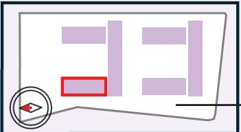

※現時点での価格表です。最終の価格表は設計と詳細部分の整合があるため7/18-7/19の説明会資料にてご確認ください。  
※各住戸の間取りや間数は住戸選定説明会資料でご提示します。  
※本計画は行政協議・施工・計画等で変更となる場合があります。

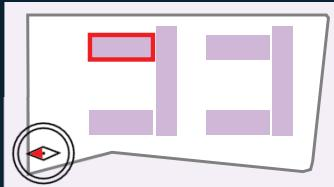

<table><tr><td></td><td></td><td></td><td></td><td></td><td></td><td rowspan=1 colspan=2>N1-3r-1404</td><td rowspan=1 colspan=1>N1-4-1406</td><td rowspan=1 colspan=1>N1-5-1407N</td><td rowspan=1 colspan=1>1-6-1408</td></tr><tr><td></td><td></td><td></td><td></td><td></td><td></td><td rowspan=1 colspan=2>N1-3r</td><td rowspan=1 colspan=1>N1-4</td><td rowspan=1 colspan=1>N1-5</td><td rowspan=1 colspan=1>N1-6</td></tr><tr><td></td><td></td><td></td><td></td><td></td><td></td><td rowspan=1 colspan=2>78.30 m²</td><td rowspan=1 colspan=1>69.60 m²</td><td rowspan=1 colspan=1>64.72 m²</td><td rowspan=1 colspan=1>64.72 m²</td></tr><tr><td></td><td></td><td></td><td></td><td></td><td></td><td rowspan=1 colspan=2>6,330</td><td rowspan=1 colspan=1>5,330</td><td rowspan=1 colspan=1>4,850</td><td rowspan=1 colspan=1>4,850</td></tr><tr><td></td><td></td><td rowspan=4 colspan=1>13階</td><td></td><td rowspan=1 colspan=2>N1-2r-1302</td><td rowspan=1 colspan=2>N1-3-1304</td><td rowspan=1 colspan=1>N1-4-1306</td><td rowspan=1 colspan=1>N1-5-1307</td><td rowspan=1 colspan=1>N1-6-1308</td></tr><tr><td></td><td></td><td></td><td rowspan=1 colspan=2>N1-2r</td><td rowspan=1 colspan=2>N1-3</td><td rowspan=1 colspan=1>N1-4</td><td rowspan=1 colspan=1>N1-5</td><td rowspan=1 colspan=1>N1-6</td></tr><tr><td></td><td></td><td></td><td rowspan=1 colspan=2>78.30 m²</td><td rowspan=1 colspan=2>71.92 m²</td><td rowspan=1 colspan=1>69.60 m²</td><td rowspan=1 colspan=1>64.72 m²</td><td rowspan=1 colspan=1>64.72 m²</td></tr><tr><td></td><td></td><td></td><td rowspan=1 colspan=2>6,270</td><td rowspan=1 colspan=2>5,450</td><td rowspan=1 colspan=1>5,270</td><td rowspan=1 colspan=1>4,800</td><td rowspan=1 colspan=1>4,650</td></tr><tr><td></td><td></td><td rowspan=4 colspan=1>12階</td><td rowspan=1 colspan=1>N1-1-1201</td><td rowspan=1 colspan=2>N1-2-1202</td><td rowspan=1 colspan=2>N1-3-1204</td><td rowspan=1 colspan=1>N1-4-1206</td><td rowspan=1 colspan=1>N1-5-1207</td><td rowspan=1 colspan=1>N1-6-1208</td></tr><tr><td></td><td></td><td rowspan=1 colspan=1>N1-1</td><td rowspan=1 colspan=2>N1-2</td><td rowspan=1 colspan=2>N1-3</td><td rowspan=1 colspan=1>N1-4</td><td rowspan=1 colspan=1>N1-5</td><td rowspan=1 colspan=1>N1-6</td></tr><tr><td></td><td></td><td rowspan=1 colspan=1>84.22 m²</td><td rowspan=1 colspan=2>71.92 m²</td><td rowspan=1 colspan=2>71.92 m²</td><td rowspan=1 colspan=1>69.60 m²</td><td rowspan=1 colspan=1>64.72 m²</td><td rowspan=1 colspan=1>64.72 m²</td></tr><tr><td></td><td></td><td rowspan=1 colspan=1>6,600</td><td rowspan=1 colspan=2>5,420</td><td rowspan=1 colspan=2>5,420</td><td rowspan=1 colspan=1>5,240</td><td rowspan=1 colspan=1>4,690</td><td rowspan=1 colspan=1>4,620</td></tr><tr><td></td><td></td><td rowspan=4 colspan=1>11階</td><td rowspan=1 colspan=1>N1-1-1101</td><td rowspan=1 colspan=2>N1-2-1102</td><td rowspan=1 colspan=2>N1-3-1104</td><td rowspan=1 colspan=1>N1-4-1106</td><td rowspan=1 colspan=1>N1-5-1107</td><td rowspan=1 colspan=1>N1-6-1108</td></tr><tr><td></td><td></td><td rowspan=1 colspan=1>N1-1</td><td rowspan=1 colspan=2>N1-2</td><td rowspan=1 colspan=2>N1-3</td><td rowspan=1 colspan=1>N1-4</td><td rowspan=1 colspan=1>N1-5</td><td rowspan=1 colspan=1>N1-6</td></tr><tr><td></td><td></td><td rowspan=1 colspan=1>84.22 m²</td><td rowspan=1 colspan=2>71.92 m²</td><td rowspan=1 colspan=2>71.92 m²</td><td rowspan=1 colspan=1>69.60 m²</td><td rowspan=1 colspan=1>64.72 m²</td><td rowspan=1 colspan=1>64.72 m²</td></tr><tr><td></td><td></td><td rowspan=1 colspan=1>6,560</td><td rowspan=1 colspan=2>5,380</td><td rowspan=1 colspan=2>5,380</td><td rowspan=1 colspan=1>5,160</td><td rowspan=1 colspan=1>4,670</td><td rowspan=1 colspan=1>4,600</td></tr><tr><td></td><td></td><td rowspan=4 colspan=1>10階</td><td rowspan=1 colspan=1>N1-1-1001</td><td rowspan=1 colspan=2>N1-2-1002</td><td rowspan=1 colspan=2>N1-3-1004</td><td rowspan=1 colspan=1>N1-4-1006</td><td rowspan=1 colspan=1>N1-5-1007</td><td rowspan=1 colspan=1>N1-6-1008</td></tr><tr><td></td><td></td><td rowspan=1 colspan=1>N1-1</td><td rowspan=1 colspan=2>N1-2</td><td rowspan=1 colspan=2>N1-3</td><td rowspan=1 colspan=1>N1-4</td><td rowspan=1 colspan=1>N1-5</td><td rowspan=1 colspan=1>N1-6</td></tr><tr><td></td><td></td><td rowspan=1 colspan=1>84.22 m²</td><td rowspan=1 colspan=2>71.92 m²</td><td rowspan=1 colspan=2>71.92 m²</td><td rowspan=1 colspan=1>69.60 m²</td><td rowspan=1 colspan=1>64.72 m²</td><td rowspan=1 colspan=1>64.72 m²</td></tr><tr><td></td><td></td><td rowspan=1 colspan=1>6,520</td><td rowspan=1 colspan=2>5,350</td><td rowspan=1 colspan=2>5,350</td><td rowspan=1 colspan=1>5,080</td><td rowspan=1 colspan=1>4,640</td><td rowspan=1 colspan=1>4,570</td></tr><tr><td></td><td></td><td rowspan=4 colspan=1>9階</td><td rowspan=1 colspan=1>N1-1-901</td><td rowspan=1 colspan=2>N1-2-902</td><td rowspan=1 colspan=2>N1-3-904</td><td rowspan=1 colspan=1>N1-4-906</td><td rowspan=1 colspan=1>N1-5-907</td><td rowspan=1 colspan=1>N1-6-908</td></tr><tr><td></td><td></td><td rowspan=1 colspan=1>N1-1</td><td rowspan=1 colspan=2>N1-2</td><td rowspan=1 colspan=2>N1-3</td><td rowspan=1 colspan=1>N1-4</td><td rowspan=1 colspan=1>N1-5</td><td rowspan=1 colspan=1>N1-6</td></tr><tr><td></td><td></td><td rowspan=1 colspan=1>84.22 m²</td><td rowspan=1 colspan=2>71.92 m²</td><td rowspan=1 colspan=2>71.92 m²</td><td rowspan=1 colspan=1>69.60 m²</td><td rowspan=1 colspan=1>64.72 m²</td><td rowspan=1 colspan=1>64.72 m²</td></tr><tr><td></td><td></td><td rowspan=1 colspan=1>6,480</td><td rowspan=1 colspan=2>5,320</td><td rowspan=1 colspan=2>5,270</td><td rowspan=1 colspan=1>5,050</td><td rowspan=1 colspan=1>4,610</td><td rowspan=1 colspan=1>4,540</td></tr><tr><td></td><td></td><td></td><td rowspan=1 colspan=1>N1-1-801</td><td rowspan=1 colspan=2>N1-2-802</td><td rowspan=1 colspan=2>N1-3-804</td><td rowspan=1 colspan=1>N1-4-806</td><td rowspan=1 colspan=1>N1-5-807</td><td rowspan=1 colspan=1>N1-6-808</td></tr><tr><td></td><td></td><td></td><td rowspan=1 colspan=1>N1-1</td><td rowspan=1 colspan=2>N1-2</td><td rowspan=1 colspan=2>N1-3</td><td rowspan=1 colspan=1>N1-4</td><td rowspan=1 colspan=1>N1-5</td><td rowspan=1 colspan=1>N1-6</td></tr><tr><td></td><td></td><td></td><td rowspan=1 colspan=1>84.22 m²</td><td rowspan=1 colspan=2>71.92 m²</td><td rowspan=1 colspan=2>71.92 m²</td><td rowspan=1 colspan=1>69.60 m²</td><td rowspan=1 colspan=1>64.72 m²</td><td rowspan=1 colspan=1>64.72 m²</td></tr><tr><td></td><td></td><td></td><td rowspan=1 colspan=1>6,450</td><td rowspan=1 colspan=2>5,240</td><td rowspan=1 colspan=2>5,240</td><td rowspan=1 colspan=1>5,020</td><td rowspan=1 colspan=1>4,580</td><td rowspan=1 colspan=1>4,510</td></tr><tr><td rowspan=3 colspan=2>住戸番号</td><td rowspan=5 colspan=1>7階</td><td rowspan=1 colspan=1>N1-1-701</td><td rowspan=1 colspan=2>N1-2-702</td><td rowspan=1 colspan=2>N1-3-704</td><td rowspan=1 colspan=1>N1-4-706</td><td rowspan=1 colspan=1>N1-5-707</td><td rowspan=1 colspan=1>N1-6-708</td></tr><tr><td rowspan=1 colspan=1>N1-1</td><td rowspan=1 colspan=2>N1-2</td><td rowspan=1 colspan=2>N1-3</td><td rowspan=1 colspan=1>N1-4</td><td rowspan=1 colspan=1>N1-5</td><td rowspan=1 colspan=1>N1-6</td></tr><tr><td rowspan=1 colspan=1>84.22 m²</td><td rowspan=1 colspan=2>71.92 m²</td><td rowspan=1 colspan=2>71.92 m²</td><td rowspan=1 colspan=1>69.60 m²</td><td rowspan=1 colspan=1>64.72 m²</td><td rowspan=1 colspan=1>64.72 m²</td></tr><tr><td rowspan=2 colspan=2>住戸タイプ</td><td></td><td></td><td></td><td></td><td></td><td></td><td></td><td></td></tr><tr><td rowspan=1 colspan=1>6,360</td><td rowspan=1 colspan=2>5,200</td><td rowspan=1 colspan=2>5,200</td><td rowspan=1 colspan=1>4,980</td><td rowspan=1 colspan=1>4,550</td><td rowspan=1 colspan=1>4,480</td></tr><tr><td rowspan=2 colspan=2>面積</td><td rowspan=4 colspan=1>6階</td><td rowspan=1 colspan=1>N1-1-601</td><td rowspan=1 colspan=2>N1-2-602</td><td rowspan=1 colspan=2>N1-3-604</td><td rowspan=1 colspan=1>N1-4-606</td><td rowspan=1 colspan=1>N1-5-607</td><td rowspan=1 colspan=1>N1-6-608</td></tr><tr><td rowspan=1 colspan=1>N1-1</td><td rowspan=1 colspan=2>N1-2</td><td rowspan=1 colspan=2>N1-3</td><td rowspan=1 colspan=1>N1-4</td><td rowspan=1 colspan=1>N1-5</td><td rowspan=1 colspan=1>N1-6</td></tr><tr><td rowspan=2 colspan=2>価格(万円)</td><td rowspan=1 colspan=1>84.22 m²</td><td rowspan=1 colspan=2>71.92 m²</td><td rowspan=1 colspan=2>71.92 m²</td><td rowspan=1 colspan=1>69.60 m²</td><td rowspan=1 colspan=1>64.72 m²</td><td rowspan=1 colspan=1>64.72 m²</td></tr><tr><td rowspan=1 colspan=1>6,320</td><td rowspan=1 colspan=2>5,170</td><td rowspan=1 colspan=2>5,170</td><td rowspan=1 colspan=1>4,950</td><td rowspan=1 colspan=1>4,520</td><td rowspan=1 colspan=1>4,450</td></tr><tr><td></td><td></td><td></td><td rowspan=1 colspan=1>N1-1-501</td><td rowspan=1 colspan=1>N1-2A-502</td><td rowspan=1 colspan=1>N1-2B-503</td><td rowspan=1 colspan=1>N1-3A-504</td><td rowspan=1 colspan=1>N1-3B-505</td><td rowspan=1 colspan=1>N1-4-506</td><td rowspan=1 colspan=1>N1-5-507</td><td rowspan=1 colspan=1>N1-6-508</td></tr><tr><td></td><td></td><td></td><td rowspan=1 colspan=1>N1-1</td><td rowspan=1 colspan=1>N1-2A</td><td rowspan=1 colspan=1>N1-2B</td><td rowspan=1 colspan=1>N1-3A</td><td rowspan=1 colspan=1>N1-3B</td><td rowspan=1 colspan=1>N1-4</td><td rowspan=1 colspan=1>N1-5</td><td rowspan=1 colspan=1>N1-6</td></tr><tr><td></td><td></td><td></td><td rowspan=1 colspan=1>84.22 m²</td><td rowspan=1 colspan=1>35.96 m²</td><td rowspan=1 colspan=1>35.96 m²</td><td rowspan=1 colspan=1>35.96 m²</td><td rowspan=1 colspan=1>35.96 m²</td><td rowspan=1 colspan=1>69.60 m²</td><td rowspan=1 colspan=1>64.72 m²</td><td rowspan=1 colspan=1>64.72 m²</td></tr><tr><td></td><td></td><td></td><td rowspan=1 colspan=1>6,280</td><td rowspan=1 colspan=1>1,890</td><td rowspan=1 colspan=1>1,890</td><td rowspan=1 colspan=1>1,890</td><td rowspan=1 colspan=1>1,890</td><td rowspan=1 colspan=1>4,920</td><td rowspan=1 colspan=1>4,490</td><td rowspan=1 colspan=1>4,420</td></tr><tr><td></td><td></td><td></td><td rowspan=1 colspan=1>N1-1-401</td><td rowspan=1 colspan=1>N1-2A-402</td><td rowspan=1 colspan=1>N1-2B-403</td><td rowspan=1 colspan=1>N1-3A-404</td><td rowspan=1 colspan=1>N1-3B-405</td><td rowspan=1 colspan=1>N1-4-406</td><td rowspan=1 colspan=1>N1-5-407</td><td rowspan=1 colspan=1>N1-6-408</td></tr><tr><td></td><td rowspan=2 colspan=1>35台</td><td></td><td rowspan=1 colspan=1>N1-1</td><td rowspan=1 colspan=1>N1-2A</td><td rowspan=1 colspan=1>N1-2B</td><td rowspan=1 colspan=1>N1-3A</td><td rowspan=1 colspan=1>N1-3B</td><td rowspan=1 colspan=1>N1-4</td><td rowspan=1 colspan=1>N1-5</td><td rowspan=1 colspan=1>N1-6</td></tr><tr><td></td><td></td><td rowspan=1 colspan=1>84.22 m²</td><td rowspan=1 colspan=1>35.96 m²</td><td rowspan=1 colspan=1>35.96 m²</td><td rowspan=1 colspan=1>35.96 m²</td><td rowspan=1 colspan=1>35.96 m²</td><td rowspan=1 colspan=1>69.60 m²</td><td rowspan=1 colspan=1>64.72 m²</td><td rowspan=1 colspan=1>64.72 m²</td></tr><tr><td></td><td rowspan=3 colspan=1>40台</td><td></td><td></td><td></td><td></td><td></td><td></td><td></td><td></td><td></td></tr><tr><td></td><td></td><td rowspan=1 colspan=1>6,240</td><td rowspan=1 colspan=1>1,880</td><td rowspan=1 colspan=1>1,880</td><td rowspan=1 colspan=1>1,880</td><td rowspan=1 colspan=1>1,880</td><td rowspan=1 colspan=1>4,890</td><td rowspan=1 colspan=1>4,460</td><td rowspan=1 colspan=1>4,390</td></tr><tr><td></td><td rowspan=4 colspan=1>3階</td><td rowspan=1 colspan=1>N1-1-301</td><td rowspan=1 colspan=1>N1-2A-302</td><td rowspan=1 colspan=1>N1-2B-303</td><td rowspan=1 colspan=1>N1-3A-304</td><td rowspan=1 colspan=1>N1-3B-305</td><td rowspan=1 colspan=1>N1-4-306</td><td rowspan=1 colspan=1>N1-5-307</td><td rowspan=1 colspan=1>N1-6-308</td></tr><tr><td></td><td rowspan=2 colspan=1>50台</td><td rowspan=1 colspan=1>N1-1</td><td rowspan=1 colspan=1>N1-2A</td><td rowspan=1 colspan=1>N1-2B</td><td rowspan=1 colspan=1>N1-3A</td><td rowspan=1 colspan=1>N1-3B</td><td rowspan=1 colspan=1>N1-4</td><td rowspan=1 colspan=1>N1-5</td><td rowspan=1 colspan=1>N1-6</td></tr><tr><td></td><td rowspan=1 colspan=1>84.22 m²</td><td rowspan=1 colspan=1>35.96 m²</td><td rowspan=1 colspan=1>35.96 m²</td><td rowspan=1 colspan=1>35.96 m²</td><td rowspan=1 colspan=1>35.96 m²</td><td rowspan=1 colspan=1>69.60 m²</td><td rowspan=1 colspan=1>64.72 m²</td><td rowspan=1 colspan=1>64.72 m²</td></tr><tr><td></td><td rowspan=2 colspan=1>60 台</td><td rowspan=1 colspan=1>6,200</td><td rowspan=1 colspan=1>1,860</td><td rowspan=1 colspan=1>1,860</td><td rowspan=1 colspan=1>1,860</td><td rowspan=1 colspan=1>1,860</td><td rowspan=1 colspan=1>4,860</td><td rowspan=1 colspan=1>4,430</td><td rowspan=1 colspan=1>4,360</td></tr><tr><td></td><td rowspan=4 colspan=1>2階</td><td rowspan=1 colspan=1>N1-1-201</td><td rowspan=1 colspan=1>N1-2A-202</td><td rowspan=1 colspan=1>N1-2B-203</td><td rowspan=1 colspan=1>N1-3A-204</td><td rowspan=1 colspan=1>N1-3B-205</td><td rowspan=1 colspan=1>N1-4-206</td><td rowspan=1 colspan=1>N1-5-207</td><td rowspan=1 colspan=1>N1-6-208</td></tr><tr><td></td><td rowspan=2 colspan=1>70台</td><td rowspan=1 colspan=1>N1-1</td><td rowspan=1 colspan=1>N1-2A</td><td rowspan=1 colspan=1>N1-2B</td><td rowspan=1 colspan=1>N1-3A</td><td rowspan=1 colspan=1>N1-3B</td><td rowspan=1 colspan=1>N1-4</td><td rowspan=1 colspan=1>N1-5</td><td rowspan=1 colspan=1>N1-6</td></tr><tr><td></td><td rowspan=1 colspan=1>84.22 m²</td><td rowspan=1 colspan=1>35.96 m²</td><td rowspan=1 colspan=1>35.96 m²</td><td rowspan=1 colspan=1>35.96 m²</td><td rowspan=1 colspan=1>35.96 m²</td><td rowspan=1 colspan=1>69.60 m²</td><td rowspan=1 colspan=1>64.72 m²</td><td rowspan=1 colspan=1>64.72 m²</td></tr><tr><td></td><td rowspan=2 colspan=1>80台</td><td rowspan=1 colspan=1>6,170</td><td rowspan=1 colspan=1>1,850</td><td rowspan=1 colspan=1>1,850</td><td rowspan=1 colspan=1>1,850</td><td rowspan=1 colspan=1>1,850</td><td rowspan=1 colspan=1>4,830</td><td rowspan=1 colspan=1>4,400</td><td rowspan=1 colspan=1>4,330</td></tr><tr><td></td><td rowspan=3 colspan=1></td><td rowspan=1 colspan=1>N1-1g-101</td><td rowspan=1 colspan=1>N1-2At-102</td><td rowspan=1 colspan=1>N1-2Bt-103</td><td rowspan=1 colspan=1>N1-3At-104</td><td rowspan=1 colspan=1>N1-3Bt-105</td><td rowspan=1 colspan=1>N1-4g-106</td><td rowspan=1 colspan=1>N1-5g-107</td><td rowspan=1 colspan=1></td></tr><tr><td></td><td rowspan=2 colspan=1>共用部</td><td rowspan=1 colspan=1>N1-1g</td><td rowspan=1 colspan=1>N1-2At</td><td rowspan=1 colspan=1>N1-2Bt</td><td rowspan=1 colspan=1>N1-3At</td><td rowspan=1 colspan=1>N1-3Bt</td><td rowspan=1 colspan=1>N1-4g</td><td rowspan=1 colspan=1>N1-5g</td><td rowspan=1 colspan=1>サブ</td></tr><tr><td></td><td rowspan=1 colspan=1>84.22 m²</td><td rowspan=1 colspan=1>35.96 m²</td><td rowspan=1 colspan=1>35.96 m²</td><td rowspan=1 colspan=1>35.96 m²</td><td rowspan=1 colspan=1>35.96 m²</td><td rowspan=1 colspan=1>69.60 m²</td><td rowspan=1 colspan=1>64.72 m²</td><td rowspan=1 colspan=1>エントランス</td></tr><tr><td></td><td></td><td rowspan=1 colspan=1>1階</td><td rowspan=1 colspan=1>6,200</td><td rowspan=1 colspan=1>1,820</td><td rowspan=1 colspan=1>1,820</td><td rowspan=1 colspan=1>1,770</td><td rowspan=1 colspan=1>1,770</td><td rowspan=1 colspan=1>4,870</td><td rowspan=1 colspan=1>4,400</td><td rowspan=1 colspan=1></td></tr></table>

<table><tr><td rowspan=4 colspan=1>14階</td><td rowspan=1 colspan=1>N4-1-1425</td><td rowspan=1 colspan=1>N4-2-1426</td><td rowspan=1 colspan=1>N4-3-1427</td><td rowspan=1 colspan=1>N4-4-1428</td><td rowspan=1 colspan=1>N4-5-1429</td><td rowspan=1 colspan=1>N4-6-1430N</td><td rowspan=1 colspan=1>4-7w-1431</td><td rowspan=6 colspan=1></td></tr><tr><td rowspan=1 colspan=1>N4-1</td><td rowspan=1 colspan=1>N4-2</td><td rowspan=1 colspan=1>N4-3</td><td rowspan=1 colspan=1>N4-4</td><td rowspan=1 colspan=1>N4-5</td><td rowspan=1 colspan=1>N4-6</td><td rowspan=1 colspan=1>N4-7W</td></tr><tr><td rowspan=1 colspan=1>64.72 m²</td><td rowspan=1 colspan=1>64.72 m²</td><td rowspan=1 colspan=1>54.25 m²</td><td rowspan=1 colspan=1>54.25 m²</td><td rowspan=1 colspan=1>54.25 m²</td><td rowspan=1 colspan=1>71.92 m²</td><td rowspan=1 colspan=1>80.62 m²</td></tr><tr><td rowspan=1 colspan=1>4,800</td><td rowspan=1 colspan=1>4,850</td><td rowspan=1 colspan=1>4,150</td><td rowspan=1 colspan=1>4,150</td><td rowspan=1 colspan=1>4,150</td><td rowspan=1 colspan=1>5,500</td><td rowspan=1 colspan=1>6,560</td></tr><tr><td rowspan=4 colspan=1>13階</td><td rowspan=1 colspan=1>N4-1-1325</td><td rowspan=1 colspan=1>N4-2-1326</td><td rowspan=1 colspan=1>N4-3-1327</td><td rowspan=1 colspan=1>N4-4-1328</td><td rowspan=1 colspan=1>N4-5-1329</td><td rowspan=1 colspan=1>N4-6-1330</td><td rowspan=1 colspan=1>N4-7r-1331</td></tr><tr><td rowspan=1 colspan=1>N4-1</td><td rowspan=1 colspan=1>N4-2</td><td rowspan=1 colspan=1>N4-3</td><td rowspan=1 colspan=1>N4-4</td><td rowspan=1 colspan=1>N4-5</td><td rowspan=1 colspan=1>N4-6</td><td rowspan=1 colspan=1>N4-7r</td></tr><tr><td rowspan=1 colspan=1>64.72 m²</td><td rowspan=1 colspan=1>64.72 m²</td><td rowspan=1 colspan=1>54.25 m²</td><td rowspan=1 colspan=1>54.25 m²</td><td rowspan=1 colspan=1>54.25 m²</td><td rowspan=1 colspan=1>71.92 m²</td><td rowspan=1 colspan=1>80.62 m²</td><td rowspan=1 colspan=1></td></tr><tr><td rowspan=1 colspan=1>4,650</td><td rowspan=1 colspan=1>4,800</td><td rowspan=1 colspan=1>4,110</td><td rowspan=1 colspan=1>4,110</td><td rowspan=1 colspan=1>4,110</td><td rowspan=1 colspan=1>5,450</td><td rowspan=1 colspan=1>6,600</td><td rowspan=1 colspan=1></td></tr><tr><td rowspan=4 colspan=1>12階</td><td rowspan=1 colspan=1>N4-1-1225</td><td rowspan=1 colspan=1>N4-2-1226</td><td rowspan=1 colspan=1>N4-3-1227</td><td rowspan=1 colspan=1>N4-4-1228</td><td rowspan=1 colspan=1>N4-5-1229</td><td rowspan=1 colspan=1>N4-6-1230</td><td rowspan=1 colspan=1>N4-7-1231</td><td rowspan=1 colspan=1>N4-8-1232</td></tr><tr><td rowspan=1 colspan=1>N4-1</td><td rowspan=1 colspan=1>N4-2</td><td rowspan=1 colspan=1>N4-3</td><td rowspan=1 colspan=1>N4-4</td><td rowspan=1 colspan=1>N4-5</td><td rowspan=1 colspan=1>N4-6</td><td rowspan=1 colspan=1>N4-7</td><td rowspan=1 colspan=1>N4-8</td></tr><tr><td rowspan=1 colspan=1>64.72 m²</td><td rowspan=1 colspan=1>64.72 m²</td><td rowspan=1 colspan=1>54.25 m²</td><td rowspan=1 colspan=1>54.25 m²</td><td rowspan=1 colspan=1>54.25 m²</td><td rowspan=1 colspan=1>71.92 m²</td><td rowspan=1 colspan=1>74.24 m²</td><td rowspan=1 colspan=1>84.22 m²</td></tr><tr><td rowspan=1 colspan=1>4,620</td><td rowspan=1 colspan=1>4,670</td><td rowspan=1 colspan=1>4,090</td><td rowspan=1 colspan=1>4,090</td><td rowspan=1 colspan=1>4,090</td><td rowspan=1 colspan=1>5,420</td><td rowspan=1 colspan=1>5,740</td><td rowspan=1 colspan=1>6,600</td></tr><tr><td rowspan=4 colspan=1>11階</td><td rowspan=1 colspan=1>N4-1-1125</td><td rowspan=1 colspan=1>N4-2-1126</td><td rowspan=1 colspan=1>N4-3-1127</td><td rowspan=1 colspan=1>N4-4-1128</td><td rowspan=1 colspan=1>N4-5-1129</td><td rowspan=1 colspan=1>N4-6-1130</td><td rowspan=1 colspan=1>N4-7-1131</td><td rowspan=1 colspan=1>N4-8-1132</td></tr><tr><td rowspan=1 colspan=1>N4-1</td><td rowspan=1 colspan=1>N4-2</td><td rowspan=1 colspan=1>N4-3</td><td rowspan=1 colspan=1>N4-4</td><td rowspan=1 colspan=1>N4-5</td><td rowspan=1 colspan=1>N4-6</td><td rowspan=1 colspan=1>N4-7</td><td rowspan=1 colspan=1>N4-8</td></tr><tr><td rowspan=1 colspan=1>64.72 m²</td><td rowspan=1 colspan=1>64.72 m²</td><td rowspan=1 colspan=1>54.25 m²</td><td rowspan=1 colspan=1>54.25 m²</td><td rowspan=1 colspan=1>54.25 m²</td><td rowspan=1 colspan=1>71.92 m²</td><td rowspan=1 colspan=1>74.24 m²</td><td rowspan=1 colspan=1>84.22 m²</td></tr><tr><td rowspan=1 colspan=1>4,600</td><td rowspan=1 colspan=1>4,650</td><td rowspan=1 colspan=1>4,010</td><td rowspan=1 colspan=1>4,060</td><td rowspan=1 colspan=1>4,060</td><td rowspan=1 colspan=1>5,380</td><td rowspan=1 colspan=1>5,710</td><td rowspan=1 colspan=1>6,560</td></tr><tr><td rowspan=4 colspan=1>10階</td><td rowspan=1 colspan=1>N4-1-1025</td><td rowspan=1 colspan=1>N4-2-1026</td><td rowspan=1 colspan=1>N4-3-1027</td><td rowspan=1 colspan=1>N4-4-1028</td><td rowspan=1 colspan=1>N4-5-1029</td><td rowspan=1 colspan=1>N4-6-1030</td><td rowspan=1 colspan=1>N4-7-1031</td><td rowspan=1 colspan=1>N4-8-1032</td></tr><tr><td rowspan=1 colspan=1>N4-1</td><td rowspan=1 colspan=1>N4-2</td><td rowspan=1 colspan=1>N4-3</td><td rowspan=1 colspan=1>N4-4</td><td rowspan=1 colspan=1>N4-5</td><td rowspan=1 colspan=1>N4-6</td><td rowspan=1 colspan=1>N4-7</td><td rowspan=1 colspan=1>N4-8</td></tr><tr><td rowspan=1 colspan=1>64.72 m²</td><td rowspan=1 colspan=1>64.72 m²</td><td rowspan=1 colspan=1>54.25 m²</td><td rowspan=1 colspan=1>54.25 m²</td><td rowspan=1 colspan=1>54.25 m²</td><td rowspan=1 colspan=1>71.92 m²</td><td rowspan=1 colspan=1>74.24 m²</td><td rowspan=1 colspan=1>84.22 m²</td></tr><tr><td rowspan=1 colspan=1>4,570</td><td rowspan=1 colspan=1>4,620</td><td rowspan=1 colspan=1>3,990</td><td rowspan=1 colspan=1>3,990</td><td rowspan=1 colspan=1>4,040</td><td rowspan=1 colspan=1>5,350</td><td rowspan=1 colspan=1>5,670</td><td rowspan=1 colspan=1>6,520</td></tr><tr><td rowspan=4 colspan=1>9階</td><td rowspan=1 colspan=1>N4-1-925</td><td rowspan=1 colspan=1>N4-2-926</td><td rowspan=1 colspan=1>N4-3-927</td><td rowspan=1 colspan=1>N4-4-928</td><td rowspan=1 colspan=1>N4-5-929</td><td rowspan=1 colspan=1>N4-6-930</td><td rowspan=1 colspan=1>N4-7-931</td><td rowspan=1 colspan=1>N4-8-932</td></tr><tr><td rowspan=1 colspan=1>N4-1</td><td rowspan=1 colspan=1>N4-2</td><td rowspan=1 colspan=1>N4-3</td><td rowspan=1 colspan=1>N4-4</td><td rowspan=1 colspan=1>N4-5</td><td rowspan=1 colspan=1>N4-6</td><td rowspan=1 colspan=1>N4-7</td><td rowspan=1 colspan=1>N4-8</td></tr><tr><td rowspan=1 colspan=1>64.72 m²</td><td rowspan=1 colspan=1>64.72 m²</td><td rowspan=1 colspan=1>54.25 m²</td><td rowspan=1 colspan=1>54.25 m²</td><td rowspan=1 colspan=1>54.25 m²</td><td rowspan=1 colspan=1>71.92 m²</td><td rowspan=1 colspan=1>74.24 m²</td><td rowspan=1 colspan=1>84.22 m²</td></tr><tr><td rowspan=1 colspan=1>4,540</td><td rowspan=1 colspan=1>4,590</td><td rowspan=1 colspan=1>3,960</td><td rowspan=1 colspan=1>3,960</td><td rowspan=1 colspan=1>3,960</td><td rowspan=1 colspan=1>5,320</td><td rowspan=1 colspan=1>5,640</td><td rowspan=1 colspan=1>6,480</td></tr><tr><td rowspan=4 colspan=1>8階</td><td rowspan=1 colspan=1>N4-1-825</td><td rowspan=1 colspan=1>N4-2-826</td><td rowspan=1 colspan=1>N4-3-827</td><td rowspan=1 colspan=1>N4-4-828</td><td rowspan=1 colspan=1>N4-5-829</td><td rowspan=1 colspan=1>N4-6-830</td><td rowspan=1 colspan=1>N4-7-831</td><td rowspan=1 colspan=1>N4-8-832</td></tr><tr><td rowspan=1 colspan=1>N4-1</td><td rowspan=1 colspan=1>N4-2</td><td rowspan=1 colspan=1>N4-3</td><td rowspan=1 colspan=1>N4-4</td><td rowspan=1 colspan=1>N4-5</td><td rowspan=1 colspan=1>N4-6</td><td rowspan=1 colspan=1>N4-7</td><td rowspan=1 colspan=1>N4-8</td></tr><tr><td rowspan=1 colspan=1>64.72 m²</td><td rowspan=1 colspan=1>64.72m²</td><td rowspan=1 colspan=1>54.25 m²</td><td rowspan=1 colspan=1>54.25 m²</td><td rowspan=1 colspan=1>54.25 m²</td><td rowspan=1 colspan=1>71.92 m²</td><td rowspan=1 colspan=1>74.24 m²</td><td rowspan=1 colspan=1>84.22 m²</td></tr><tr><td rowspan=1 colspan=1>4,510</td><td rowspan=1 colspan=1>4,510</td><td rowspan=1 colspan=1>3,890</td><td rowspan=1 colspan=1>3,940</td><td rowspan=1 colspan=1>3,940</td><td rowspan=1 colspan=1>5,240</td><td rowspan=1 colspan=1>5,610</td><td rowspan=1 colspan=1>6,450</td></tr><tr><td rowspan=4 colspan=1>7階</td><td rowspan=1 colspan=1>N4-1-725</td><td rowspan=1 colspan=1>N4-2-726</td><td rowspan=1 colspan=1>N4-3-727</td><td rowspan=1 colspan=1>N4-4-728</td><td rowspan=1 colspan=1>N4-5-729</td><td rowspan=1 colspan=1>N4-6-730</td><td rowspan=1 colspan=1>N4-7-731</td><td rowspan=1 colspan=1>N4-8-732</td></tr><tr><td rowspan=1 colspan=1>NN4-1</td><td rowspan=1 colspan=1>N4-2</td><td rowspan=1 colspan=1>N4-3</td><td rowspan=1 colspan=1>N4-4</td><td rowspan=1 colspan=1>N4-5</td><td rowspan=1 colspan=1>N4-6</td><td rowspan=1 colspan=1>N4-7</td><td rowspan=1 colspan=1>N4-8</td></tr><tr><td rowspan=1 colspan=1>64.72 m²</td><td rowspan=1 colspan=1>64.72 m²</td><td rowspan=1 colspan=1>54.25 m²</td><td rowspan=1 colspan=1>54.25 m²</td><td rowspan=1 colspan=1>54.25 m²</td><td rowspan=1 colspan=1>71.92 m²</td><td rowspan=1 colspan=1>74.24 m²</td><td rowspan=1 colspan=1>84.22 m²</td></tr><tr><td rowspan=1 colspan=1>4,480</td><td rowspan=1 colspan=1>4,480</td><td rowspan=1 colspan=1>3,860</td><td rowspan=1 colspan=1>3,910</td><td rowspan=1 colspan=1>3,910</td><td rowspan=1 colspan=1>5,200</td><td rowspan=1 colspan=1>5,570</td><td rowspan=1 colspan=1>6,410</td></tr><tr><td rowspan=4 colspan=1>6階</td><td rowspan=1 colspan=1>N4-1-625</td><td rowspan=1 colspan=1>N4-2-626</td><td rowspan=1 colspan=1>N4-3-627</td><td rowspan=1 colspan=1>N4-4-628</td><td rowspan=1 colspan=1>N4-5-629</td><td rowspan=1 colspan=1>N4-6-630</td><td rowspan=1 colspan=1>N4-7-631</td><td rowspan=1 colspan=1>N4-8-632</td></tr><tr><td rowspan=1 colspan=1>N4-1</td><td rowspan=1 colspan=1>N4-2</td><td rowspan=1 colspan=1>N4-3</td><td rowspan=1 colspan=1>N4-4</td><td rowspan=1 colspan=1>N4-5</td><td rowspan=1 colspan=1>N4-6</td><td rowspan=1 colspan=1>N4-7</td><td rowspan=1 colspan=1>N4-8</td></tr><tr><td rowspan=1 colspan=1>64.72 m²</td><td rowspan=1 colspan=1>64.72 m²</td><td rowspan=1 colspan=1>54.25 m²</td><td rowspan=1 colspan=1>54.25 m²</td><td rowspan=1 colspan=1>54.25 m²</td><td rowspan=1 colspan=1>71.92 m²</td><td rowspan=1 colspan=1>74.24 m²</td><td rowspan=1 colspan=1>84.22 m²</td></tr><tr><td rowspan=1 colspan=1>4,450</td><td rowspan=1 colspan=1>4,450</td><td rowspan=1 colspan=1>3,840</td><td rowspan=1 colspan=1>3,840</td><td rowspan=1 colspan=1>3,890</td><td rowspan=1 colspan=1>5,170</td><td rowspan=1 colspan=1>5,540</td><td rowspan=1 colspan=1>6,370</td></tr><tr><td rowspan=4 colspan=1>5階</td><td rowspan=1 colspan=1>N4-1-525</td><td rowspan=1 colspan=1>N4-2-526</td><td rowspan=1 colspan=1>N4-3-527</td><td rowspan=1 colspan=1>N4-4-528</td><td rowspan=1 colspan=1>N4-5-529</td><td rowspan=1 colspan=1>N4-6-530</td><td rowspan=1 colspan=1>N4-7-531</td><td rowspan=1 colspan=1>N4-8-532</td></tr><tr><td rowspan=1 colspan=1>N4-1</td><td rowspan=1 colspan=1>N4-2</td><td rowspan=1 colspan=1>N4-3</td><td rowspan=1 colspan=1>N4-4</td><td rowspan=1 colspan=1>N4-5</td><td rowspan=1 colspan=1>N4-6</td><td rowspan=1 colspan=1>N4-7</td><td rowspan=1 colspan=1>N4-8</td></tr><tr><td rowspan=1 colspan=1>64.72 m²</td><td rowspan=1 colspan=1>64.72 m²</td><td rowspan=1 colspan=1>54.25 m²</td><td rowspan=1 colspan=1>54.25 m²</td><td rowspan=1 colspan=1>54.25 m²</td><td rowspan=1 colspan=1>71.92 m²</td><td rowspan=1 colspan=1>74.24 m²</td><td rowspan=1 colspan=1>84.22 m²</td></tr><tr><td rowspan=1 colspan=1>4,420</td><td rowspan=1 colspan=1>4,420</td><td rowspan=1 colspan=1>3,810</td><td rowspan=1 colspan=1>3,810</td><td rowspan=1 colspan=1>3,860</td><td rowspan=1 colspan=1>5,140</td><td rowspan=1 colspan=1>5,460</td><td rowspan=1 colspan=1>6,330</td></tr><tr><td rowspan=4 colspan=1>4階</td><td rowspan=1 colspan=1>N4-1-425</td><td rowspan=1 colspan=1>N4-2-426</td><td rowspan=1 colspan=1>N4-3-427</td><td rowspan=1 colspan=1>N4-4-428</td><td rowspan=1 colspan=1>N4-5-429</td><td rowspan=1 colspan=1>N4-6-430</td><td rowspan=1 colspan=1>N4-7-431</td><td rowspan=1 colspan=1>N4-8-432</td></tr><tr><td rowspan=1 colspan=1>N4-1</td><td rowspan=1 colspan=1>N4-2</td><td rowspan=1 colspan=1>N4-3</td><td rowspan=1 colspan=1>N4-4</td><td rowspan=1 colspan=1>N4-5</td><td rowspan=1 colspan=1>N4-6</td><td rowspan=1 colspan=1>N4-7</td><td rowspan=1 colspan=1>N4-8</td></tr><tr><td rowspan=1 colspan=1>64.72 m²</td><td rowspan=1 colspan=1>64.72 m²</td><td rowspan=1 colspan=1>54.25 m²</td><td rowspan=1 colspan=1>54.25 m²</td><td rowspan=1 colspan=1>54.25 m²</td><td rowspan=1 colspan=1>71.92 m²</td><td rowspan=1 colspan=1>74.24 m²</td><td rowspan=1 colspan=1>84.22 m²</td></tr><tr><td rowspan=1 colspan=1>4,390</td><td rowspan=1 colspan=1>4,390</td><td rowspan=1 colspan=1>3,740</td><td rowspan=1 colspan=1>3,790</td><td rowspan=1 colspan=1>3,790</td><td rowspan=1 colspan=1>5,110</td><td rowspan=1 colspan=1>5,420</td><td rowspan=1 colspan=1>6,290</td></tr><tr><td rowspan=4 colspan=1>3階</td><td rowspan=1 colspan=1>N4-1-325</td><td rowspan=1 colspan=1>N4-2-326</td><td rowspan=1 colspan=1>N4-3-327</td><td rowspan=1 colspan=1>N4-4-328</td><td rowspan=1 colspan=1>N4-5-329</td><td rowspan=1 colspan=1>N4-6-330</td><td rowspan=1 colspan=1>N4-7-331</td><td rowspan=1 colspan=1>N4-8-332</td></tr><tr><td rowspan=1 colspan=1>N4-1</td><td rowspan=1 colspan=1>N4-2</td><td rowspan=1 colspan=1>N4-3</td><td rowspan=1 colspan=1>N4-4</td><td rowspan=1 colspan=1>N4-5</td><td rowspan=1 colspan=1>N4-6</td><td rowspan=1 colspan=1>N4-7</td><td rowspan=1 colspan=1>N4-8</td></tr><tr><td rowspan=1 colspan=1>64.72 m²</td><td rowspan=1 colspan=1>64.72 m²</td><td rowspan=1 colspan=1>54.25 m²</td><td rowspan=1 colspan=1>54.25 m²</td><td rowspan=1 colspan=1>54.25 m²</td><td rowspan=1 colspan=1>71.92 m²</td><td rowspan=1 colspan=1>74.24 m²</td><td rowspan=1 colspan=1>84.22 m²</td></tr><tr><td rowspan=1 colspan=1>4,360</td><td rowspan=1 colspan=1>4,360</td><td rowspan=1 colspan=1>3,710</td><td rowspan=1 colspan=1>3,760</td><td rowspan=1 colspan=1>3,760</td><td rowspan=1 colspan=1>5,040</td><td rowspan=1 colspan=1>5,390</td><td rowspan=1 colspan=1>6,200</td></tr><tr><td rowspan=4 colspan=1>2階</td><td rowspan=1 colspan=1>N4-1-225</td><td rowspan=1 colspan=1>N4-2-226</td><td rowspan=1 colspan=1>N4-3-227</td><td rowspan=1 colspan=1>N4-4-228</td><td rowspan=1 colspan=1>N4-5-229</td><td rowspan=1 colspan=1>N4-6-230</td><td rowspan=1 colspan=1>N4-7-231</td><td rowspan=1 colspan=1>N4-8-232</td></tr><tr><td rowspan=1 colspan=1>N4-1</td><td rowspan=1 colspan=1>N4-2</td><td rowspan=1 colspan=1>N4-3</td><td rowspan=1 colspan=1>N4-4</td><td rowspan=1 colspan=1>N4-5</td><td rowspan=1 colspan=1>N4-6</td><td rowspan=1 colspan=1>N4-7</td><td rowspan=1 colspan=1>N4-8</td></tr><tr><td rowspan=1 colspan=1>64.72 m²</td><td rowspan=1 colspan=1>64.72 m²</td><td rowspan=1 colspan=1>54.25 m²</td><td rowspan=1 colspan=1>54.25 m²</td><td rowspan=1 colspan=1>54.25 m²</td><td rowspan=1 colspan=1>71.92 m²</td><td rowspan=1 colspan=1>74.24 m²</td><td rowspan=1 colspan=1>84.22 m²</td></tr><tr><td rowspan=1 colspan=1>4,330</td><td rowspan=1 colspan=1>4,280</td><td rowspan=1 colspan=1>3,690</td><td rowspan=1 colspan=1>3,740</td><td rowspan=1 colspan=1>3,740</td><td rowspan=1 colspan=1>4,990</td><td rowspan=1 colspan=1>5,360</td><td rowspan=1 colspan=1>6,170</td></tr><tr><td rowspan=4 colspan=1>1階</td><td rowspan=1 colspan=1></td><td rowspan=1 colspan=1></td><td rowspan=1 colspan=1>N4-3g-127</td><td rowspan=1 colspan=1>N4-4g-128</td><td rowspan=1 colspan=1>N4-5g-129</td><td rowspan=1 colspan=1>N4-6g-130</td><td rowspan=1 colspan=1>N4-7g-131</td><td rowspan=1 colspan=1>N4-8g-132</td></tr><tr><td rowspan=1 colspan=1>共用</td><td rowspan=1 colspan=1>共用</td><td rowspan=1 colspan=1>N4-3g</td><td rowspan=1 colspan=1>N4-4g</td><td rowspan=1 colspan=1>N4-5g</td><td rowspan=1 colspan=1>N4-6g</td><td rowspan=1 colspan=1>N4-7g</td><td rowspan=1 colspan=1>N4-8g</td></tr><tr><td rowspan=1 colspan=1></td><td rowspan=1 colspan=1></td><td rowspan=1 colspan=1>54.25 m²</td><td rowspan=1 colspan=1>54.25 m²</td><td rowspan=1 colspan=1>54.25 m²</td><td rowspan=1 colspan=1>71.92 m²</td><td rowspan=1 colspan=1>74.24 m²</td><td rowspan=1 colspan=1>71.98 m²</td></tr><tr><td rowspan=1 colspan=1></td><td rowspan=1 colspan=1></td><td rowspan=1 colspan=1>3,650</td><td rowspan=1 colspan=1>3,750</td><td rowspan=1 colspan=1>3,800</td><td rowspan=1 colspan=1>5,040</td><td rowspan=1 colspan=1>5,350</td><td rowspan=1 colspan=1>5,320</td></tr></table>

<table><tr><td rowspan=1 colspan=1>35 台</td></tr><tr><td rowspan=1 colspan=1>40 台</td></tr><tr><td rowspan=1 colspan=1>50 台</td></tr><tr><td rowspan=1 colspan=1>60 台</td></tr><tr><td rowspan=1 colspan=1>70 台</td></tr><tr><td rowspan=1 colspan=1>80 台</td></tr><tr><td rowspan=1 colspan=1>共用部</td></tr></table>

## 住戸価格について

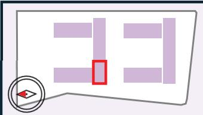

価格表

※現時点での価格表です。最終の価格表は設計と詳細部分の整合があるため7/18-7/19の説明会資料にてご確認ください。  
各住戸の間取りや間数は住戸選定説明会資料でご提示します。  
※本計画は行政協議・施工・計画等で変更となる場合があります。

N-3棟 （南向き）  
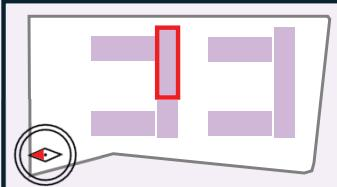

住戸番号住戸タイプ面積価格(万円)

凡例

住戸面積
<table><tr><td rowspan=4 colspan=1>14階</td><td rowspan=2 colspan=1>N2-1-1409N2-1</td><td rowspan=1 colspan=1>N2-2-1410</td><td rowspan=1 colspan=1>N2-3-1411N</td><td rowspan=1 colspan=1>2-4-1412</td><td rowspan=1 colspan=1>N2-5-1413</td><td rowspan=2 colspan=1></td><td rowspan=1 colspan=1>N3-1-1414</td><td rowspan=1 colspan=1>N3-2-1415</td><td rowspan=1 colspan=1>N3-3-1416</td><td rowspan=1 colspan=1>N3-4-1417</td><td rowspan=1 colspan=1>N3-5-1418</td><td rowspan=1 colspan=1>N3-6-1419</td><td rowspan=1 colspan=1>N3-7-1420N</td><td rowspan=1 colspan=1>3-8-1421</td><td rowspan=1 colspan=1>N3-9-1422 N</td><td rowspan=1 colspan=1>3-10-1423 N</td><td rowspan=1 colspan=1>3-11-1424</td></tr><tr><td rowspan=1 colspan=1>N2-2</td><td rowspan=1 colspan=1>N2-3</td><td rowspan=1 colspan=1>N2-4</td><td rowspan=1 colspan=1>N2-5</td><td rowspan=1 colspan=1>N3-1</td><td rowspan=1 colspan=1>N3-2</td><td rowspan=1 colspan=1>N3-3</td><td rowspan=1 colspan=1>N3-4</td><td rowspan=1 colspan=1>N3-5</td><td rowspan=1 colspan=1>N3-6</td><td rowspan=1 colspan=1>N3-7</td><td rowspan=1 colspan=1>N3-8</td><td rowspan=1 colspan=1>N3-9</td><td rowspan=1 colspan=1>N3-10</td><td rowspan=1 colspan=1>N3-11</td></tr><tr><td rowspan=1 colspan=1>61.80 m²</td><td rowspan=1 colspan=1>50.02 m²</td><td rowspan=1 colspan=1>50.02 m²</td><td rowspan=1 colspan=1>47.38 m²</td><td rowspan=1 colspan=1>61.80 m²</td><td rowspan=1 colspan=1></td><td rowspan=1 colspan=1>69.60 m²</td><td rowspan=1 colspan=1>69.60 m²</td><td rowspan=1 colspan=1>69.60 m²</td><td rowspan=1 colspan=1>69.60 m²</td><td rowspan=1 colspan=1>69.60 m²</td><td rowspan=1 colspan=1>69.60 m²</td><td rowspan=1 colspan=1>69.60 m²</td><td rowspan=1 colspan=1>68.85 m²</td><td rowspan=1 colspan=1>54.25 m²</td><td rowspan=1 colspan=1>64.22 m²</td><td rowspan=1 colspan=1>81.42 m²</td></tr><tr><td rowspan=1 colspan=1>5,430</td><td rowspan=1 colspan=1>4,010</td><td rowspan=1 colspan=1>3,860</td><td rowspan=1 colspan=1>3,580</td><td rowspan=1 colspan=1>4,790</td><td rowspan=1 colspan=1>14階</td><td rowspan=1 colspan=1>5,480</td><td rowspan=1 colspan=1>5,480</td><td rowspan=1 colspan=1>5,480</td><td rowspan=1 colspan=1>5,480</td><td rowspan=1 colspan=1>5,480</td><td rowspan=1 colspan=1>5,480</td><td rowspan=1 colspan=1>5,480</td><td rowspan=1 colspan=1>5,340</td><td rowspan=1 colspan=1>4,190</td><td rowspan=1 colspan=1>4,980</td><td rowspan=1 colspan=1>6,910</td></tr><tr><td rowspan=3 colspan=1></td><td rowspan=2 colspan=1>N2-1-1309N2-1</td><td rowspan=2 colspan=1>N2-2-1310N2-2</td><td rowspan=2 colspan=1>N2-3-131N2-3</td><td rowspan=2 colspan=1>N2-4-1312N2-4</td><td rowspan=1 colspan=1>N2-5-1313</td><td rowspan=2 colspan=1></td><td rowspan=1 colspan=1>N3-1-1314</td><td rowspan=1 colspan=1>N3-2-1315</td><td rowspan=1 colspan=1>N3-3-1316</td><td rowspan=1 colspan=1>N3-4-1317</td><td rowspan=1 colspan=1>N3-5-1318</td><td rowspan=1 colspan=1>N3-6-1319</td><td rowspan=1 colspan=1>N3-7-1320</td><td rowspan=1 colspan=1>N3-8-1321</td><td rowspan=1 colspan=1>N3-9-1322</td><td rowspan=1 colspan=1>N3-10-1323</td><td rowspan=1 colspan=1>N3-11-1324</td></tr><tr><td rowspan=1 colspan=1>N2-5</td><td rowspan=1 colspan=1>N3-1</td><td rowspan=1 colspan=1>N3-2</td><td rowspan=1 colspan=1>N3-3</td><td rowspan=1 colspan=1>N3-4</td><td rowspan=1 colspan=1>N3-5</td><td rowspan=1 colspan=1>N3-6</td><td rowspan=1 colspan=1>N3-7</td><td rowspan=1 colspan=1>N3-8</td><td rowspan=1 colspan=1>N3-9</td><td rowspan=1 colspan=1>N3-10</td><td rowspan=1 colspan=1>N3-11</td></tr><tr><td rowspan=1 colspan=1>61.80 m²</td><td rowspan=1 colspan=1>50.02 m²</td><td rowspan=1 colspan=1>50.02 m²</td><td rowspan=1 colspan=1>47.38 m²</td><td rowspan=1 colspan=1>61.80 m²</td><td rowspan=1 colspan=1></td><td rowspan=1 colspan=1>69.60 m²</td><td rowspan=1 colspan=1>69.60 m²</td><td rowspan=1 colspan=1>69.60 m²</td><td rowspan=1 colspan=1>69.60 m²</td><td rowspan=1 colspan=1>69.60 m²</td><td rowspan=1 colspan=1>69.60 m²</td><td rowspan=1 colspan=1>69.60 m²</td><td rowspan=1 colspan=1>68.85 m²</td><td rowspan=1 colspan=1>54.25 m²</td><td rowspan=1 colspan=1>64.22 m²</td><td rowspan=1 colspan=1>81.42 m²</td></tr><tr><td rowspan=1 colspan=1>13階</td><td rowspan=1 colspan=1>5,380</td><td rowspan=1 colspan=1>3,970</td><td rowspan=1 colspan=1>3,820</td><td rowspan=1 colspan=1>3,550</td><td rowspan=1 colspan=1>4,740</td><td rowspan=1 colspan=1>13階</td><td rowspan=1 colspan=1>5,430</td><td rowspan=1 colspan=1>5,430</td><td rowspan=1 colspan=1>5,430</td><td rowspan=1 colspan=1>5,430</td><td rowspan=1 colspan=1>5,430</td><td rowspan=1 colspan=1>5,430</td><td rowspan=1 colspan=1>5,430</td><td rowspan=1 colspan=1>5,290</td><td rowspan=1 colspan=1>4,150</td><td rowspan=1 colspan=1>4,930</td><td rowspan=1 colspan=1>6,840</td></tr><tr><td rowspan=3 colspan=1>N</td><td rowspan=2 colspan=1>2-1-1209N2-1</td><td rowspan=1 colspan=1>N2-2-1210</td><td rowspan=1 colspan=1>N2-3-1211</td><td rowspan=1 colspan=1>N2-4-1212</td><td rowspan=1 colspan=1>N2-5-1213</td><td rowspan=2 colspan=1></td><td rowspan=1 colspan=1>N3-1-1214</td><td rowspan=1 colspan=1>N3-2-1215</td><td rowspan=1 colspan=1>N3-3-1216</td><td rowspan=1 colspan=1>N3-4-1217</td><td rowspan=1 colspan=1>N3-5-1218</td><td rowspan=1 colspan=1>N3-6-1219</td><td rowspan=1 colspan=1>N3-7-1220</td><td rowspan=1 colspan=1>N3-8-1221</td><td rowspan=1 colspan=1>N3-9-1222</td><td rowspan=1 colspan=1>N3-10-12233N</td><td rowspan=1 colspan=1>3-11-1224</td></tr><tr><td rowspan=1 colspan=1>N2-2</td><td rowspan=1 colspan=1>N2-3</td><td rowspan=1 colspan=1>N2-4</td><td rowspan=1 colspan=1>N2-5</td><td rowspan=1 colspan=1>N3-1</td><td rowspan=1 colspan=1>N3-2</td><td rowspan=1 colspan=1>N3-3</td><td rowspan=1 colspan=1>N3-4</td><td rowspan=1 colspan=1>N3-5</td><td rowspan=1 colspan=1>N3-6</td><td rowspan=1 colspan=1>N3-7</td><td rowspan=1 colspan=1>N3-8</td><td rowspan=1 colspan=1>N3-9</td><td rowspan=1 colspan=1>N3-10</td><td rowspan=1 colspan=1>N3-11</td></tr><tr><td rowspan=1 colspan=1>61.80 m²</td><td rowspan=1 colspan=1>50.02 m²</td><td rowspan=1 colspan=1>50.02 m²</td><td rowspan=1 colspan=1>47.38 m²</td><td rowspan=1 colspan=1>61.80 m²</td><td rowspan=1 colspan=1></td><td rowspan=1 colspan=1>69.60 m²</td><td rowspan=1 colspan=1>69.60 m²</td><td rowspan=1 colspan=1>69.60 m²</td><td rowspan=1 colspan=1>69.60 m²</td><td rowspan=1 colspan=1>69.60 m²</td><td rowspan=1 colspan=1>69.60 m²</td><td rowspan=1 colspan=1>69.60 m²</td><td rowspan=1 colspan=1>68.85 m²</td><td rowspan=1 colspan=1>54.25 m²</td><td rowspan=1 colspan=1>64.22 m²</td><td rowspan=1 colspan=1>81.42 m²</td></tr><tr><td rowspan=1 colspan=1>12階</td><td rowspan=1 colspan=1>5,350</td><td rowspan=1 colspan=1>3,950</td><td rowspan=1 colspan=1>3,800</td><td rowspan=1 colspan=1>3,520</td><td rowspan=1 colspan=1>4,710</td><td rowspan=1 colspan=1>12階</td><td rowspan=1 colspan=1>5,400</td><td rowspan=1 colspan=1>5,400</td><td rowspan=1 colspan=1>5,400</td><td rowspan=1 colspan=1>5,400</td><td rowspan=1 colspan=1>5,400</td><td rowspan=1 colspan=1>5,400</td><td rowspan=1 colspan=1>5,400</td><td rowspan=1 colspan=1>5,260</td><td rowspan=1 colspan=1>4,130</td><td rowspan=1 colspan=1>4,900</td><td rowspan=1 colspan=1>6,810</td></tr><tr><td rowspan=4 colspan=1>11階</td><td rowspan=2 colspan=1>N2-1-1109N2-1</td><td rowspan=2 colspan=1>N2-2-1110N2-2</td><td rowspan=2 colspan=1>N2-3-1111N2-3</td><td rowspan=2 colspan=1>N2-4-1112N2-4</td><td rowspan=2 colspan=1>N2-5-1113N2-5</td><td rowspan=2 colspan=1></td><td rowspan=1 colspan=1>N3-1-1114</td><td rowspan=1 colspan=1>N3-2-1115</td><td rowspan=1 colspan=1>N3-3-1116</td><td rowspan=1 colspan=1>N3-4-1117</td><td rowspan=1 colspan=1>N3-5-1118</td><td rowspan=1 colspan=1>N3-6-1119</td><td rowspan=1 colspan=1>N3-7-1120</td><td rowspan=1 colspan=1>N3-8-1121</td><td rowspan=1 colspan=1>N3-9-1122</td><td rowspan=1 colspan=1>N3-10-1123</td><td rowspan=1 colspan=1>N3-11-1124</td></tr><tr><td rowspan=1 colspan=1>N3-1</td><td rowspan=1 colspan=1>N3-2</td><td rowspan=1 colspan=1>N3-3</td><td rowspan=1 colspan=1>N3-4</td><td rowspan=1 colspan=1>N3-5</td><td rowspan=1 colspan=1>N3-6</td><td rowspan=1 colspan=1>N3-7</td><td rowspan=1 colspan=1>N3-8</td><td rowspan=1 colspan=1>N3-9</td><td rowspan=1 colspan=1>N3-10</td><td rowspan=1 colspan=1>N3-11</td></tr><tr><td rowspan=1 colspan=1>61.80 m²</td><td rowspan=1 colspan=1>50.02 m²</td><td rowspan=1 colspan=1>50.02 m²</td><td rowspan=1 colspan=1>47.38 m²</td><td rowspan=1 colspan=1>61.80 m²</td><td rowspan=1 colspan=1></td><td rowspan=1 colspan=1>69.60 m²</td><td rowspan=1 colspan=1>69.60 m²</td><td rowspan=1 colspan=1>69.60 m²</td><td rowspan=1 colspan=1>69.60 m²</td><td rowspan=1 colspan=1>69.60 m²</td><td rowspan=1 colspan=1>69.60 m²</td><td rowspan=1 colspan=1>69.60 m²</td><td rowspan=1 colspan=1>68.85 m²</td><td rowspan=1 colspan=1>54.25 m²</td><td rowspan=1 colspan=1>64.22 m²</td><td rowspan=1 colspan=1>81.42 m²</td></tr><tr><td rowspan=1 colspan=1>5,330</td><td rowspan=1 colspan=1>3,930</td><td rowspan=1 colspan=1>3,780</td><td rowspan=1 colspan=1>3,500</td><td rowspan=1 colspan=1>4,690</td><td rowspan=1 colspan=1>11階</td><td rowspan=1 colspan=1>5,370</td><td rowspan=1 colspan=1>5,370</td><td rowspan=1 colspan=1>5,370</td><td rowspan=1 colspan=1>5,370</td><td rowspan=1 colspan=1>5,370</td><td rowspan=1 colspan=1>5,370</td><td rowspan=1 colspan=1>5,370</td><td rowspan=1 colspan=1>5,230</td><td rowspan=1 colspan=1>4,100</td><td rowspan=1 colspan=1>4,870</td><td rowspan=1 colspan=1>6,770</td></tr><tr><td rowspan=3 colspan=1></td><td rowspan=1 colspan=1>N2-1-1009</td><td rowspan=1 colspan=1>N2-2-1010</td><td rowspan=1 colspan=1>N2-3-1011</td><td rowspan=1 colspan=1>N2-4-1012</td><td rowspan=1 colspan=1>N2-5-1013</td><td rowspan=1 colspan=1></td><td rowspan=1 colspan=1>N3-1-1014</td><td rowspan=1 colspan=1>N3-2-1015</td><td rowspan=1 colspan=1>N3-3-1016</td><td rowspan=1 colspan=1>N3-4-1017</td><td rowspan=1 colspan=1>N3-5-1018</td><td rowspan=1 colspan=1>N3-6-1019</td><td rowspan=1 colspan=1>N3-7-1020</td><td rowspan=1 colspan=1>N3-8-1021</td><td rowspan=1 colspan=1>N3-9-1022</td><td rowspan=1 colspan=1>N3-10-1023</td><td rowspan=1 colspan=1>N3-11-1024</td></tr><tr><td rowspan=1 colspan=1>N2-1</td><td rowspan=1 colspan=1>N2-2</td><td rowspan=1 colspan=1>N2-3</td><td rowspan=1 colspan=1>N2-4</td><td rowspan=1 colspan=1>N2-5</td><td rowspan=1 colspan=1></td><td rowspan=1 colspan=1>N3-1</td><td rowspan=1 colspan=1>N3-2</td><td rowspan=1 colspan=1>N3-3</td><td rowspan=1 colspan=1>N3-4</td><td rowspan=1 colspan=1>N3-5</td><td rowspan=1 colspan=1>N3-6</td><td rowspan=1 colspan=1>N3-7</td><td rowspan=1 colspan=1>N3-8</td><td rowspan=1 colspan=1>N3-9</td><td rowspan=1 colspan=1>N3-10</td><td rowspan=1 colspan=1>N3-11</td></tr><tr><td rowspan=1 colspan=1>61.80 m²</td><td rowspan=1 colspan=1>50.02 m²</td><td rowspan=1 colspan=1>50.02 m²</td><td rowspan=1 colspan=1>47.38 m²</td><td rowspan=1 colspan=1>61.80 m²</td><td rowspan=1 colspan=1></td><td rowspan=1 colspan=1>69.60 m²</td><td rowspan=1 colspan=1>69.60 m²</td><td rowspan=1 colspan=1>69.60 m²</td><td rowspan=1 colspan=1>69.60 m²</td><td rowspan=1 colspan=1>69.60 m²</td><td rowspan=1 colspan=1>69.60 m²</td><td rowspan=1 colspan=1>69.60 m²</td><td rowspan=1 colspan=1>68.85 m²</td><td rowspan=1 colspan=1>54.25 m²</td><td rowspan=1 colspan=1>64.22 m²</td><td rowspan=1 colspan=1>81.42 m²</td></tr><tr><td rowspan=1 colspan=1>10階</td><td rowspan=1 colspan=1>5,300</td><td rowspan=1 colspan=1>3,910</td><td rowspan=1 colspan=1>3,750</td><td rowspan=1 colspan=1>3,480</td><td rowspan=1 colspan=1>4,660</td><td rowspan=1 colspan=1>10階</td><td rowspan=1 colspan=1>5,340</td><td rowspan=1 colspan=1>5,340</td><td rowspan=1 colspan=1>5,340</td><td rowspan=1 colspan=1>5,340</td><td rowspan=1 colspan=1>5,340</td><td rowspan=1 colspan=1>5,340</td><td rowspan=1 colspan=1>5,340</td><td rowspan=1 colspan=1>5,200</td><td rowspan=1 colspan=1>4,080</td><td rowspan=1 colspan=1>4,840</td><td rowspan=1 colspan=1>6,730</td></tr><tr><td rowspan=3 colspan=1></td><td rowspan=2 colspan=1>N2-1-909N2-1</td><td rowspan=1 colspan=1>N2-2-910</td><td rowspan=2 colspan=1>N2-3-911N2-3</td><td rowspan=1 colspan=1>N2-4-912</td><td rowspan=1 colspan=1>N2-5-913</td><td rowspan=1 colspan=1></td><td rowspan=1 colspan=1>N3-1-914</td><td rowspan=1 colspan=1>N3-2-915</td><td rowspan=1 colspan=1>N3-3-916</td><td rowspan=1 colspan=1>N3-4-917</td><td rowspan=1 colspan=1>N3-5-918</td><td rowspan=1 colspan=1>N3-6-919</td><td rowspan=1 colspan=1>N3-7-920</td><td rowspan=1 colspan=1>N3-8-921</td><td rowspan=1 colspan=1>N3-9-922</td><td rowspan=1 colspan=1>N3-10-923</td><td rowspan=1 colspan=1>N3-11-924</td></tr><tr><td rowspan=1 colspan=1>N2-2</td><td rowspan=1 colspan=1>N2-4</td><td rowspan=1 colspan=1>N2-5</td><td rowspan=1 colspan=1></td><td rowspan=1 colspan=1>N3-1</td><td rowspan=1 colspan=1>N3-2</td><td rowspan=1 colspan=1>N3-3</td><td rowspan=1 colspan=1>N3-4</td><td rowspan=1 colspan=1>N3-5</td><td rowspan=1 colspan=1>N3-6</td><td rowspan=1 colspan=1>N3-7</td><td rowspan=1 colspan=1>N3-8</td><td rowspan=1 colspan=1>N3-9</td><td rowspan=1 colspan=1>N3-10</td><td rowspan=1 colspan=1>N3-11</td></tr><tr><td rowspan=1 colspan=1>61.80 m²</td><td rowspan=1 colspan=1>50.02 m²</td><td rowspan=1 colspan=1>50.02 m²</td><td rowspan=1 colspan=1>47.38 m²</td><td rowspan=1 colspan=1>61.80 m²</td><td rowspan=1 colspan=1></td><td rowspan=1 colspan=1>69.60 m²</td><td rowspan=1 colspan=1>69.60 m²</td><td rowspan=1 colspan=1>69.60 m²</td><td rowspan=1 colspan=1>69.60 m²</td><td rowspan=1 colspan=1>69.60 m²</td><td rowspan=1 colspan=1>69.60 m²</td><td rowspan=1 colspan=1>69.60 m²</td><td rowspan=1 colspan=1>68.85 m²</td><td rowspan=1 colspan=1>54.25 m²</td><td rowspan=1 colspan=1>64.22 m²</td><td rowspan=1 colspan=1>81.42 m²</td></tr><tr><td rowspan=1 colspan=1>9階</td><td rowspan=1 colspan=1>5,270</td><td rowspan=1 colspan=1>3,880</td><td rowspan=1 colspan=1>3,730</td><td rowspan=1 colspan=1>3,460</td><td rowspan=1 colspan=1>4,630</td><td rowspan=1 colspan=1>9階</td><td rowspan=1 colspan=1>5,300</td><td rowspan=1 colspan=1>5,300</td><td rowspan=1 colspan=1>5,300</td><td rowspan=1 colspan=1>5,300</td><td rowspan=1 colspan=1>5,300</td><td rowspan=1 colspan=1>5,300</td><td rowspan=1 colspan=1>5,300</td><td rowspan=1 colspan=1>5,170</td><td rowspan=1 colspan=1>4,050</td><td rowspan=1 colspan=1>4,810</td><td rowspan=1 colspan=1>6,700</td></tr><tr><td rowspan=3 colspan=1></td><td rowspan=2 colspan=1>N2-1-809N2-1</td><td rowspan=1 colspan=1>N2-2-810</td><td rowspan=1 colspan=1>N2-3-811</td><td rowspan=1 colspan=1>N2-4-812</td><td rowspan=1 colspan=1>N2-5-813</td><td rowspan=1 colspan=1></td><td rowspan=1 colspan=1>N3-1-814</td><td rowspan=1 colspan=1>N3-2-815</td><td rowspan=1 colspan=1>N3-3-816</td><td rowspan=1 colspan=1>N3-4-817</td><td rowspan=1 colspan=1>N3-5-818</td><td rowspan=1 colspan=1>N3-6-819</td><td rowspan=1 colspan=1>N3-7-820</td><td rowspan=1 colspan=1>N3-8-821</td><td rowspan=1 colspan=1>N3-9-822</td><td rowspan=1 colspan=1>N3-10-823</td><td rowspan=1 colspan=1>N3-11-824</td></tr><tr><td rowspan=1 colspan=1>N2-2</td><td rowspan=1 colspan=1>N2-3</td><td rowspan=1 colspan=1>N2-4</td><td rowspan=1 colspan=1>N2-5</td><td rowspan=1 colspan=1></td><td rowspan=1 colspan=1>N3-1</td><td rowspan=1 colspan=1>N3-2</td><td rowspan=1 colspan=1>N3-3</td><td rowspan=1 colspan=1>N3-4</td><td rowspan=1 colspan=1>N3-5</td><td rowspan=1 colspan=1>N3-6</td><td rowspan=1 colspan=1>N3-7</td><td rowspan=1 colspan=1>N3-8</td><td rowspan=1 colspan=1>N3-9</td><td rowspan=1 colspan=1>N3-10</td><td rowspan=1 colspan=1>N3-11</td></tr><tr><td rowspan=1 colspan=1>61.80 m²</td><td rowspan=1 colspan=1>50.02 m²</td><td rowspan=1 colspan=1>50.02 m²</td><td rowspan=1 colspan=1>47.38 m²</td><td rowspan=1 colspan=1>61.80 m²</td><td rowspan=1 colspan=1></td><td rowspan=1 colspan=1>69.60 m²</td><td rowspan=1 colspan=1>69.60 m²</td><td rowspan=1 colspan=1>69.60 m²</td><td rowspan=1 colspan=1>69.60 m²</td><td rowspan=1 colspan=1>69.60 m²</td><td rowspan=1 colspan=1>69.60 m²</td><td rowspan=1 colspan=1>69.60 m²</td><td rowspan=1 colspan=1>68.85 m²</td><td rowspan=1 colspan=1>54.25 m²</td><td rowspan=1 colspan=1>64.22 m²</td><td rowspan=1 colspan=1>81.42 m²</td></tr><tr><td rowspan=1 colspan=1>8階</td><td rowspan=1 colspan=1>5,240</td><td rowspan=1 colspan=1>3,860</td><td rowspan=1 colspan=1>3,710</td><td rowspan=1 colspan=1>3,440</td><td rowspan=1 colspan=1>4,600</td><td rowspan=1 colspan=1>8階</td><td rowspan=1 colspan=1>5,270</td><td rowspan=1 colspan=1>5,270</td><td rowspan=1 colspan=1>5,270</td><td rowspan=1 colspan=1>5,270</td><td rowspan=1 colspan=1>5,270</td><td rowspan=1 colspan=1>5,270</td><td rowspan=1 colspan=1>5,270</td><td rowspan=1 colspan=1>5,140</td><td rowspan=1 colspan=1>4,030</td><td rowspan=1 colspan=1>4,780</td><td rowspan=1 colspan=1>6,660</td></tr><tr><td rowspan=3 colspan=1></td><td rowspan=2 colspan=1>N2-1-709N2-1</td><td rowspan=1 colspan=1>N2-2-710</td><td rowspan=1 colspan=1>N2-3-711</td><td rowspan=1 colspan=1>N2-4-712</td><td rowspan=1 colspan=1>N2-5-713</td><td rowspan=1 colspan=1></td><td rowspan=1 colspan=1>N3-1-714</td><td rowspan=1 colspan=1>N3-2-715</td><td rowspan=1 colspan=1>N3-3-716</td><td rowspan=1 colspan=1>N3-4-717</td><td rowspan=1 colspan=1>N3-5-718</td><td rowspan=1 colspan=1>N3-6-719</td><td rowspan=1 colspan=1>N3-7-720</td><td rowspan=1 colspan=1>N3-8-721</td><td rowspan=1 colspan=1>N3-9-722</td><td rowspan=1 colspan=1>N3-10-723</td><td rowspan=1 colspan=1>N3-11-724</td></tr><tr><td rowspan=1 colspan=1>N2-2</td><td rowspan=1 colspan=1>N2-3</td><td rowspan=1 colspan=1>N2-4</td><td rowspan=1 colspan=1>N2-5</td><td rowspan=1 colspan=1></td><td rowspan=1 colspan=1>N3-1</td><td rowspan=1 colspan=1>N3-2</td><td rowspan=1 colspan=1>N3-3</td><td rowspan=1 colspan=1>N3-4</td><td rowspan=1 colspan=1>N3-5</td><td rowspan=1 colspan=1>N3-6</td><td rowspan=1 colspan=1>N3-7</td><td rowspan=1 colspan=1>N3-8</td><td rowspan=1 colspan=1>N3-9</td><td rowspan=1 colspan=1>N3-10</td><td rowspan=1 colspan=1>N3-11</td></tr><tr><td rowspan=1 colspan=1>61.80 m²</td><td rowspan=1 colspan=1>50.02 m²</td><td rowspan=1 colspan=1>50.02 m²</td><td rowspan=1 colspan=1>47.38 m²</td><td rowspan=1 colspan=1>61.80 m²</td><td rowspan=1 colspan=1></td><td rowspan=1 colspan=1>69.60 m²</td><td rowspan=1 colspan=1>69.60 m²</td><td rowspan=1 colspan=1>69.60 m²</td><td rowspan=1 colspan=1>69.60 m²</td><td rowspan=1 colspan=1>69.60 m²</td><td rowspan=1 colspan=1>69.60 m²</td><td rowspan=1 colspan=1>69.60 m²</td><td rowspan=1 colspan=1>68.85 m²</td><td rowspan=1 colspan=1>54.25 m²</td><td rowspan=1 colspan=1>64.22 m²</td><td rowspan=1 colspan=1>81.42 m²</td></tr><tr><td rowspan=1 colspan=1>7階</td><td rowspan=1 colspan=1>5,210</td><td rowspan=1 colspan=1>3,840</td><td rowspan=1 colspan=1>3,690</td><td rowspan=1 colspan=1>3,420</td><td rowspan=1 colspan=1>4,570</td><td rowspan=1 colspan=1>7階</td><td rowspan=1 colspan=1>5,240</td><td rowspan=1 colspan=1>5,240</td><td rowspan=1 colspan=1>5,240</td><td rowspan=1 colspan=1>5,240</td><td rowspan=1 colspan=1>5,240</td><td rowspan=1 colspan=1>5,240</td><td rowspan=1 colspan=1>5,240</td><td rowspan=1 colspan=1>5,100</td><td rowspan=1 colspan=1>4,000</td><td rowspan=1 colspan=1>4,760</td><td rowspan=1 colspan=1>6,570</td></tr><tr><td rowspan=3 colspan=1></td><td rowspan=1 colspan=1>N2-1-609</td><td rowspan=1 colspan=1>N2-2-610</td><td rowspan=1 colspan=1>N2-3-611</td><td rowspan=1 colspan=1>N2-4-612</td><td rowspan=1 colspan=1>N2-5-613</td><td rowspan=1 colspan=1></td><td rowspan=1 colspan=1>N3-1-614</td><td rowspan=1 colspan=1>N3-2-615</td><td rowspan=1 colspan=1>N3-3-616</td><td rowspan=1 colspan=1>N3-4-617</td><td rowspan=1 colspan=1>N3-5-618</td><td rowspan=1 colspan=1>N3-6-619</td><td rowspan=1 colspan=1>N3-7-620</td><td rowspan=1 colspan=1>N3-8-621</td><td rowspan=1 colspan=1>N3-9-622</td><td rowspan=1 colspan=1>N3-10-623</td><td rowspan=1 colspan=1>N3-11-624</td></tr><tr><td rowspan=1 colspan=1>N2-1</td><td rowspan=1 colspan=1>N2-2</td><td rowspan=1 colspan=1>N2-3</td><td rowspan=1 colspan=1>N2-4</td><td rowspan=1 colspan=1>N2-5</td><td rowspan=1 colspan=1></td><td rowspan=1 colspan=1>N3-1</td><td rowspan=1 colspan=1>N3-2</td><td rowspan=1 colspan=1>N3-3</td><td rowspan=1 colspan=1>N3-4</td><td rowspan=1 colspan=1>N3-5</td><td rowspan=1 colspan=1>N3-6</td><td rowspan=1 colspan=1>N3-7</td><td rowspan=1 colspan=1>N3-8</td><td rowspan=1 colspan=1>N3-9</td><td rowspan=1 colspan=1>N3-10</td><td rowspan=1 colspan=1>N3-11</td></tr><tr><td rowspan=1 colspan=1>61.80 m²</td><td rowspan=1 colspan=1>50.02 m²</td><td rowspan=1 colspan=1>50.02 m²</td><td rowspan=1 colspan=1>47.38 m²</td><td rowspan=1 colspan=1>61.80 m²</td><td rowspan=1 colspan=1></td><td rowspan=1 colspan=1>69.60 m²</td><td rowspan=1 colspan=1>69.60 m²</td><td rowspan=1 colspan=1>69.60 m²</td><td rowspan=1 colspan=1>69.60 m²</td><td rowspan=1 colspan=1>69.60 m²</td><td rowspan=1 colspan=1>69.60 m²</td><td rowspan=1 colspan=1>69.60 m²</td><td rowspan=1 colspan=1>68.85 m²</td><td rowspan=1 colspan=1>54.25 m²</td><td rowspan=1 colspan=1>64.22 m²</td><td rowspan=1 colspan=1>81.42 m²</td></tr><tr><td rowspan=1 colspan=1>6階</td><td rowspan=1 colspan=1>5,190</td><td rowspan=1 colspan=1>3,810</td><td rowspan=1 colspan=1>3,660</td><td rowspan=1 colspan=1>3,400</td><td rowspan=1 colspan=1>4,550</td><td rowspan=1 colspan=1>6階</td><td rowspan=1 colspan=1>5,210</td><td rowspan=1 colspan=1>5,210</td><td rowspan=1 colspan=1>5,210</td><td rowspan=1 colspan=1>5,210</td><td rowspan=1 colspan=1>5,210</td><td rowspan=1 colspan=1>5,210</td><td rowspan=1 colspan=1>5,210</td><td rowspan=1 colspan=1>5,070</td><td rowspan=1 colspan=1>3,980</td><td rowspan=1 colspan=1>4,680</td><td rowspan=1 colspan=1>6,540</td></tr><tr><td rowspan=3 colspan=1></td><td rowspan=1 colspan=1>N2-1-509</td><td rowspan=1 colspan=1>N2-2-510</td><td rowspan=1 colspan=1>N2-3-511</td><td rowspan=1 colspan=1>N2-4-512</td><td rowspan=1 colspan=1>N2-5-513</td><td rowspan=1 colspan=1></td><td rowspan=1 colspan=1>N3-1-514</td><td rowspan=1 colspan=1>N3-2-515</td><td rowspan=1 colspan=1>N3-3-516</td><td rowspan=1 colspan=1>N3-4-517</td><td rowspan=1 colspan=1>N3-5-518</td><td rowspan=1 colspan=1>N3-6-519</td><td rowspan=1 colspan=1>N3-7-520</td><td rowspan=1 colspan=1>N3-8-521</td><td rowspan=1 colspan=1>N3-9-522</td><td rowspan=1 colspan=1>N3-10-523</td><td rowspan=1 colspan=1>N3-11-524</td></tr><tr><td rowspan=1 colspan=1>N2-1</td><td rowspan=1 colspan=1>N2-2</td><td rowspan=1 colspan=1>N2-3</td><td rowspan=1 colspan=1>N2-4</td><td rowspan=1 colspan=1>N2-5</td><td rowspan=1 colspan=1></td><td rowspan=1 colspan=1>N3-1</td><td rowspan=1 colspan=1>N3-2</td><td rowspan=1 colspan=1>N3-3</td><td rowspan=1 colspan=1>N3-4</td><td rowspan=1 colspan=1>N3-5</td><td rowspan=1 colspan=1>N3-6</td><td rowspan=1 colspan=1>N3-7</td><td rowspan=1 colspan=1>N3-8</td><td rowspan=1 colspan=1>N3-9</td><td rowspan=1 colspan=1>N3-10</td><td rowspan=1 colspan=1>N3-11</td></tr><tr><td rowspan=1 colspan=1>61.80 m²</td><td rowspan=1 colspan=1>50.02 m²</td><td rowspan=1 colspan=1>50.02 m²</td><td rowspan=1 colspan=1>47.38 m²</td><td rowspan=1 colspan=1>61.80 m²</td><td rowspan=1 colspan=1></td><td rowspan=1 colspan=1>69.60 m²</td><td rowspan=1 colspan=1>69.60 m²</td><td rowspan=1 colspan=1>69.60 m²</td><td rowspan=1 colspan=1>69.60 m²</td><td rowspan=1 colspan=1>69.60 m²</td><td rowspan=1 colspan=1>69.60 m²</td><td rowspan=1 colspan=1>69.60 m²</td><td rowspan=1 colspan=1>68.85 m²</td><td rowspan=1 colspan=1>54.25 m²</td><td rowspan=1 colspan=1>64.22 m²</td><td rowspan=1 colspan=1>81.42 m²</td></tr><tr><td rowspan=1 colspan=1>5階</td><td rowspan=1 colspan=1>5,160</td><td rowspan=1 colspan=1>3,790</td><td rowspan=1 colspan=1>3,640</td><td rowspan=1 colspan=1>3,320</td><td rowspan=1 colspan=1>4,470</td><td rowspan=1 colspan=1>5階</td><td rowspan=1 colspan=1>5,130</td><td rowspan=1 colspan=1>5,130</td><td rowspan=1 colspan=1>5,180</td><td rowspan=1 colspan=1>5,180</td><td rowspan=1 colspan=1>5,180</td><td rowspan=1 colspan=1>5,180</td><td rowspan=1 colspan=1>5,180</td><td rowspan=1 colspan=1>5,040</td><td rowspan=1 colspan=1>3,910</td><td rowspan=1 colspan=1>4,650</td><td rowspan=1 colspan=1>6,500</td></tr><tr><td rowspan=3 colspan=1></td><td rowspan=2 colspan=1>N2-1-409N2-1</td><td rowspan=1 colspan=1>N2-2-410</td><td rowspan=1 colspan=1>N2-3-411</td><td rowspan=1 colspan=1>N2-4-412</td><td rowspan=1 colspan=1>N2-5-413</td><td rowspan=1 colspan=1></td><td rowspan=1 colspan=1>N3-1-414</td><td rowspan=1 colspan=1>N3-2-415</td><td rowspan=1 colspan=1>N3-3-416</td><td rowspan=1 colspan=1>N3-4-417</td><td rowspan=1 colspan=1>N3-5-418</td><td rowspan=1 colspan=1>N3-6-419</td><td rowspan=1 colspan=1>N3-7-420</td><td rowspan=1 colspan=1>N3-8-421</td><td rowspan=1 colspan=1>N3-9-422</td><td rowspan=1 colspan=1>N3-10-423</td><td rowspan=1 colspan=1>N3-11-424</td></tr><tr><td rowspan=1 colspan=1>N2-2</td><td rowspan=1 colspan=1>N2-3</td><td rowspan=1 colspan=1>N2-4</td><td rowspan=1 colspan=1>N2-5</td><td rowspan=1 colspan=1></td><td rowspan=1 colspan=1>N3-1</td><td rowspan=1 colspan=1>N3-2</td><td rowspan=1 colspan=1>N3-3</td><td rowspan=1 colspan=1>N3-4</td><td rowspan=1 colspan=1>N3-5</td><td rowspan=1 colspan=1>N3-6</td><td rowspan=1 colspan=1>N3-7</td><td rowspan=1 colspan=1>N3-8</td><td rowspan=1 colspan=1>N3-9</td><td rowspan=1 colspan=1>N3-10</td><td rowspan=1 colspan=1>N3-11</td></tr><tr><td rowspan=1 colspan=1>61.80 m²</td><td rowspan=1 colspan=1>50.02 m²</td><td rowspan=1 colspan=1>50.02 m²</td><td rowspan=1 colspan=1>47.38 m²</td><td rowspan=1 colspan=1>61.80 m²</td><td rowspan=1 colspan=1></td><td rowspan=1 colspan=1>69.60 m²</td><td rowspan=1 colspan=1>69.60 m²</td><td rowspan=1 colspan=1>69.60 m²</td><td rowspan=1 colspan=1>69.60 m²</td><td rowspan=1 colspan=1>69.60 m²</td><td rowspan=1 colspan=1>69.60 m²</td><td rowspan=1 colspan=1>69.60 m²</td><td rowspan=1 colspan=1>68.85 m²</td><td rowspan=1 colspan=1>54.25 m²</td><td rowspan=1 colspan=1>64.22 m²</td><td rowspan=1 colspan=1>81.42 m²</td></tr><tr><td rowspan=1 colspan=1>4階</td><td rowspan=1 colspan=1>5,130</td><td rowspan=1 colspan=1>3,770</td><td rowspan=1 colspan=1>3,570</td><td rowspan=1 colspan=1>3,300</td><td rowspan=1 colspan=1>4,440</td><td rowspan=1 colspan=1>4階</td><td rowspan=1 colspan=1>5,100</td><td rowspan=1 colspan=1>5,100</td><td rowspan=1 colspan=1>5,100</td><td rowspan=1 colspan=1>5,100</td><td rowspan=1 colspan=1>5,150</td><td rowspan=1 colspan=1>5,150</td><td rowspan=1 colspan=1>5,100</td><td rowspan=1 colspan=1>4,960</td><td rowspan=1 colspan=1>3,850</td><td rowspan=1 colspan=1>4,570</td><td rowspan=1 colspan=1>6,410</td></tr><tr><td rowspan=2 colspan=1></td><td rowspan=1 colspan=1>N2-1-309</td><td rowspan=1 colspan=1>N2-2-310</td><td rowspan=1 colspan=1>N2-3-311</td><td rowspan=1 colspan=1>N2-4-312</td><td rowspan=1 colspan=1>N2-5-313</td><td rowspan=1 colspan=1></td><td rowspan=1 colspan=1>N3-1-314</td><td rowspan=1 colspan=1>N3-2-315</td><td rowspan=1 colspan=1>N3-3-316</td><td rowspan=1 colspan=1>N3-4-317</td><td rowspan=1 colspan=1>N3-5-318</td><td rowspan=1 colspan=1>N3-6-319</td><td rowspan=1 colspan=1>N3-7-320</td><td rowspan=1 colspan=1>N3-8-321</td><td rowspan=1 colspan=1>N3-9-322</td><td rowspan=1 colspan=1>N3-10-323</td><td rowspan=1 colspan=1>N3-11-324</td></tr><tr><td rowspan=1 colspan=1>N2-1</td><td rowspan=1 colspan=1>N2-2</td><td rowspan=1 colspan=1>N2-3</td><td rowspan=1 colspan=1>N2-4</td><td rowspan=1 colspan=1>N2-5</td><td rowspan=1 colspan=1></td><td rowspan=1 colspan=1>N52514</td><td rowspan=1 colspan=1>N32315</td><td rowspan=1 colspan=1></td><td rowspan=1 colspan=1>N3-4</td><td rowspan=1 colspan=1>N5 3 518</td><td rowspan=1 colspan=1>N3-6</td><td rowspan=1 colspan=1>N3-7</td><td rowspan=1 colspan=1>N3.8 321</td><td rowspan=1 colspan=1>N3-9</td><td rowspan=1 colspan=1>N31°323</td><td rowspan=1 colspan=1>N3-11</td></tr><tr><td rowspan=1 colspan=1></td><td rowspan=1 colspan=1>61.80 m²</td><td rowspan=1 colspan=1>50.02 m²</td><td rowspan=1 colspan=1>50.02 m²</td><td rowspan=1 colspan=1>47.38 m²</td><td rowspan=1 colspan=1>61.80 m²</td><td rowspan=1 colspan=1></td><td rowspan=1 colspan=1>69.60 m²</td><td rowspan=1 colspan=1>69.60 m²</td><td rowspan=1 colspan=1>69.60 m²</td><td rowspan=1 colspan=1>69.60 m²</td><td rowspan=1 colspan=1>69.60 m²</td><td rowspan=1 colspan=1>69.60 m²</td><td rowspan=1 colspan=1>69.60 m²</td><td rowspan=1 colspan=1>68.85 m²</td><td rowspan=1 colspan=1>54.25 m²</td><td rowspan=1 colspan=1>64.22 m²</td><td rowspan=1 colspan=1>81.42 m²</td></tr><tr><td rowspan=1 colspan=1>3階</td><td rowspan=1 colspan=1>5,100</td><td rowspan=1 colspan=1>3,700</td><td rowspan=1 colspan=1>3,550</td><td rowspan=1 colspan=1>3,280</td><td rowspan=1 colspan=1>4,410</td><td rowspan=1 colspan=1>3階</td><td rowspan=1 colspan=1>5,060</td><td rowspan=1 colspan=1>5,060</td><td rowspan=1 colspan=1>5,060</td><td rowspan=1 colspan=1>5,060</td><td rowspan=1 colspan=1>5,060</td><td rowspan=1 colspan=1>5,060</td><td rowspan=1 colspan=1>5,060</td><td rowspan=1 colspan=1>4,880</td><td rowspan=1 colspan=1>3,810</td><td rowspan=1 colspan=1>4,540</td><td rowspan=1 colspan=1>6,380</td></tr><tr><td rowspan=3 colspan=1></td><td rowspan=2 colspan=1>N2-1-209N2-1</td><td rowspan=1 colspan=1>N2-2-210</td><td rowspan=1 colspan=1>N2-3-211</td><td rowspan=1 colspan=1>N2-4-212</td><td rowspan=1 colspan=1>N2-5-213</td><td rowspan=1 colspan=1></td><td rowspan=1 colspan=1>N3-1-214</td><td rowspan=1 colspan=1>N3-2-215</td><td rowspan=1 colspan=1>N3-3-216</td><td rowspan=1 colspan=1>N3-4-217</td><td rowspan=1 colspan=1>N3-5-218</td><td rowspan=1 colspan=1>N3-6-219</td><td rowspan=1 colspan=1>N3-7-220</td><td rowspan=1 colspan=1>N3-8-221</td><td rowspan=1 colspan=1>N3-9-222</td><td rowspan=1 colspan=1>N3-10-223</td><td rowspan=1 colspan=1></td></tr><tr><td rowspan=1 colspan=1>N2-2</td><td rowspan=1 colspan=1></td><td rowspan=1 colspan=1>N2-4</td><td rowspan=1 colspan=1>N2-5</td><td rowspan=1 colspan=1></td><td rowspan=1 colspan=1>N32214</td><td rowspan=1 colspan=1>N32215</td><td rowspan=1 colspan=1>N33 210</td><td rowspan=1 colspan=1>N3.4 217</td><td rowspan=1 colspan=1>N3.3 218</td><td rowspan=1 colspan=1>N5 0219</td><td rowspan=1 colspan=1>N3.7220</td><td rowspan=1 colspan=1>N3.8 221</td><td rowspan=1 colspan=1>N3.3222</td><td rowspan=1 colspan=1>N31°223</td><td rowspan=1 colspan=1>エントランス</td></tr><tr><td rowspan=1 colspan=1>61.80 m²</td><td rowspan=1 colspan=1>50.02 m²</td><td rowspan=1 colspan=1>50.02 m²</td><td rowspan=1 colspan=1>47.38 m²</td><td rowspan=1 colspan=1>61.80 m²</td><td rowspan=1 colspan=1></td><td rowspan=1 colspan=1>69.60 m²</td><td rowspan=1 colspan=1>69.60 m²</td><td rowspan=1 colspan=1>69.60 m²</td><td rowspan=1 colspan=1>69.60 m²</td><td rowspan=1 colspan=1>69.60 m²</td><td rowspan=1 colspan=1>69.60 m²</td><td rowspan=1 colspan=1>69.60 m²</td><td rowspan=1 colspan=1>68.85 m²</td><td rowspan=1 colspan=1>54.25 m²</td><td rowspan=1 colspan=1>64.22 m²</td><td rowspan=1 colspan=1>エつドつつス</td></tr><tr><td rowspan=1 colspan=1>2階</td><td rowspan=1 colspan=1>5,020</td><td rowspan=1 colspan=1>3,670</td><td rowspan=1 colspan=1>3,520</td><td rowspan=1 colspan=1>3,260</td><td rowspan=1 colspan=1>4,380</td><td rowspan=1 colspan=1>2階</td><td rowspan=1 colspan=1>5,030</td><td rowspan=1 colspan=1>5,030</td><td rowspan=1 colspan=1>4,980</td><td rowspan=1 colspan=1>4,980</td><td rowspan=1 colspan=1>4,980</td><td rowspan=1 colspan=1>4,930</td><td rowspan=1 colspan=1>4,930</td><td rowspan=1 colspan=1>4,800</td><td rowspan=1 colspan=1>3,730</td><td rowspan=1 colspan=1>4,460</td><td rowspan=1 colspan=1></td></tr><tr><td rowspan=4 colspan=1>1階</td><td rowspan=1 colspan=1></td><td rowspan=1 colspan=1>_</td><td rowspan=1 colspan=1></td><td rowspan=1 colspan=1></td><td rowspan=1 colspan=1></td><td rowspan=1 colspan=1></td><td rowspan=1 colspan=1></td><td rowspan=1 colspan=1></td><td rowspan=1 colspan=1></td><td rowspan=1 colspan=1></td><td rowspan=1 colspan=1></td><td rowspan=1 colspan=1></td><td rowspan=1 colspan=1></td><td rowspan=1 colspan=1></td><td rowspan=1 colspan=1></td><td rowspan=1 colspan=1></td><td rowspan=1 colspan=1></td></tr><tr><td rowspan=1 colspan=1>N2-1g-109</td><td rowspan=1 colspan=1>N2-29-110</td><td rowspan=1 colspan=1>N2-3g-111</td><td rowspan=1 colspan=1>N2-4g-112N2-4g</td><td rowspan=1 colspan=1>N2-5g-113</td><td rowspan=1 colspan=1></td><td rowspan=1 colspan=1>N3-1g-114</td><td rowspan=1 colspan=1>N3-2g-115</td><td rowspan=1 colspan=1>N3-3g-116</td><td rowspan=1 colspan=1>N3-4g-117</td><td rowspan=1 colspan=1>N3-5g-118</td><td rowspan=1 colspan=1>N3-6g-119</td><td rowspan=1 colspan=1>N3-7g-120</td><td rowspan=1 colspan=1></td><td rowspan=1 colspan=1></td><td rowspan=1 colspan=1></td><td rowspan=1 colspan=1>エントランス</td></tr><tr><td rowspan=1 colspan=1>61.80 m²</td><td rowspan=1 colspan=1>50.02 m²</td><td rowspan=1 colspan=1>50.02 m²</td><td rowspan=1 colspan=1>47.38 m²</td><td rowspan=1 colspan=1>61.80 m²</td><td rowspan=1 colspan=1></td><td rowspan=1 colspan=1>69.60 m²</td><td rowspan=1 colspan=1>69.60 m²</td><td rowspan=1 colspan=1>69.60 m²</td><td rowspan=1 colspan=1>69.60 m²</td><td rowspan=1 colspan=1>69.60 m²</td><td rowspan=1 colspan=1>60.60.m²</td><td rowspan=1 colspan=1>69.60 m²</td><td rowspan=1 colspan=1>共用</td><td rowspan=1 colspan=1>共用</td><td rowspan=1 colspan=1>共用</td><td rowspan=1 colspan=1>エンドつつス</td></tr><tr><td rowspan=1 colspan=1>5,080</td><td rowspan=1 colspan=1>3,740</td><td rowspan=1 colspan=1>3,580</td><td rowspan=1 colspan=1>3,320</td><td rowspan=1 colspan=1>4,440</td><td rowspan=1 colspan=1>1階</td><td rowspan=1 colspan=1>5,030</td><td rowspan=1 colspan=1>5,030</td><td rowspan=1 colspan=1>4,980</td><td rowspan=1 colspan=1>4,980</td><td rowspan=1 colspan=1>4,980</td><td rowspan=1 colspan=1>4,980</td><td rowspan=1 colspan=1>4,980</td><td rowspan=1 colspan=1></td><td rowspan=1 colspan=1></td><td rowspan=1 colspan=1></td><td rowspan=1 colspan=1></td></tr></table>

## 各面積帯の代表的な間取りです。

住戸選定の説明会資料ではすべての住戸タイプの間取りをご確認いただき、お選びいただくことになります。  
今後の検討や設計の精査等により変更が生じる場合があります。

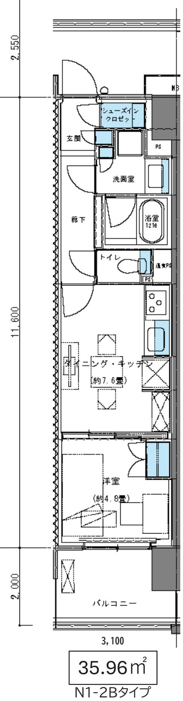

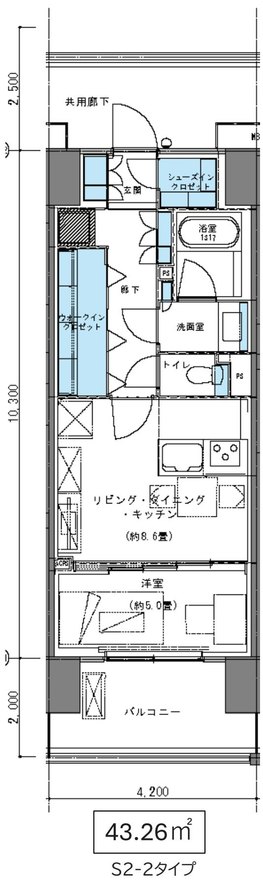

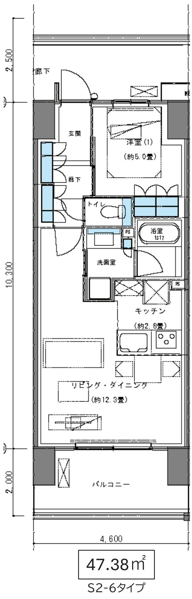

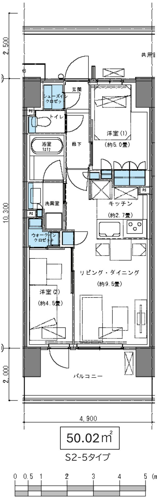

## 各面積帯の代表的な間取りです。

住戸選定の説明会資料ではすべての住戸タイプの間取りをご確認いただき、お選びいただくことになります。  
今後の検討や設計の精査等により変更が生じる場合があります。

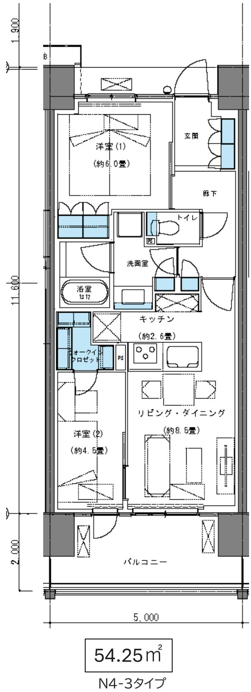

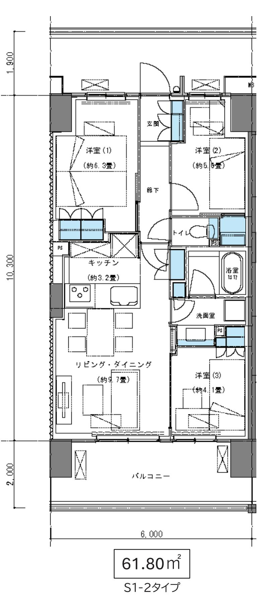

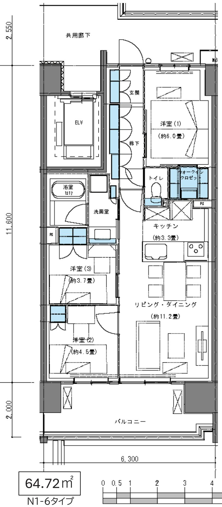

## 各面積帯の代表的な間取りです。

住戸選定の説明会資料ではすべての住戸タイプの間取りをご確認いただき、お選びいただくことになります。  
今後の検討や設計の精査等により変更が生じる場合があります。

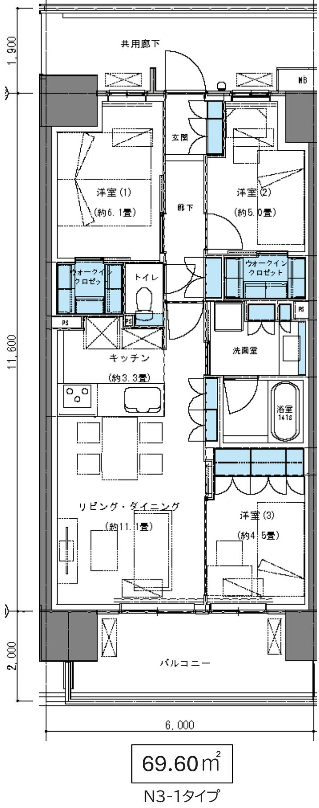

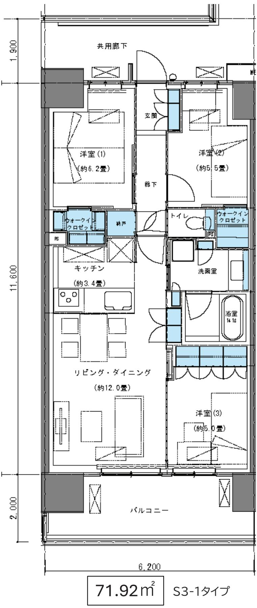

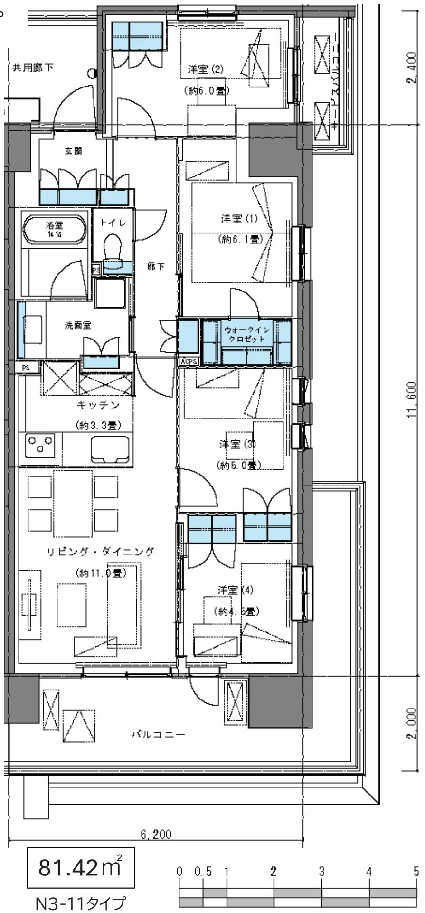

## 住戸選定の進め方

## 住戸選定の流れ(案)

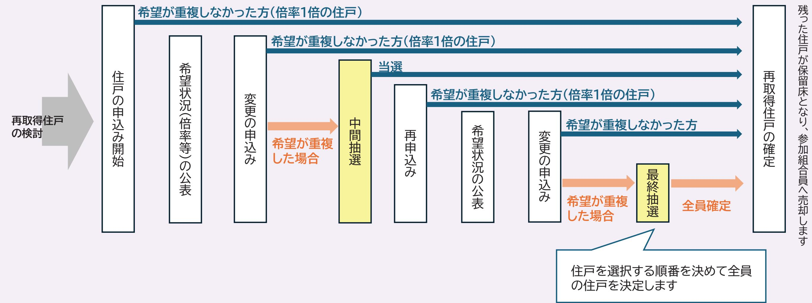

## スケジュール(案)

住戸選定のスケジュールはあくまでも暫定です。住戸選定説明会資料にて改めて日程をお知らせします。

<table><tr><td rowspan=1 colspan=16>7月</td><td rowspan=1 colspan=31>8月</td><td rowspan=1 colspan=12>9月</td></tr><tr><td rowspan=1 colspan=1>10.</td><td rowspan=1 colspan=1>17</td><td rowspan=1 colspan=1>18</td><td rowspan=1 colspan=1>19</td><td rowspan=1 colspan=1>20</td><td rowspan=1 colspan=1>21</td><td rowspan=1 colspan=1>22</td><td rowspan=1 colspan=1>23</td><td rowspan=1 colspan=3>242526</td><td rowspan=1 colspan=1>27</td><td rowspan=1 colspan=1>28</td><td rowspan=1 colspan=2>2930</td><td rowspan=1 colspan=1>31</td><td rowspan=1 colspan=1>1</td><td rowspan=1 colspan=1>2</td><td rowspan=1 colspan=1>3</td><td rowspan=1 colspan=1>4</td><td rowspan=1 colspan=1>5</td><td rowspan=1 colspan=1>6</td><td rowspan=1 colspan=1>7</td><td rowspan=1 colspan=1>8</td><td rowspan=1 colspan=1>9</td><td rowspan=1 colspan=2>1011</td><td rowspan=1 colspan=1>12</td><td rowspan=1 colspan=1>13</td><td rowspan=1 colspan=1>1415</td><td rowspan=1 colspan=2>16</td><td rowspan=1 colspan=1>17</td><td rowspan=1 colspan=1>18</td><td rowspan=1 colspan=1>19</td><td rowspan=1 colspan=1>20</td><td rowspan=1 colspan=1>21</td><td rowspan=1 colspan=1>22</td><td rowspan=1 colspan=1>23</td><td rowspan=1 colspan=1>24</td><td rowspan=1 colspan=1>25</td><td rowspan=1 colspan=1>26</td><td rowspan=1 colspan=1>27</td><td rowspan=1 colspan=1>28</td><td rowspan=1 colspan=1>29</td><td rowspan=1 colspan=1>30</td><td rowspan=1 colspan=1>31</td><td rowspan=1 colspan=1>1</td><td rowspan=1 colspan=1>2</td><td rowspan=1 colspan=1>3</td><td rowspan=1 colspan=1>4</td><td rowspan=1 colspan=1>5</td><td rowspan=1 colspan=1>6</td><td rowspan=1 colspan=1>7</td><td rowspan=1 colspan=1>8</td><td rowspan=1 colspan=1>9</td><td rowspan=1 colspan=1>10</td><td rowspan=1 colspan=1>11</td><td rowspan=1 colspan=1>12</td></tr><tr><td rowspan=2 colspan=2>資料到着（想定）</td><td rowspan=2 colspan=1>住戸選定説明会住戸</td><td rowspan=2 colspan=1>選定説明会</td><td rowspan=2 colspan=1></td><td rowspan=2 colspan=14>①結果申込取りまとめ①締切申込受付期間7/24-8/2(10日間)</td><td rowspan=2 colspan=1>公表·郵送·②申込開始</td><td rowspan=2 colspan=16>②結果公表·郵送·③申込開始申込取りまとめ中間抽選会②締切変更受付期間8/8-8/17(13日間)</td><td rowspan=2 colspan=11>③結果申込取りまとめ③締切申込受付期間8/21-8/30(10日間)</td><td rowspan=1 colspan=1></td><td rowspan=2 colspan=11>公表·郵送·④申込開始                                          取りまとめ・対象者へ連絡最終抽選会④締切変更受付期間9/3-9/10(9日間)</td></tr><tr><td rowspan=1 colspan=1></td><td rowspan=1 colspan=1></td><td rowspan=1 colspan=1></td><td rowspan=1 colspan=1></td><td rowspan=1 colspan=1></td><td rowspan=1 colspan=1></td><td rowspan=1 colspan=1></td><td rowspan=1 colspan=1></td><td rowspan=1 colspan=1></td><td rowspan=1 colspan=1></td><td rowspan=1 colspan=1></td><td rowspan=1 colspan=1></td><td rowspan=1 colspan=1></td><td rowspan=1 colspan=1></td><td rowspan=1 colspan=1></td><td rowspan=1 colspan=1></td><td rowspan=1 colspan=1></td><td rowspan=1 colspan=1></td><td rowspan=1 colspan=1></td><td rowspan=1 colspan=1></td><td rowspan=1 colspan=1></td><td rowspan=1 colspan=1></td><td rowspan=1 colspan=1></td><td rowspan=1 colspan=1></td><td rowspan=1 colspan=1></td><td rowspan=1 colspan=1></td><td></td><td rowspan=1 colspan=1></td><td rowspan=1 colspan=1></td><td rowspan=1 colspan=1></td><td rowspan=1 colspan=1></td></tr></table>

<table><tr><td>A-401</td><td>A-402</td><td>A-403</td><td>A-404</td><td>A-405</td><td>A-406</td><td></td><td rowspan="2">倍率1倍＝住戸決定</td></tr><tr><td>A-301</td><td>A-302</td><td>1 A-303</td><td>A-304</td><td>A-305</td><td>A-306</td><td></td></tr><tr><td></td><td></td><td></td><td>2</td><td></td><td></td><td></td><td rowspan="2">倍率2倍以上 = 最終抽選会に参加</td></tr><tr><td>A-201</td><td>A-202 1</td><td>A-203</td><td>A-204 2</td><td>A-205</td><td>A-206 1</td><td></td></tr><tr><td>A-101</td><td>A-102</td><td>A-103</td><td>A-104</td><td>A-105</td><td>A-106</td><td></td><td></td></tr><tr><td></td><td>3</td><td>2</td><td>1</td><td>1</td><td>3</td><td></td><td></td></tr></table>

## 抽選方法

## 中間抽選会(8/19予定)

同じ倍率ごとに抽選を行う

1.申込住戸毎に申込人数ごとの番号をくじ引き(番号決め)

2. 同じ倍率(申込者数)の住戸毎に当選番号を抽選

## ■例締切時の倍率

<table><tr><td rowspan=1 colspan=1>A-401</td><td rowspan=1 colspan=1>A-402</td><td rowspan=1 colspan=1>A-4031</td><td rowspan=1 colspan=1>A-404</td><td rowspan=1 colspan=1>A-405</td><td rowspan=1 colspan=1>A-406</td></tr><tr><td rowspan=1 colspan=1>A-301</td><td rowspan=1 colspan=1>A-302</td><td rowspan=1 colspan=1>A-303</td><td rowspan=1 colspan=1>A-3042</td><td rowspan=1 colspan=1>A-305</td><td rowspan=1 colspan=1>A-306</td></tr><tr><td rowspan=1 colspan=1>A-201</td><td rowspan=1 colspan=1>A-2021</td><td rowspan=1 colspan=1>A-203</td><td rowspan=1 colspan=1>A-2042</td><td rowspan=1 colspan=1>A-205</td><td rowspan=1 colspan=1>A-2061</td></tr><tr><td rowspan=1 colspan=1>A-101</td><td rowspan=1 colspan=1>A-1023</td><td rowspan=1 colspan=1>A-1032</td><td rowspan=1 colspan=1>A-1041</td><td rowspan=1 colspan=1>A-1051</td><td rowspan=1 colspan=1>A-1063</td></tr></table>

倍率1グループ＝住戸決定

倍率2グループ＝抽選

倍率3グループ＝抽選

## <倍率2グループ>

くじにて番号決め

②が出た場合

<table><tr><td rowspan=1 colspan=1>新住戸番号</td><td rowspan=1 colspan=1>申込者</td><td rowspan=1 colspan=1>番号</td></tr><tr><td rowspan=1 colspan=1>A-103</td><td rowspan=1 colspan=1>現O-102現O-401</td><td rowspan=1 colspan=1>①②</td></tr><tr><td rowspan=1 colspan=1>A-204</td><td rowspan=1 colspan=1>現O-204現O-107</td><td rowspan=1 colspan=1>②①</td></tr><tr><td rowspan=1 colspan=1>A-304</td><td rowspan=1 colspan=1>現〇-201現〇-303</td><td rowspan=1 colspan=1>①②</td></tr></table>

まとめて抽選

くじにて番号決め

<倍率3グループ>

③が出た場合

<table><tr><td rowspan=1 colspan=1>新住戸番号</td><td rowspan=1 colspan=1>申込者</td><td rowspan=1 colspan=1>番号</td></tr><tr><td rowspan=1 colspan=1>A-102</td><td rowspan=1 colspan=1>現O-101現〇-503現-205</td><td rowspan=1 colspan=1>①③②</td></tr><tr><td rowspan=1 colspan=1>A-106</td><td rowspan=1 colspan=1>現O-202現O-304現O-301</td><td rowspan=1 colspan=1>③②①</td></tr></table>

まとめて抽選

抽選結果

⇒再申込みへ  
⇒当選(住戸確定)  
⇒再申込みへ

く抽選会について>

抽選会への参加は不要です。抽選会は集会所で公開にて開催します。

抽選の対象住戸は当日会場に貼り出します。

申込者ご本人ではなく事業者が代理で実施します。

⇒抽選で外れた方は後日改めて住戸の申込みに進みます。

## 最終抽選会(9/12予定)

住戸を選択する順番を決め、希望住戸を決定する

1.参加者全員分の数字が書かれたくじを引く(順番決め)

2.出た数字が住戸を選択する順番です

3.選択順に取得者が決定していない住戸から希望住戸を選択していきます。

## ■例 締切時の倍率

くじにて順番決め

<table><tr><td rowspan=1 colspan=1>申込者</td><td rowspan=1 colspan=1>選択順位</td><td></td><td rowspan=1 colspan=1>希望住戸(新住戸)</td><td rowspan=9 colspan=1>住戸から希望住戸を選択選択順位順に取得者が決定していない</td></tr><tr><td rowspan=1 colspan=1>現O-205</td><td rowspan=1 colspan=1>1</td><td></td><td rowspan=1 colspan=1>A-102</td></tr><tr><td rowspan=1 colspan=1>現〇-401</td><td rowspan=1 colspan=1>2</td><td></td><td rowspan=1 colspan=1>A-103</td></tr><tr><td rowspan=1 colspan=1>現O-107</td><td rowspan=1 colspan=1>3</td><td></td><td rowspan=1 colspan=1>A-204</td></tr><tr><td rowspan=1 colspan=1>現O-503</td><td rowspan=1 colspan=1>4</td><td></td><td rowspan=1 colspan=1>A-302</td></tr><tr><td rowspan=1 colspan=1>現〇-304</td><td rowspan=1 colspan=1>5</td><td></td><td rowspan=1 colspan=1>A-304</td></tr><tr><td rowspan=1 colspan=1>現O-101</td><td rowspan=1 colspan=1>6</td><td></td><td rowspan=1 colspan=1>A-402</td></tr><tr><td rowspan=1 colspan=1>現O-303</td><td rowspan=1 colspan=1>7</td><td></td><td rowspan=1 colspan=1>A-404</td></tr><tr><td rowspan=1 colspan=1></td><td rowspan=1 colspan=1></td><td></td><td rowspan=1 colspan=1>•</td></tr></table>

## く抽選会について>

対象者には事前にご連絡をし、当日の出席の確認をします。

(順番を決め空いている住戸から選択していくため対象者はなるべく出席をお願いします)抽選会は集会所で公開にて開催します。

当日会場に来れない方は申込者同意のもと事業者が代理人となり実施します。

⇒全員の住戸が決定します

## 建替えサロンからのお知らせ

～ 事務連絡 ～

## 建替えサロンからのお知らせ

既にご案内している内容ですが、個人個人の今後のお手続きに関わる重要な内容ですので今一度ご確認ください。

① 権利処分による登記(相続、売買、贈与)は7月末までに法務局への申請を完了させてください。

今後、権利変換計画作成の手続きに入ります。権利変換計画書は登記上の所有者と真の所有者の情報が一致している必要があり、致していない場合は権利変換の手続き全体に影響が生じてしまう可能性があります。

7月末までに登記申請を進めていただき、8月以降は新たな権利処分のお手続きは避けていただきますようご協力お願いします。  
相続など避けようがない権利処分もありますので、その際は必ず建替えサロンにご相談ください。

②現在の所有者以外の方が新マンションの資金調達をする場合は、建替えサロンにご相談ください

円滑化法に基づく建替え事業においては、建替え後の住宅を取得できるのは「従前住戸を所有している区分所有者(共有の場合は共有者全員)」に限られます。そのため、増床負担金のお支払いも「従前住戸を所有している区分所有者」に限られます。  
現在の所有者以外の方が新マンションの資金調達をする場合は、建替えサロンにご相談ください。

## ③担保権者連絡先確認票を提出してください(該当者のみ)

## 対象者…今の登記情報に担保権(抵当権や買戻し特約等)が付いている方

※対象の方には4/7頃に別途「調査票」をお送りしています。ご案内が届いている方はご対応お願いします。

今後、権利変換計画書を作成するにあたり、担保権を設定している場合は担保権者(銀行等)の同意が必要となります。  
担保権者に対しては、建替組合から事業概要等の説明を実施する予定です。

④借家人の退去状況をお知らせください(賃貸人の方のみ)

1件でも退去が遅れてしまうと事業全体に影響が出てしまいます。  
借家人の退去状況が不明な方には、5月頃に建替えサロンよりアンケートをお送りしています。  
お手元に届いた方はご回答いただきますようよろしくお願いいたします。

【お問合せ先】府中日鋼団地 建替えサロン

受付時間:9:00～17:00(土・日・祝日除<)TEL:042-306-5319

## 今回の説明会についてのQ＆A

説明会資料をしっかり読み込むのが大変な方向けに、一問一答形式で本日の説明会でご確認いただきたい内容をまとめました。

Q1.なぜ今になって負担が増えるのですか？

A. 主な理由は、物価上昇により事業費が想定以上に増加したためです。特に建築費の高騰等により、総事業費が約1.2倍となり、予備費が大幅に減少しました。  
このままでは将来の価格上昇に対応できず、事業が不安定になるため、今の段階で見直しが必要となりました。

Q2.組合員の負担を増やすことが目的なのですか？

A.いいえ、まずは補助金や保留地価格の見直しなどで収入確保を行い、できるだけ負担増を抑える検討をしました。そのうえで不足分について、やむを得ず一部見直しを行っています。

Q3.なぜ「増床部分」だけ値上げなのですか？

A.建替事業では本来、増床・保留床は同じ「原価水準」で設定するのが原則です。これまでは、組合員負担を抑えるため増床を割安に設定していました。しかし今回は、保留床は既に市場的に限界価格であり、これ以上の値上げが難しいため、増床を本来の原価水準に戻す見直しとなりました。

Q4.どれくらい負担は増えるのか？

A.平均で約4万円の増加となります。ただし階数、向き、面積により異なるため、実際の負担は住戸ごとに異なります。

Q5.今の自分の資産(評価額)は変わるの？

A.変わりません。従前評価額は据え置きです。  
そのため負担額は、主に「どのような住戸を選ぶかどうか」が影響します。

Q6.小さい部屋を選べば負担は減るのか？

A.はい。負担額は「新しい住戸価格－従前評価額」で決まるため、面積を小さくすれば負担は抑えられます。今回40台住戸を増やしたのも、その選択肢を広げる目的です。

Q7.今後、事業が進まなくなる可能性はありますか？

A. ゼロではありません。  
実際に他の建替事業では資金不足で着工が遅れている事例もあります。  
そのため今回の資金計画の見直しは事業を止めないための対応です。

Q8.今回の説明会の内容はもう決定ですか？

A.まだ最終決定ではありません。今後7月の臨時総会や権利変換計画承認の総会で組合員の承認を得て確定します。

Q9.住戸選定は先着順ですか？

A.いいえ、先着ではありません。  
基本は申込→抽選→再申込→最終決定という流れになります。

Q10.住戸選定で希望が重なつた場合はどうなりますか？

A.再申込み後も倍率がついた住戸は抽選で決定します。  
外れた場合はさらにその後の申込で別の住戸を選択します。

Q11.抽選に参加できなくても大丈夫ですか？

A.中間抽選会は事業者が代理をして抽選を実施するため不参加でも大丈夫です。最終抽選会は原則出席を推奨しますが、不参加の方は事業者が代理で実施します。

Q12.住戸選定の最後はどうやって決まりますか？

A.最終抽選会にて選択順（くじで決定)に従って住戸を確定します。  
結果として全員がいずれかの住戸を取得できる仕組みです。

## 【お問合せ先】

府中日鋼団地建替えサロン

TEL：042-306-5319

受付:9:00～17:00（土・日·祝日休み)